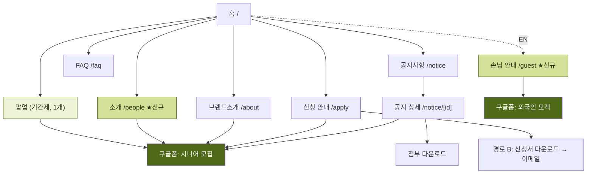
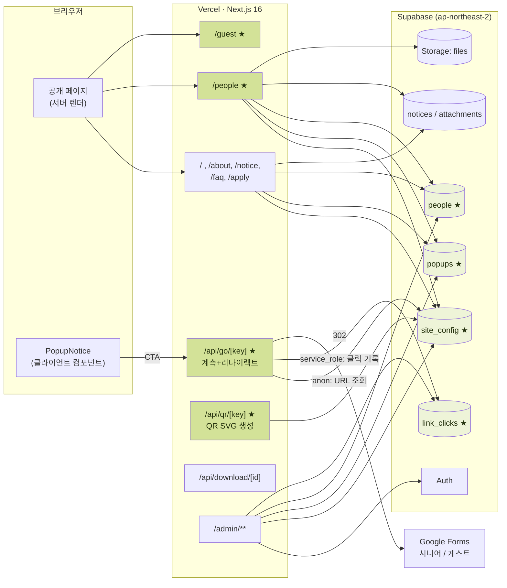
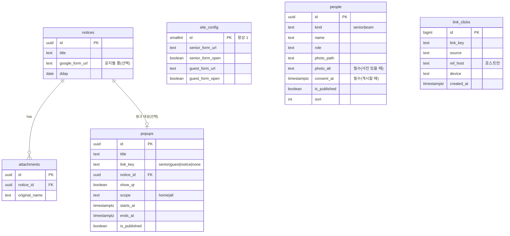
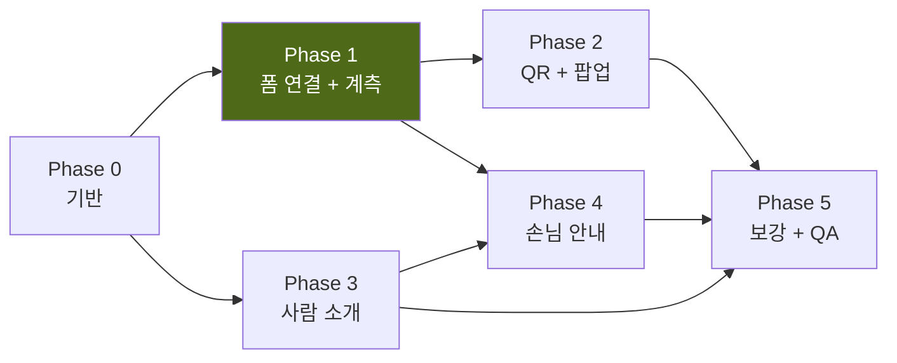

# 서울이모삼촌 v1.1 실행 계획 — 지원 퍼널 연결 + 사람 소개

| 항목 | 값 |
|---|---|
| 문서명 | PLAN v1.1 (PRD + TSD 통합 실행 계획) |
| 버전 | v1.1-draft.1 |
| 작성일 | 2026-08-01 |
| 상태 | **구현 완료 (2026-08-01)** — Phase 0~5 코드·DB 반영. §21 회신 필요 항목은 콘텐츠·설정 영역만 남음 |
| 상위 문서 | [PRD.md](PRD.md) (v1.0), [TSD.md](TSD.md) (v1.0) |
| 대상 릴리스 | 2026-08-30 모집 마감 이전 (D-29) |
| 배포 URL | https://seoul-imosamchon.vercel.app/ |

> **이 문서의 역할**
> v1.0 PRD/TSD는 "사이트를 만든다"를 정의했고 그 결과가 현재 배포되어 있다.
> 이 문서는 그 위에 얹는 **v1.1 증분(增分)** 을 정의한다. 두 가지다.
> 1. **지원 퍼널 연결** — 두 개의 구글폼(시니어 모집 / 외국인 손님 모객)을 사이트에 연결한다. 방식은 ① 상시 노출 CTA 버튼 ② 기간제 QR 팝업 공지 **둘 다**.
> 2. **사람 소개** — 모집 완료된 시니어(김선영·조숙현)와 팀 theOne 팀원을 소개하는 페이지를 만든다.
>
> **Part 1 = PRD**(무엇을·누구를 위해·왜), **Part 2 = TSD**(어떻게 만드는가), **Part 3 = 실행 계획**(순서·검증·리스크).

---

## 목차

**Part 0 — 현황**
- [0. 현재 시스템 스냅샷](#0-현재-시스템-스냅샷)

**Part 1 — PRD (제품 요구사항)**
- [1. 배경 & 문제 정의](#1-배경--문제-정의)
- [2. 목표 & 성공지표](#2-목표--성공지표)
- [3. 페르소나 & 사용자 여정](#3-페르소나--사용자-여정)
- [4. 기능 요구사항](#4-기능-요구사항)
- [5. 정보구조(IA) 변경](#5-정보구조ia-변경)
- [6. 비기능 요구사항](#6-비기능-요구사항)
- [7. 범위 밖(Out of Scope)](#7-범위-밖out-of-scope)

**Part 2 — TSD (기술 명세)**
- [8. 아키텍처 개요](#8-아키텍처-개요)
- [9. 데이터 모델 & 마이그레이션](#9-데이터-모델--마이그레이션)
- [10. 라우트 맵 & 디렉토리](#10-라우트-맵--디렉토리)
- [11. F1 — 폼 URL 단일 소스(site_config)](#11-f1--폼-url-단일-소스site_config)
- [12. F2 — 지원 버튼 & 계측 리다이렉트](#12-f2--지원-버튼--계측-리다이렉트)
- [13. F3 — QR 코드 생성](#13-f3--qr-코드-생성)
- [14. F4 — 팝업 공지](#14-f4--팝업-공지)
- [15. F5 — 사람 소개 페이지](#15-f5--사람-소개-페이지)
- [16. F6 — 외국인 손님 안내 페이지](#16-f6--외국인-손님-안내-페이지)
- [17. 관리자 UI 확장](#17-관리자-ui-확장)
- [18. 보안 · 개인정보](#18-보안--개인정보)
- [19. 성능 · 캐싱 · 접근성 구현](#19-성능--캐싱--접근성-구현)

**Part 3 — 실행**
- [20. 개발 단계(Phase)](#20-개발-단계phase)
- [21. 착수 전 확정 필요 항목](#21-착수-전-확정-필요-항목)
- [22. 수용 테스트(QA) 체크리스트](#22-수용-테스트qa-체크리스트)
- [23. 리스크 & 대응](#23-리스크--대응)

---

# Part 0 — 현황

## 0. 현재 시스템 스냅샷

**2026-08-01 기준 실제 코드/DB를 읽어 확인한 사실이다. 이 문서의 모든 설계는 이 상태를 전제로 한다.**

### 0.1 배포된 스택 (실측)

| 레이어 | 실제 값 | v1.0 TSD 대비 |
|---|---|---|
| 프레임워크 | **Next.js 16.2.11** (App Router, Turbopack 기본) | TSD는 "Next.js 15" 표기 → **16으로 갱신됨** |
| React | 19.2.4 | 동일 |
| 스타일 | **순수 CSS**([app/globals.css](../app/globals.css) 186줄, CSS 변수 토큰) | TSD의 "Tailwind + shadcn/ui" **미채택**. tailwind는 devDep에만 존재하고 실사용 없음 |
| DB | Supabase Postgres 17 · 프로젝트 `pxfmvncfdfiuxobjzihw` · **ap-northeast-2(서울)** | 동일 |
| 스토리지 | 단일 버킷 `files` (public=true, 10MB 상한) | 동일 |
| 인증 | Supabase Auth **이메일+비밀번호** ([app/admin/login/page.tsx](../app/admin/login/page.tsx)) | TSD의 매직링크 대신 비밀번호 방식 |
| 미들웨어 | **`proxy.ts`** (Next 16에서 `middleware` → `proxy` 리네임 반영 완료) | TSD 표기 갱신 필요 |
| 렌더링 | 전 페이지 `export const dynamic = "force-dynamic"` | TSD의 "ISR + revalidateTag" **미채택** |
| 마크다운 | react-markdown + remark-gfm + rehype-sanitize | 동일 |

### 0.2 배포된 라우트

```
/                app/page.tsx           홈(히어로 + 최신 공지 4건)
/about           브랜드소개(정적 콘텐츠)
/notice          공지 목록
/notice/[id]     공지 상세 + 첨부 다운로드 + 공지별 구글폼 버튼
/faq             FAQ (하드코딩 배열 4건)
/apply           신청 안내 (경로 A/B 설명 — 현재 폼 직결 링크 없음)
/api/download/[id]  첨부 다운로드 + download_count 증가
/admin           관리자 대시보드 + 공지 작성
/admin/login     로그인
/admin/notice/[id]/edit  공지 수정
```

> TSD가 `/notices`(복수)로 적었으나 **실제 구현은 `/notice`(단수)** 다. 이 문서는 실제 코드 기준으로 쓴다.

### 0.3 실제 DB 스키마 (Supabase 실측)

| 테이블 | 행 수 | 컬럼 | 비고 |
|---|---|---|---|
| `admins` | 1 | id, email(unique), name, created_at | TSD는 email PK였으나 실제는 uuid PK |
| `notices` | 1 | id, category(모집공고\|안내\|공지), title, body, **google_form_url**, dday(date), pinned, is_published, created_at, updated_at | TSD와 컬럼명 다름(`pinned`≠`is_pinned`) |
| `attachments` | 2 | id, notice_id, storage_path, **original_name**, mime_type, size_bytes, kind(form\|notice\|etc), **sort**, download_count | TSD는 `file_name`/`sort_order` |
| `events` | 0 | id, title, caption, storage_path, sort, is_published | TSD의 `gallery_images` 대신 이 이름으로 존재. **미사용** |
| `faqs` | 0 | id, question, answer, sort, is_published | **미사용**(FAQ는 코드 하드코딩) |

**DB 함수**: `is_admin()` (stable, security definer), `increment_download(uuid)` (security definer), `touch_updated_at()` (트리거)
**RLS 패턴**: 공개읽기 `using (is_published or is_admin())`, 관리자 `using/with check (is_admin())`

### 0.4 ⚠️ 확인된 부채 (v1.1에서 처리)

| # | 부채 | 영향 | 이 계획의 처리 |
|---|---|---|---|
| D1 | **`supabase/migrations/` 폴더가 없다.** 스키마가 대시보드/MCP로 직접 적용됨 | 스키마가 코드에 없어 재현·리뷰·롤백 불가. 협업 시 즉시 사고 | §9.1에서 마이그레이션 파일 체계 도입 + 현행 스키마 베이스라인 캡처 |
| D2 | 스토리지 `files` 버킷에 **SELECT(public read) RLS 정책이 없다** | 버킷이 `public=true`라 공개 URL은 동작하지만, 정책 부재는 의도가 불명확 | §18.3에서 명시적 정책 추가 |
| D3 | 스토리지 insert 정책에 **확장자 화이트리스트가 없다**(TSD §4.4 명세는 있었으나 미적용) | 관리자 계정 탈취 시 임의 확장자 업로드 가능 | §18.3에서 추가 |
| D4 | 계측(analytics)이 **전무**하다 | v1.0 PRD의 K1(신청 시작률) 측정 불가 | §12에서 `/api/go` 계측 리다이렉트로 해소 |
| D5 | `events`·`faqs` 테이블이 만들어졌으나 **미사용** | 혼란 | v1.1 범위 밖. §7에 기록만 |
| D6 | 전 페이지 `force-dynamic` | 매 요청 Supabase 왕복 → LCP 손해 | v1.1 범위 밖(§7). 단, 신규 페이지도 동일 컨벤션 유지해 일관성 확보 |

---

# Part 1 — PRD (제품 요구사항 명세)

## 1. 배경 & 문제 정의

### 1.1 왜 지금 이 두 기능인가

v1.0 사이트는 "브랜드 신뢰를 주는 홈페이지"까지 도달했다. 그러나 **모집 퍼널의 마지막 한 뼘이 비어 있다.**

| 현재 상태 | 문제 |
|---|---|
| 헤더 `신청하기` → `/apply` → "공지사항의 모집공고에서 신청 버튼을 눌러 주세요" → `/notice` → 공고 상세 → 구글폼 | **구글폼까지 클릭 4회.** 만 60세 사용자에게 4단계는 이탈 구간이다 |
| 구글폼 URL이 `notices.google_form_url` 한 곳에만 존재 | 홈·헤더·`/apply` 어디에서도 폼으로 직접 못 감. 폼이 "공지 안에 숨어 있다" |
| 오프라인 포스터·명함·현수막 → 사이트 유입 후 폼을 못 찾음 | QR로 들어온 사람이 다시 폼을 찾아 헤맴 |
| 외국인 손님(게스트) 모객 폼은 **사이트에 존재하지 않음** | 공급(시니어)만 모으고 수요(손님)는 못 모음 → 프로그램이 성립 안 됨 |
| 사이트에 **사람이 없다.** 로고·문구·공지뿐 | "60년을 살아야 얻어지는 것을 판다"는 브랜드 서사를 증명할 얼굴이 없음. 자녀세대가 신뢰할 근거 부족 |

### 1.2 지금이 적기인 이유

- 모집 공고가 **D-29**(2026-08-30 마감)로 활성 상태다. 퍼널 개선 효과가 즉시 측정된다.
- **김선영·조숙현 두 분이 실제로 합류**했다. 실존 인물이 확보된 순간이 "사람 소개"의 시작점이다. 사람 없이 만든 소개 페이지는 껍데기지만, 두 명이면 시작할 수 있다.
- 두 번째 폼(외국인 모객)이 준비되는 시점에 연결 구조가 없으면 또 급조하게 된다.

### 1.3 핵심 난제

> **QR은 모바일에서 무용지물이다.**

이 프로젝트에서 가장 놓치기 쉬운 함정이다. v1.0 PRD K4는 **모바일 세션 80% 이상**을 목표로 한다. 그런데 스마트폰으로 사이트를 보는 사람은 **자기 폰 화면의 QR을 자기 폰으로 스캔할 수 없다.**

QR이 실제로 작동하는 시나리오는 셋뿐이다.
1. **데스크톱/노트북 화면** → 폰으로 스캔 (자녀가 PC로 찾아보고 부모님 폰으로 넘김)
2. **화면을 보여주며 대면 전달** (복지관·시장 상인회에서 태블릿·노트북으로)
3. **QR 이미지를 저장/캡처해 인쇄·공유** (포스터 재생산)

따라서 **팝업 = QR**이 아니다. **팝업 = 상황에 맞는 진입점**이고, QR은 그중 데스크톱 전용 보조 수단이다. 모바일 팝업의 주인공은 **큼직한 "신청하러 가기" 버튼**과 **"카톡으로 보내기(링크 복사)"** 여야 한다. §14에서 이를 반응형으로 구현한다.

두 번째 난제:

> **시니어의 실명·얼굴을 공개하는 것은 개인정보·초상권 문제다.**

김선영·조숙현 님의 사진과 이름을 웹에 올리는 순간 되돌릴 수 없다(검색엔진 색인·캐시·스크래핑). **서면 동의 없이는 게시 불가**이며, 이를 문서가 아니라 **DB 제약으로 강제**한다(§9.4).

---

## 2. 목표 & 성공지표

### 2.1 정성 목표

| # | 목표 | 검증 문장 |
|---|---|---|
| **G1** | **한 번에 폼까지** | 사이트 어느 페이지에서든 **클릭 1회**로 시니어 모집 폼에 도달한다 |
| **G2** | **마감된 폼은 자동으로 사라진다** | 마감일이 지나면 운영자가 아무것도 하지 않아도 팝업·버튼이 "마감" 상태로 바뀐다 |
| **G3** | **얼굴이 있는 브랜드** | 자녀세대가 "실제로 이런 분들이 하시는구나"를 3초 안에 확인한다 |
| **G4** | **운영자가 코드 없이 전부 바꾼다** | 폼 URL 교체·팝업 시작/종료·인물 추가를 `/admin`에서 3분 내 완료한다 |
| **G5** | **팝업이 짜증나지 않는다** | 한 번 닫으면 당일 다시 뜨지 않고, 닫기 버튼을 못 찾는 사람이 없다 |

### 2.2 KPI

| # | 지표 | 목표 | 측정 방법 | 측정 가능 시점 |
|---|---|---|---|---|
| **K1'** | **신청 시작률** (세션 → 폼 클릭) | ≥ 15% | `link_clicks`(분자) ÷ Vercel Web Analytics 페이지뷰(분모) | Phase 1 완료 즉시 |
| **K8** | **평균 클릭 수** (랜딩 → 폼) | ≤ 1.5회 | 진입점별 `link_clicks.source` 분포 | Phase 1 |
| **K9** | **팝업 CTA 클릭률** (팝업 노출 → 폼 클릭) | ≥ 12% | `link_clicks WHERE source='popup'` ÷ 팝업 노출 로그 | Phase 2 |
| **K10** | **팝업 즉시닫기율** (3초 내 닫기) | ≤ 40% (초과 시 팝업 설계 재검토) | 팝업 노출/닫기 이벤트 간격 | Phase 2 |
| **K11** | **소개 페이지 도달률** | 전체 세션의 ≥ 10% | Vercel Analytics `/people` 페이지뷰 | Phase 3 |
| **K12** | **소개 페이지 경유 전환** | `/people` 방문자의 폼 클릭률 ≥ 20% | `link_clicks WHERE source='people'` | Phase 3 |

> **분모 확보 방식**: 자체 페이지뷰 테이블은 봇 트래픽 분리가 어렵고 매 요청 DB 쓰기가 발생한다. **Vercel Web Analytics**(`@vercel/analytics`, 쿠키리스·개인정보 미수집·Hobby 무료)를 분모로 쓰고, 분자만 자체 `link_clicks`로 정확히 센다. — **Should** 우선순위(§4.7).

---

## 3. 페르소나 & 사용자 여정

### 3.1 신규 페르소나

v1.0의 두 페르소나(시니어 본인 / 자녀세대)에 하나를 추가한다.

| 페르소나 | 설명 | 이 릴리스에서의 니즈 |
|---|---|---|
| **P3 — 외국인 손님(게스트)** | 서울 방문 여행자. 영어권. 모바일. "진짜 한국 가정식"을 검색 | 프로그램이 뭔지 30초 안에 파악 → 예약 폼 |

### 3.2 여정 비교 (시니어 모집)

**AS-IS (현재 — 4클릭)**
```
인스타 포스터 → 사이트 홈 → [신청하기] → /apply
  → "공지사항에서 신청" 읽기 → /notice → 공고 카드 → 상세
  → [휴대폰으로 5분 신청하기] → 구글폼
```

**TO-BE (v1.1 — 1클릭)**
```
인스타 포스터 → 사이트 홈
  ├─ 팝업 [신청하러 가기] ─────────────┐
  ├─ 헤더 [신청하기] ─────────────────┤
  ├─ 히어로 [신청하기] ───────────────┼→ /api/go/senior → 구글폼(새 탭)
  ├─ /people 하단 [나도 신청하기] ────┤       ↑ 계측 통과
  └─ /apply [바로 신청하기] ──────────┘
```
`/apply`·`/notice`는 **없애지 않는다.** "종이로 하고 싶다", "공고 전문을 읽고 싶다"는 수요가 실재하기 때문이다. 다만 **기본 경로에서 빼고 대안 경로로 내린다.**

### 3.3 여정 (외국인 손님)

```
구글 검색 / 인스타 → /guest (영문)
  → 프로그램 3장 카드 + 호스트 얼굴(/people 재사용)
  → [Book a class] → /api/go/guest → 구글폼(영문)
```

---

## 4. 기능 요구사항

우선순위: **M**(Must, 없으면 릴리스 불가) · **S**(Should) · **C**(Could)

### F1. 폼 URL 단일 소스 관리 — **M**

**무엇**: 시니어 모집 폼 / 외국인 모객 폼 URL과 "접수 중" 여부를 사이트 전역에서 하나의 출처로 관리한다.

| # | 수용 기준 |
|---|---|
| F1-1 | 운영자가 `/admin/settings`에서 두 폼 URL을 입력·저장할 수 있다 |
| F1-2 | 각 폼에 **접수 중 / 접수 마감** 토글이 있다 |
| F1-3 | 접수 마감 상태면 사이트의 모든 해당 폼 버튼이 자동으로 `마감되었습니다` 비활성 표시로 바뀐다 |
| F1-4 | `https://docs.google.com/...` 또는 `https://forms.gle/...` 이외의 URL은 **DB 레벨에서 저장이 거부**된다 |
| F1-5 | 저장 즉시(재배포 없이) 공개 페이지에 반영된다 |
| F1-6 | 기존 `notices.google_form_url`(공지별 폼)은 **그대로 유지**한다. 공지별 폼이 있으면 그것을, 없으면 전역 폼을 쓴다 |

### F2. 지원 버튼 & 계측 리다이렉트 — **M**

**무엇**: 사이트 전역의 지원 CTA를 `/api/go/[key]` 경유로 통일해 클릭을 계측하고, 마감·URL 검증을 서버에서 한 번에 처리한다.

| # | 수용 기준 |
|---|---|
| F2-1 | 헤더 `신청하기`, 홈 히어로 `신청하기`, `/apply` 주 CTA, `/people` 하단 CTA가 모두 폼으로 **1클릭** 연결된다 |
| F2-2 | 링크는 **새 탭**(`target="_blank" rel="noopener noreferrer"`)으로 열린다. 사이트를 잃지 않는다 |
| F2-3 | 클릭 시 `link_clicks`에 `(link_key, source, ref_host, device)`가 1행 기록된다. **IP·쿠키·개인식별정보는 저장하지 않는다** |
| F2-4 | 계측 실패가 리다이렉트를 막지 않는다(로그 실패해도 폼으로 간다) |
| F2-5 | 임의 URL로의 리다이렉트가 불가능하다(오픈 리다이렉트 차단, §18.1) |
| F2-6 | 마감 상태에서 URL을 직접 치고 들어와도 폼이 아니라 `/apply?closed=1`로 안내된다 |
| F2-7 | 리다이렉트 추가 지연이 **200ms 이하**다 |

### F3. QR 코드 자동 생성 — **M**

**무엇**: 폼 URL에서 QR을 **서버에서 자동 생성**한다. 이미지 업로드 방식이 아니다.

| # | 수용 기준 |
|---|---|
| F3-1 | 운영자가 폼 URL만 바꾸면 QR이 **자동으로 갱신**된다. QR 이미지를 따로 만들 필요가 없다 |
| F3-2 | QR은 `/api/go/senior?src=qr`를 가리킨다. 즉 **QR 스캔도 계측된다** |
| F3-3 | QR 아래 **"QR 이미지 저장"** 버튼으로 포스터 제작용 PNG/SVG를 내려받을 수 있다 |
| F3-4 | QR 대비율이 인쇄·화면 모두에서 충분하다(전경 `#23201c`, 배경 `#ffffff`, 오류정정 레벨 **M** 이상) |
| F3-5 | 외부 QR 생성 API(예: `api.qrserver.com`)를 **사용하지 않는다** — 외부 서비스 중단 시 QR이 깨지고, 폼 URL이 제3자에게 전송된다 |

### F4. 팝업 공지 — **M**

**무엇**: 기간을 정해 운영하는 팝업 1개. 모바일에서는 CTA 중심, 데스크톱에서는 QR 병행.

| # | 수용 기준 |
|---|---|
| F4-1 | 동시에 노출되는 팝업은 **최대 1개**다(시니어 대상 사이트에서 다중 팝업은 금지) |
| F4-2 | 운영자가 **시작일시·종료일시**를 지정한다. 기간 밖이면 자동으로 안 뜬다 (**G2**) |
| F4-3 | 노출 범위를 `홈에서만` / `모든 페이지`로 선택한다. 기본값은 **홈에서만** |
| F4-4 | `/admin/**`, `/api/**`에서는 **절대** 뜨지 않는다 |
| F4-5 | 닫기 버튼은 **최소 56×56px**, 아이콘+`닫기` 텍스트를 함께 표기한다 |
| F4-6 | `오늘 하루 보지 않기`(24시간) 와 `다시 보지 않기`(영구) 두 옵션을 제공한다 |
| F4-7 | 새 팝업이 등록되면 이전 팝업의 "다시 보지 않기"와 무관하게 다시 노출된다(팝업 ID 기준 저장) |
| F4-8 | ESC 키, 배경 클릭, 닫기 버튼 **모두**로 닫힌다. 포커스가 팝업 안에 갇히고, 닫으면 원래 위치로 돌아온다 |
| F4-9 | 팝업 때문에 **CLS가 발생하지 않고**, LCP가 나빠지지 않는다(첫 페인트 이후 지연 오픈) |
| F4-10 | 모바일: QR 대신 **큰 CTA 버튼 + "링크 복사"**. 데스크톱: **QR + CTA 병행** (§1.3) |
| F4-11 | `prefers-reduced-motion`이면 등장 애니메이션이 없다 |
| F4-12 | JS가 꺼져 있으면 팝업이 아예 렌더되지 않는다(콘텐츠를 가리지 않는다) |

### F5. 사람 소개 페이지 `/people` — **M**

**무엇**: 시니어 호스트와 팀원을 한 페이지에서 소개한다.

| # | 수용 기준 |
|---|---|
| F5-1 | `우리 이모·삼촌`(시니어) 섹션과 `함께 만드는 사람들`(팀) 섹션이 한 페이지에 순서대로 있다 |
| F5-2 | 카드에 **사진·이름·역할·활동지역·한 줄 소개·인용구**가 표시된다 |
| F5-3 | **사진이 없어도 카드가 완성돼 보인다** — 라임그린 배경 + 성씨 이니셜 아바타 폴백 |
| F5-4 | **동의 일시가 기록되지 않은 인물은 게시할 수 없다**(DB 제약으로 강제) |
| F5-5 | 사진에는 **의미 있는 대체텍스트**가 필수다. 사진이 있는데 alt가 비면 저장이 거부된다 |
| F5-6 | 홈에 `우리 이모·삼촌을 소개합니다` 섹션(상위 3명 + 전체보기)이 추가된다 |
| F5-7 | 페이지 하단에 `나도 신청하기` CTA(`source=people`)가 있다 |
| F5-8 | 인원이 0명이어도 페이지가 깨지지 않는다(빈 상태 문구) |
| F5-9 | 운영자가 `/admin/people`에서 추가·수정·순서변경·숨김을 할 수 있다 |
| F5-10 | 개인 상세 페이지(`/people/[slug]`)는 **v1.2**. 단 스키마에 `slug`·`story`를 미리 두어 마이그레이션 없이 확장 가능하게 한다 |

### F6. 외국인 손님 안내 `/guest` — **S**

| # | 수용 기준 |
|---|---|
| F6-1 | 영문 콘텐츠 단일 페이지. `<main lang="en">`으로 언어를 명시한다(루트는 `lang="ko"`) |
| F6-2 | `Book a class` CTA → `/api/go/guest` |
| F6-3 | 호스트 사진 3장(`/people` 데이터 재사용)이 노출된다 |
| F6-4 | 헤더에 작은 `EN` 링크를 둔다(주 내비게이션을 늘리지 않는다) |
| F6-5 | 게스트 폼 URL이 비어 있으면 페이지가 `Coming soon` 상태로 우아하게 표시된다 |
| F6-6 | 전체 다국어(i18n) 라우팅은 **v2**. 이 릴리스는 단일 영문 페이지다 |

### F7. 계측 기반 — **S**

| # | 수용 기준 |
|---|---|
| F7-1 | `@vercel/analytics`가 루트 레이아웃에 설치된다(쿠키리스) |
| F7-2 | `/admin`에 최근 30일 클릭 요약(진입점별)이 표시된다 |
| F7-3 | 팝업 노출·닫기 이벤트가 기록된다 |

### F8. 마이그레이션 파일 체계 — **M** (부채 D1)

| # | 수용 기준 |
|---|---|
| F8-1 | `supabase/migrations/*.sql`가 저장소에 커밋된다 |
| F8-2 | `0000_baseline.sql`이 **현재 운영 DB 상태**를 그대로 기술한다 |
| F8-3 | v1.1의 모든 DDL이 마이그레이션 파일로 존재한다. 대시보드 직접 수정 금지 규칙을 `AGENTS.md`에 명시한다 |

---

## 5. 정보구조(IA) 변경



### 5.1 내비게이션 변경

| 위치 | AS-IS | TO-BE |
|---|---|---|
| 상단 내비 | 홈 · 브랜드소개 · 공지사항 · FAQ · **[신청하기]** | 홈 · 브랜드소개 · **소개** · 공지사항 · FAQ · `EN` · **[신청하기]** |
| `[신청하기]` 링크 대상 | `/apply` | **`/api/go/senior?src=nav`** (새 탭) |
| 푸터 바로가기 | 4개 | + `소개`, + `손님 안내(EN)` |

> **내비 항목이 4개 → 5개+EN이 된다.** 시니어 사이트에서 메뉴 증가는 비용이다. 모바일에서는 `EN`을 아이콘 크기로 축소하고, `소개`는 `브랜드소개` 바로 옆에 붙여 인접 그룹으로 인지시킨다. 820px 이하에서 내비가 2줄로 넘칠 경우 `FAQ`를 푸터로 내리는 것을 대안으로 검토한다(§21-Q6).

---

## 6. 비기능 요구사항

### 6.1 접근성 (v1.0 기준 계승 + 팝업 추가 요건)

| # | 요구 | 근거 |
|---|---|---|
| A1 | 팝업은 네이티브 `<dialog>` + `showModal()` — 포커스 트랩·ESC·`aria-modal` 무료 획득 | 직접 구현한 모달은 포커스 트랩을 거의 항상 틀린다 |
| A2 | 닫기 버튼 ≥ 56×56px, 아이콘 단독 금지(`✕` + `닫기` 텍스트) | WCAG 2.2 **2.5.8 Target Size(Minimum)** 초과 달성, 시니어 손떨림 대응 |
| A3 | 팝업 안 모든 버튼 최소 높이 52px(기존 `.btn` 토큰 준수) | 기존 디자인 시스템 일치 |
| A4 | 인물 사진 `alt`는 **장식이 아니라 정보** — "김선영 호스트, 망원시장에서 장을 보는 모습" 형태 | 시각장애 사용자에게 사람의 존재를 전달 |
| A5 | 본문 대비 ≥ 7:1(AAA), 팝업 내부 포함 | v1.0 K6 계승 |
| A6 | `/guest`는 `lang="en"` — 스크린리더 발음 전환 | WCAG 3.1.2 Language of Parts |
| A7 | 팝업 열림 시 배경 스크롤 잠금, 닫힘 시 **원래 포커스 복원** | WCAG 2.4.3 Focus Order |
| A8 | `prefers-reduced-motion: reduce`에서 모든 등장 전환 제거 | WCAG 2.3.3 |
| A9 | QR에는 **반드시 텍스트 대안**(같은 화면의 CTA 버튼)이 동반된다. QR만 있는 진입점은 없다 | QR은 시각·인지·기기 접근성 모두에서 배타적 수단 |

### 6.2 성능

| 지표 | 목표 | 이 릴리스의 위험 요인 |
|---|---|---|
| LCP (느린 3G) | ≤ 2.5s | 팝업이 LCP를 밀지 않도록 **첫 페인트 이후 지연 오픈** |
| CLS | ≤ 0.02 | 인물 사진에 `width`/`height` 필수. `<dialog>`는 문서 흐름 밖이라 CLS 0 |
| INP | ≤ 200ms | 팝업 오픈은 CSS 전환만 사용 |
| 추가 JS | ≤ 8KB gzip | 팝업 클라이언트 컴포넌트 1개. QR 생성은 **100% 서버** |
| `/api/go` 지연 | ≤ 200ms | 로깅을 `after()`로 응답 이후에 실행(§12.3) |

### 6.3 개인정보 · 법적

| # | 요구 |
|---|---|
| PR1 | **인물 게시 전 서면(또는 문서화된) 동의 필수.** 동의 일시 미기록 시 DB가 게시를 거부한다 |
| PR2 | 동의 범위에 **웹사이트 공개 게시 · 검색엔진 노출 · 홍보물 재사용**이 포함돼야 한다 |
| PR3 | 계측은 **IP·쿠키·식별자 미수집**. 리퍼러는 **호스트명만** 저장(경로·쿼리 제거) |
| PR4 | 지원 CTA 근처에 "지원서는 Google Forms에서 접수되며, 개인정보 처리 주체는 팀 theOne입니다" 고지 |
| PR5 | 인물 사진은 public 버킷에 저장된다 → **미게시(is_published=false) 상태여도 URL을 알면 접근 가능**. 게시 확정 전 업로드를 피하거나 §18.3의 비공개 경로 규칙을 따른다 |
| PR6 | 게시 철회 요청 시 **DB 행 삭제 + Storage 객체 삭제**를 함께 수행한다(고아 파일 금지) |

---

## 7. 범위 밖 (Out of Scope)

| 항목 | 사유 | 언제 |
|---|---|---|
| 사이트 내 자체 신청 폼(구글폼 대체) | 개인정보 수집·저장 책임이 우리에게 넘어옴. 구글폼이 접근성·저장·알림 모두 우위 | 미정 |
| `/people/[slug]` 개인 상세·인터뷰 페이지 | 콘텐츠(인터뷰) 미확보. 스키마만 준비 | v1.2 |
| 전체 다국어 i18n 라우팅 | `/guest` 단일 페이지로 충분히 검증 후 판단 | v2 |
| `events`·`faqs` 테이블 실사용(갤러리/FAQ CMS) | v1.1 목표와 무관 | v1.2 |
| Cache Components(`cacheComponents: true`) 마이그레이션 | 전 페이지 렌더링 모델 변경 = 별도 릴리스. 지금 섞으면 회귀 원인 추적 불가 | v1.2 |
| Tailwind 도입 | 현재 순수 CSS가 잘 동작. 지금 섞으면 스타일 소스가 둘이 됨 | 미정 |
| 예약/결제/일정 관리 | 구글폼 + 수기 운영으로 충분 | v2+ |

---

# Part 2 — TSD (기술 명세)

## 8. 아키텍처 개요

### 8.1 시스템 다이어그램 (v1.1 증분 강조)



### 8.2 설계 원칙 (이 릴리스에서 지킬 것)

| # | 원칙 | 구체적 귀결 |
|---|---|---|
| **P1** | **폼 URL의 단일 소스는 DB다** | 환경변수에 폼 URL을 두지 않는다. 운영자가 Vercel 대시보드를 열어야 하는 순간 G4가 깨진다 |
| **P2** | **모든 외부 이동은 서버를 거친다** | `<a href="{구글폼}">` 직링크 금지. `/api/go/[key]` 단일 통로 → 계측·마감처리·검증이 한 곳에 |
| **P3** | **리다이렉트 대상은 코드가 정한다, 사용자가 아니라** | URL을 쿼리로 받지 않는다. **키만** 받는다. 오픈 리다이렉트 원천 차단 |
| **P4** | **삭제 대신 만료** | 팝업·모집은 지우는 게 아니라 기간이 끝난다. 운영자의 "지우기 잊음"이 사고가 되지 않게 |
| **P5** | **QR은 파일이 아니라 함수다** | URL을 입력으로 그때그때 생성. 업로드된 QR 이미지는 URL과 어긋날 수 있다 |
| **P6** | **개인정보는 DB 제약으로 지킨다** | "동의 받고 올리세요"는 문서다. `CHECK` 제약은 시스템이다 |
| **P7** | **기존 컨벤션을 따른다** | `sort`, `is_published`, `is_admin()`, `force-dynamic`, 순수 CSS. 새 패러다임을 섞지 않는다 |

### 8.3 기술 결정 기록 (ADR)

| # | 결정 | 대안 | 선택 이유 |
|---|---|---|---|
| **ADR-1** | 폼 URL을 **단일 행 `site_config` 테이블**로 관리 | (a) 환경변수 (b) key-value `settings` 테이블 | (a)는 비개발자가 못 바꾸고 재배포 필요 → P1 위배. (b)는 타입 안전성이 없고 오타 키가 조용히 실패. 컬럼 = 명세이므로 TypeScript·관리자 폼 모두 안전. 설정 항목 추가는 마이그레이션 1줄 |
| **ADR-2** | 팝업을 **별도 `popups` 테이블**(기간제 다중 레코드) | `site_config`에 팝업 컬럼 추가 | 시즌마다 새 팝업을 만들고 과거를 보관해야 한다. 단일 행이면 매번 덮어써서 이력이 사라지고, 만료 자동화(P4)를 못 한다 |
| **ADR-3** | QR을 **서버 라우트에서 `qrcode`로 생성** | (a) 관리자 이미지 업로드 (b) 외부 QR API | (a)는 URL 변경 시 QR 갱신을 잊는 사고가 확실히 난다. (b)는 외부 장애 시 QR이 깨지고 폼 URL이 제3자 서버로 전송된다(F3-5). 서버 생성은 URL과 항상 일치 |
| **ADR-4** | QR을 **``** 로 제공 | 서버에서 SVG 문자열을 `dangerouslySetInnerHTML`로 인라인 | `dangerouslySetInnerHTML`를 새로 도입하지 않는다. 라우트 방식은 URL 해시로 캐시 무효화가 자연스럽고(§13.2), 이미지 저장(F3-3)이 우클릭만으로 된다 |
| **ADR-5** | 클릭 로그 쓰기에 **service_role 키** 사용 | anon INSERT 정책 허용 | anon INSERT를 열면 누구나 Supabase REST로 로그를 오염시킬 수 있다. 서버 라우트 전용 키로 RLS를 우회하면 클라이언트에서 쓰기 경로 자체가 없다 |
| **ADR-6** | 신규 페이지도 **`force-dynamic`** 유지 | 신규만 `use cache` 도입 | 렌더링 모델이 페이지마다 다르면 버그 원인 추적이 지옥이 된다. 캐싱 전환은 별도 릴리스(§7) |
| **ADR-7** | `/guest`는 **단일 영문 페이지** | next-intl 등 i18n 라우팅 도입 | 페이지 1장 때문에 전 라우트를 `[locale]`로 재편하는 건 비용 대비 무의미. 수요 검증 후 v2 |
| **ADR-8** | `<dialog>` **네이티브 요소** | headless-ui / radix-dialog 등 라이브러리 | 의존성 0, 번들 0, 포커스 트랩·ESC·백드롭이 브라우저 기본 제공. 지원 요구 브라우저(Safari 16.4+, Chrome 111+)가 Next 16 요구사항과 정확히 일치 |

---

## 9. 데이터 모델 & 마이그레이션

### 9.1 마이그레이션 파일 체계 (부채 D1 해소)

```
supabase/
└─ migrations/
   ├─ 0000_baseline.sql          # 현행 운영 DB 상태 캡처 (신규 적용 없음, 기록용)
   ├─ 0010_site_config.sql       # F1
   ├─ 0011_link_clicks.sql       # F2/F7
   ├─ 0012_popups.sql            # F4
   ├─ 0013_people.sql            # F5
   └─ 0014_storage_hardening.sql # D2/D3
```

**규칙 (AGENTS.md에 추가)**
1. 스키마 변경은 **반드시 마이그레이션 파일로 작성한 뒤 적용**한다. Supabase 대시보드에서 직접 바꾸지 않는다.
2. 파일은 **멱등(idempotent)** 하게 쓴다 — `create table if not exists`, `drop policy if exists` 후 `create policy`.
3. `0000_baseline.sql`은 **재실행하지 않는다**(현행 상태 기록용). 새 환경 구축 시에만 사용.

### 9.2 `site_config` — 사이트 전역 설정 (F1)

```sql
-- supabase/migrations/0010_site_config.sql
create table if not exists public.site_config (
  id                 smallint primary key default 1 check (id = 1),  -- 단일 행 강제

  -- 시니어 모집 폼
  senior_form_url    text,
  senior_form_open   boolean     not null default true,
  senior_form_label  text        not null default '휴대폰으로 5분 신청하기',
  senior_closed_note text        not null default '이번 모집은 마감되었습니다. 다음 공고를 기다려 주세요.',

  -- 외국인 손님(게스트) 모객 폼
  guest_form_url     text,
  guest_form_open    boolean     not null default false,
  guest_form_label   text        not null default 'Book a class',

  -- 연락 안내
  contact_email      text        not null default 'songchaewoo0@gmail.com',
  contact_phone      text,

  updated_at         timestamptz not null default now(),

  -- ★ 오픈 리다이렉트 방어 1선: DB가 구글폼 도메인만 허용
  constraint site_config_senior_url_ok check (
    senior_form_url is null
    or senior_form_url ~ '^https://(docs\.google\.com/forms/|forms\.gle/)'
  ),
  constraint site_config_guest_url_ok check (
    guest_form_url is null
    or guest_form_url ~ '^https://(docs\.google\.com/forms/|forms\.gle/)'
  )
);

insert into public.site_config (id) values (1) on conflict (id) do nothing;

drop trigger if exists trg_site_config_updated on public.site_config;
create trigger trg_site_config_updated
  before update on public.site_config
  for each row execute function public.touch_updated_at();

alter table public.site_config enable row level security;

drop policy if exists "site_config public read" on public.site_config;
create policy "site_config public read"
  on public.site_config for select using (true);

drop policy if exists "site_config admin update" on public.site_config;
create policy "site_config admin update"
  on public.site_config for update
  using (public.is_admin()) with check (public.is_admin());
-- INSERT/DELETE 정책 없음 → 단일 행이 구조적으로 보장된다
```

> **왜 공개 읽기인가**: 이 테이블에는 어차피 화면에 노출될 값(폼 URL, 문의 이메일)만 들어간다. 비밀은 하나도 없다. 비밀이 생기면 별도 테이블로 분리한다.

### 9.3 `link_clicks` — 클릭 계측 (F2, F7)

```sql
-- supabase/migrations/0011_link_clicks.sql
create table if not exists public.link_clicks (
  id         bigint generated always as identity primary key,
  link_key   text        not null,                    -- 'senior' | 'guest'
  source     text        not null default 'unknown',  -- 'nav'|'hero'|'popup'|'qr'|'people'|'apply'|'notice'|'guest'
  ref_host   text,                                    -- 리퍼러 '호스트명만' (경로·쿼리 제거)
  device     text,                                    -- 'mobile'|'desktop'|'bot'
  created_at timestamptz not null default now()
);
-- ★ IP·User-Agent 원문·쿠키·세션ID는 저장하지 않는다 (PR3)

create index if not exists idx_link_clicks_key_time
  on public.link_clicks (link_key, created_at desc);
create index if not exists idx_link_clicks_source_time
  on public.link_clicks (source, created_at desc);

alter table public.link_clicks enable row level security;

drop policy if exists "link_clicks admin read" on public.link_clicks;
create policy "link_clicks admin read"
  on public.link_clicks for select using (public.is_admin());
-- INSERT 정책 없음 → anon/authenticated 모두 쓰기 불가.
-- 쓰기는 service_role 키를 쓰는 서버 라우트만 가능하다 (ADR-5)

-- 관리자 대시보드용 요약 (F7-2)
create or replace function public.link_click_summary(days int default 30)
returns table (link_key text, source text, clicks bigint)
language sql stable security definer set search_path = public as $$
  select c.link_key, c.source, count(*)::bigint
  from public.link_clicks c
  where public.is_admin()                                   -- ★ 함수 내부에서 인가 재확인
    and c.created_at >= now() - make_interval(days => greatest(days, 1))
    and c.device is distinct from 'bot'
  group by 1, 2
  order by 3 desc;
$$;
revoke all on function public.link_click_summary(int) from public, anon;
grant execute on function public.link_click_summary(int) to authenticated;
```

> `security definer` 함수는 RLS를 우회하므로 **함수 본문 안에서 `is_admin()`을 반드시 확인**한다. 이걸 빠뜨리면 로그인만 하면 남의 통계를 볼 수 있게 된다.

### 9.4 `people` — 인물 (F5)

```sql
-- supabase/migrations/0013_people.sql
create table if not exists public.people (
  id           uuid primary key default gen_random_uuid(),
  kind         text        not null check (kind in ('senior','team')),
  name         text        not null,                  -- 표기명 그대로 ('김선영' 또는 '김선영(선영 이모)')
  role         text        not null default '',       -- 시니어: '쿠킹클래스 호스트' / 팀: '대표'
  region       text,                                  -- 시니어: '마포 망원동'
  tagline      text        not null default '',       -- 카드 헤드라인 한 줄
  bio          text        not null default '',       -- 문단 (마크다운 허용)
  quote        text,                                  -- 인용구
  photo_path   text,                                  -- files 버킷 경로 'people/{uuid}-{ts}.jpg'
  photo_alt    text        not null default '',       -- 접근성 대체텍스트
  tags         text[]      not null default '{}',     -- ['쿠킹클래스','망원시장']
  slug         text unique,                           -- v1.2 상세 페이지용 (F5-10)
  story        text,                                  -- v1.2 인터뷰 본문 (F5-10)
  sort         int         not null default 0,
  is_published boolean     not null default false,    -- ★ 다른 테이블과 달리 기본 false
  consent_at   timestamptz,                           -- ★ 초상권·개인정보 공개 동의 일시
  consent_memo text        not null default '',       -- 동의 방식 기록 ('2026-08-01 서면 동의서 수령')
  created_at   timestamptz not null default now(),
  updated_at   timestamptz not null default now(),

  -- ★ PR1: 동의 없이는 게시 불가 — 문서가 아니라 시스템으로 강제
  constraint people_consent_required
    check (is_published = false or consent_at is not null),

  -- ★ A4/F5-5: 사진이 있으면 대체텍스트 필수
  constraint people_alt_required
    check (photo_path is null or length(btrim(photo_alt)) > 0),

  constraint people_slug_format
    check (slug is null or slug ~ '^[a-z0-9]+(-[a-z0-9]+)*$')
);

create index if not exists idx_people_published
  on public.people (kind, is_published, sort, created_at);

drop trigger if exists trg_people_updated on public.people;
create trigger trg_people_updated
  before update on public.people
  for each row execute function public.touch_updated_at();

alter table public.people enable row level security;

drop policy if exists "people public read" on public.people;
create policy "people public read"
  on public.people for select using (is_published or public.is_admin());

drop policy if exists "people admin all" on public.people;
create policy "people admin all"
  on public.people for all
  using (public.is_admin()) with check (public.is_admin());
```

**`is_published` 기본값이 `false`인 이유**: `notices`·`faqs`는 기본 `true`다. 인물만 다르다. 실수로 저장했을 때 공지가 하나 뜨는 것과 **동의받지 않은 사람의 얼굴이 인터넷에 공개되는 것**은 되돌릴 수 있는 정도가 다르다. 기본값은 안전한 쪽으로 둔다.

### 9.5 `popups` — 팝업 (F4)

```sql
-- supabase/migrations/0012_popups.sql
create table if not exists public.popups (
  id           uuid primary key default gen_random_uuid(),
  title        text        not null,
  subtitle     text        not null default '',
  body         text        not null default '',       -- 짧은 안내 (마크다운 아님, 평문)
  link_key     text        not null default 'senior'
                 check (link_key in ('senior','guest','notice','none')),
  notice_id    uuid references public.notices(id) on delete set null,
  cta_label    text        not null default '신청하러 가기',
  show_qr      boolean     not null default true,     -- 데스크톱 QR 표시 여부
  scope        text        not null default 'home' check (scope in ('home','all')),
  starts_at    timestamptz not null default now(),
  ends_at      timestamptz,                           -- null = 무기한
  sort         int         not null default 0,
  is_published boolean     not null default false,
  created_at   timestamptz not null default now(),
  updated_at   timestamptz not null default now(),

  constraint popups_period check (ends_at is null or ends_at > starts_at),
  constraint popups_notice_required check (link_key <> 'notice' or notice_id is not null)
);

create index if not exists idx_popups_active
  on public.popups (is_published, starts_at, ends_at, sort);

drop trigger if exists trg_popups_updated on public.popups;
create trigger trg_popups_updated
  before update on public.popups
  for each row execute function public.touch_updated_at();

alter table public.popups enable row level security;

drop policy if exists "popups public read" on public.popups;
create policy "popups public read"
  on public.popups for select using (is_published or public.is_admin());

drop policy if exists "popups admin all" on public.popups;
create policy "popups admin all"
  on public.popups for all
  using (public.is_admin()) with check (public.is_admin());
```

**활성 팝업 조회 (항상 최대 1건)**
```sql
select * from public.popups
where is_published
  and starts_at <= now()
  and (ends_at is null or ends_at > now())
  and scope in ('home','all')          -- 페이지에 따라 필터
order by sort asc, created_at desc
limit 1;
```

### 9.6 ER 다이어그램 (v1.1 전체)



### 9.7 신규 의존성

| 패키지 | 용도 | 위치 | 비고 |
|---|---|---|---|
| `qrcode` | QR SVG/PNG 생성 | **서버 전용** | MIT. 클라이언트 번들 0 |
| `@types/qrcode` | 타입 | devDependencies | |
| `@vercel/analytics` | 페이지뷰(KPI 분모) | 클라이언트 | **S** 우선순위. 쿠키리스 |

```bash
npm i qrcode @vercel/analytics && npm i -D @types/qrcode
```

### 9.8 신규 환경변수

| 키 | 예시 | 노출 | 용도 |
|---|---|---|---|
| `SUPABASE_SERVICE_ROLE_KEY` | `eyJ...` (또는 `sb_secret_...`) | **서버 전용 · 절대 `NEXT_PUBLIC_` 금지** | `/api/go` 클릭 로그 기록 (ADR-5) |

> **가드**: `lib/supabase/service.ts` 최상단에 `import 'server-only'`를 넣는다. 클라이언트 컴포넌트가 실수로 임포트하면 **빌드가 실패**한다. 런타임 사고가 아니라 빌드 에러로 잡는다.

---

## 10. 라우트 맵 & 디렉토리

### 10.1 라우트 (★ = 신규, ◆ = 수정)

| 경로 | 종류 | 렌더링 | 설명 |
|---|---|---|---|
| `/` | Page | force-dynamic | ◆ 팝업 마운트 + 인물 섹션 추가 |
| `/about` | Page | 정적 | ◆ 하단 CTA를 `/api/go/senior?src=about`로 |
| `/notice`, `/notice/[id]` | Page | force-dynamic | ◆ 상세 CTA를 계측 경유로 |
| `/faq` | Page | 정적 | 변경 없음 |
| `/apply` | Page | force-dynamic | ◆ 최상단에 **바로 신청** 주 CTA 추가 |
| **`/people`** | Page | force-dynamic | ★ 시니어 + 팀원 소개 |
| **`/guest`** | Page | force-dynamic | ★ 영문 손님 안내 |
| `/api/download/[id]` | Route | 동적 | 변경 없음 |
| **`/api/go/[key]`** | Route | 동적 | ★ 계측 + 302 리다이렉트 |
| **`/api/qr/[key]`** | Route | 동적 | ★ QR SVG 생성 |
| `/admin` | Page | 보호 | ◆ 클릭 요약 카드 추가 |
| **`/admin/settings`** | Page | 보호 | ★ 폼 URL·접수 상태 |
| **`/admin/popups`** | Page | 보호 | ★ 팝업 CRUD |
| **`/admin/people`** | Page | 보호 | ★ 인물 CRUD |

> `proxy.ts`의 matcher는 `_next/static`·이미지 확장자만 제외하므로 **신규 라우트가 자동으로 포함**된다. proxy 수정 불필요.

### 10.2 디렉토리 (신규/수정 파일)

```
app/
├─ layout.tsx                     ◆ <Analytics /> 추가
├─ page.tsx                       ◆ <PopupMount page="home" /> + <PeopleStrip />
├─ people/page.tsx                ★
├─ guest/page.tsx                 ★
├─ apply/page.tsx                 ◆ 주 CTA를 최상단으로
├─ api/
│  ├─ go/[key]/route.ts           ★ 계측 리다이렉트
│  └─ qr/[key]/route.ts           ★ QR 생성
├─ admin/
│  ├─ settings/page.tsx           ★ + SettingsForm.tsx
│  ├─ popups/page.tsx             ★ + PopupEditor.tsx
│  ├─ people/page.tsx             ★ + PersonEditor.tsx
│  └─ page.tsx                    ◆ 클릭 요약 + 신규 메뉴 링크
components/
├─ ApplyButton.tsx                ★ 계측 CTA (서버 컴포넌트)
├─ PopupMount.tsx                 ★ 서버: 활성 팝업 조회
├─ PopupNotice.tsx                ★ 클라이언트: <dialog> 렌더
├─ QrPanel.tsx                    ★ QR + 저장 + 링크복사
├─ CopyLink.tsx                   ★ CopyEmail 일반화
├─ PersonCard.tsx                 ★
├─ PersonAvatar.tsx               ★ 사진 or 이니셜 폴백
├─ PeopleStrip.tsx                ★ 홈 섹션
├─ SiteHeader.tsx                 ◆ '소개' · 'EN' · CTA 계측화
└─ SiteFooter.tsx                 ◆ 바로가기 2개 추가
lib/
├─ config.ts                      ★ getSiteConfig()
├─ people.ts                      ★ 타입 + 조회
├─ popups.ts                      ★ 타입 + 활성 조회
├─ links.ts                       ★ goHref(key, source) 헬퍼
├─ qr.ts                          ★ QR 생성 (server-only)
└─ supabase/service.ts            ★ service_role 클라이언트 (server-only)
supabase/migrations/*.sql         ★ §9.1
app/globals.css                   ◆ 팝업·인물카드·QR 스타일 추가
```

---

## 11. F1 — 폼 URL 단일 소스(site_config)

### 11.1 조회 헬퍼

```ts
// lib/config.ts
import { cache } from 'react';
import { createClient } from '@/lib/supabase/server';

export type SiteConfig = {
  senior_form_url: string | null;
  senior_form_open: boolean;
  senior_form_label: string;
  senior_closed_note: string;
  guest_form_url: string | null;
  guest_form_open: boolean;
  guest_form_label: string;
  contact_email: string;
  contact_phone: string | null;
};

const FALLBACK: SiteConfig = {
  senior_form_url: null,
  senior_form_open: false,
  senior_form_label: '휴대폰으로 5분 신청하기',
  senior_closed_note: '이번 모집은 마감되었습니다. 다음 공고를 기다려 주세요.',
  guest_form_url: null,
  guest_form_open: false,
  guest_form_label: 'Book a class',
  contact_email: process.env.NEXT_PUBLIC_APPLICATION_EMAIL || 'songchaewoo0@gmail.com',
  contact_phone: null,
};

/** 요청 단위 메모이즈 — 한 페이지에서 헤더·히어로·팝업이 각각 불러도 쿼리는 1회 */
export const getSiteConfig = cache(async (): Promise<SiteConfig> => {
  const supabase = await createClient();
  const { data } = await supabase
    .from('site_config')
    .select('*')
    .eq('id', 1)
    .maybeSingle();
  // DB 장애 시에도 페이지는 떠야 한다 — 폴백은 '마감' 상태로 안전하게
  return data ? { ...FALLBACK, ...data } : FALLBACK;
});
```

> **`react`의 `cache()`를 쓰는 이유**: `force-dynamic`이라 요청마다 새로 부르지만, **한 요청 안에서** 헤더·히어로·팝업·푸터가 각각 호출하면 왕복이 4번이다. `cache()`는 요청 스코프 중복 제거만 한다(영속 캐시가 아니므로 `force-dynamic`과 충돌 없음).

### 11.2 폼 해석 우선순위 (F1-6)

```
공지 상세 페이지:  notices.google_form_url  →  없으면 site_config.senior_form_url
그 외 모든 곳:                                 site_config.senior_form_url
```
공지별 폼은 "이번 공고 전용 폼"을 쓰고 싶을 때를 위한 예외다. 기존 데이터(공고 1건에 폼 URL 존재)가 그대로 동작한다.

---

## 12. F2 — 지원 버튼 & 계측 리다이렉트

### 12.1 링크 헬퍼

```ts
// lib/links.ts
export type LinkKey = 'senior' | 'guest';
export type LinkSource =
  | 'nav' | 'hero' | 'popup' | 'qr' | 'people'
  | 'apply' | 'notice' | 'about' | 'guest' | 'footer';

export function goHref(key: LinkKey, source: LinkSource): string {
  return `/api/go/${key}?src=${source}`;
}
```

### 12.2 CTA 컴포넌트 (서버 컴포넌트 — JS 0바이트)

```tsx
// components/ApplyButton.tsx
import { getSiteConfig } from '@/lib/config';
import { goHref, type LinkKey, type LinkSource } from '@/lib/links';

export default async function ApplyButton({
  linkKey = 'senior',
  source,
  className = 'btn btn-primary',
  label,
}: {
  linkKey?: LinkKey;
  source: LinkSource;
  className?: string;
  label?: string;
}) {
  const cfg = await getSiteConfig();
  const open = linkKey === 'senior' ? cfg.senior_form_open : cfg.guest_form_open;
  const url  = linkKey === 'senior' ? cfg.senior_form_url  : cfg.guest_form_url;
  const text = label ?? (linkKey === 'senior' ? cfg.senior_form_label : cfg.guest_form_label);

  // 마감 또는 URL 미설정 → 버튼이 사라지는 게 아니라 '마감' 상태로 남는다 (G2)
  if (!open || !url) {
    return (
      <span className={`${className} is-closed`} aria-disabled="true" role="link">
        {linkKey === 'senior' ? '접수 마감' : 'Applications closed'}
      </span>
    );
  }

  return (
    <a
      className={className}
      href={goHref(linkKey, source)}
      target="_blank"
      rel="noopener noreferrer"
    >
      {text}
      <span className="sr-only"> (새 창에서 열립니다)</span>
    </a>
  );
}
```

> **`target="_blank"`에 스크린리더 안내를 붙이는 이유**: 새 창이 열리면 스크린리더 사용자는 맥락을 잃는다. WCAG 3.2.5(Change on Request) 대응이다. `.sr-only` 클래스를 `globals.css`에 추가한다.

### 12.3 계측 리다이렉트 라우트

```ts
// app/api/go/[key]/route.ts
import { NextResponse, after, userAgent } from 'next/server';
import { createClient } from '@/lib/supabase/server';
import { createServiceClient } from '@/lib/supabase/service';

// ★ P3: 이동 대상은 '키'로만 지정된다. URL을 쿼리로 받지 않는다
const KEYS = new Set(['senior', 'guest']);
const SOURCES = new Set([
  'nav','hero','popup','qr','people','apply','notice','about','guest','footer','unknown',
]);
// ★ 방어 2선 (DB CHECK가 1선)
const URL_ALLOWLIST = /^https:\/\/(docs\.google\.com\/forms\/|forms\.gle\/)/;

export async function GET(
  req: Request,
  { params }: { params: Promise<{ key: string }> },
) {
  const { key } = await params;
  const origin = new URL(req.url).origin;

  if (!KEYS.has(key)) {
    return NextResponse.redirect(new URL('/apply', origin), 302);
  }

  const supabase = await createClient();
  const { data: cfg } = await supabase
    .from('site_config')
    .select('senior_form_url, senior_form_open, guest_form_url, guest_form_open')
    .eq('id', 1)
    .maybeSingle();

  const isSenior = key === 'senior';
  const open = isSenior ? cfg?.senior_form_open : cfg?.guest_form_open;
  const target = isSenior ? cfg?.senior_form_url : cfg?.guest_form_url;

  if (!open || !target || !URL_ALLOWLIST.test(target)) {
    const to = isSenior ? '/apply?closed=1' : '/guest?closed=1';
    return NextResponse.redirect(new URL(to, origin), 302);
  }

  // ── 계측: 응답 이후에 실행 → 리다이렉트 지연 0 (NFR §6.2)
  const rawSrc = new URL(req.url).searchParams.get('src') ?? 'unknown';
  const source = SOURCES.has(rawSrc) ? rawSrc : 'unknown';   // 임의 문자열 저장 방지
  const ua = userAgent(req as never);
  const device = ua.isBot ? 'bot' : ua.device.type === 'mobile' ? 'mobile' : 'desktop';

  let refHost: string | null = null;
  try {
    const r = req.headers.get('referer');
    refHost = r ? new URL(r).hostname : null;   // ★ PR3: 호스트명만, 경로·쿼리 폐기
  } catch { /* 잘못된 리퍼러는 무시 */ }

  after(async () => {
    try {
      await createServiceClient()
        .from('link_clicks')
        .insert({ link_key: key, source, ref_host: refHost, device });
    } catch {
      // F2-4: 계측 실패가 사용자 여정을 막지 않는다
    }
  });

  return NextResponse.redirect(target, 302);
}
```

**설계 근거**
- `after()` (Next 16 `next/server`, 안정화됨)는 **응답 전송 후** 콜백을 실행한다. 서버리스에서 흔한 "fire-and-forget이 프로세스 종료로 잘리는" 문제를 정식으로 해결한다.
- `source`를 화이트리스트로 정규화한다. 안 하면 누구나 `?src=<임의 문자열>`로 로그 테이블을 오염시키고 관리자 화면에 임의 텍스트가 렌더된다.
- `device`에 User-Agent **원문을 저장하지 않는다.** 분류값만 남긴다(PR3).

### 12.4 service_role 클라이언트

```ts
// lib/supabase/service.ts
import 'server-only';                          // ★ 클라이언트 임포트 시 빌드 실패
import { createClient } from '@supabase/supabase-js';

export function createServiceClient() {
  const url = process.env.NEXT_PUBLIC_SUPABASE_URL;
  const key = process.env.SUPABASE_SERVICE_ROLE_KEY;
  if (!url || !key) throw new Error('service role env missing');
  return createClient(url, key, {
    auth: { persistSession: false, autoRefreshToken: false },
  });
}
```

### 12.5 진입점별 `source` 배치

| 진입점 | `source` | 파일 |
|---|---|---|
| 상단 내비 `신청하기` | `nav` | `components/SiteHeader.tsx` |
| 홈 히어로 `신청하기` | `hero` | `app/page.tsx` |
| 팝업 CTA | `popup` | `components/PopupNotice.tsx` |
| QR 스캔 | `qr` | `/api/qr/senior` 가 인코딩 |
| `/people` 하단 | `people` | `app/people/page.tsx` |
| `/apply` 주 CTA | `apply` | `app/apply/page.tsx` |
| 공지 상세 | `notice` | `app/notice/[id]/page.tsx` |
| `/about` 하단 | `about` | `app/about/page.tsx` |
| `/guest` CTA | `guest` | `app/guest/page.tsx` |

---

## 13. F3 — QR 코드 생성

### 13.1 생성 로직

```ts
// lib/qr.ts
import 'server-only';
import QRCode from 'qrcode';

export async function renderQrSvg(url: string): Promise<string> {
  return QRCode.toString(url, {
    type: 'svg',
    errorCorrectionLevel: 'M',   // F3-4: 인쇄 시 일부 손상돼도 인식
    margin: 2,                   // quiet zone — 0이면 스캐너가 못 읽는다
    width: 512,
    color: { dark: '#23201cff', light: '#ffffffff' },  // 브랜드 --ink / --bg
  });
}
```

### 13.2 QR 라우트 (캐시 무효화 포함)

```ts
// app/api/qr/[key]/route.ts
import { createHash } from 'node:crypto';
import { getSiteConfig } from '@/lib/config';
import { renderQrSvg } from '@/lib/qr';

const KEYS = new Set(['senior', 'guest']);

export async function GET(
  req: Request,
  { params }: { params: Promise<{ key: string }> },
) {
  const { key } = await params;
  if (!KEYS.has(key)) return new Response('Not found', { status: 404 });

  const cfg = await getSiteConfig();
  const url = key === 'senior' ? cfg.senior_form_url : cfg.guest_form_url;
  if (!url) return new Response('Not configured', { status: 404 });

  // ★ QR은 '폼 원본'이 아니라 '계측 경유 링크'를 가리킨다 (F3-2)
  const origin = process.env.NEXT_PUBLIC_SITE_URL || new URL(req.url).origin;
  const target = `${origin}/api/go/${key}?src=qr`;

  const svg = await renderQrSvg(target);
  return new Response(svg, {
    headers: {
      'Content-Type': 'image/svg+xml; charset=utf-8',
      // v 쿼리로 캐시 무효화하므로 장기 캐시가 안전 (§13.3)
      'Cache-Control': 'public, max-age=3600, s-maxage=86400',
      'Content-Disposition': `inline; filename="seoul-imosamchon-${key}-qr.svg"`,
    },
  });
}

/** 폼 URL이 바뀌면 값이 바뀌는 8자 해시 — 의 ?v= 에 사용 */
export function qrVersion(url: string | null): string {
  return createHash('sha1').update(url ?? '').digest('hex').slice(0, 8);
}
```

> **주의**: `qrVersion`은 라우트 파일이 아니라 `lib/qr.ts`에 둔다. Route Handler 파일은 `GET`/`POST` 등 예약된 export만 갖는 것이 안전하다. 위 코드는 설명 편의상 한 블록에 적었을 뿐이며, 구현 시 **분리한다.**

### 13.3 QR 패널 컴포넌트

```tsx
// components/QrPanel.tsx  (서버 컴포넌트)
import { getSiteConfig } from '@/lib/config';
import { qrVersion } from '@/lib/qr';
import CopyLink from '@/components/CopyLink';

export default async function QrPanel({ linkKey = 'senior' as const }) {
  const cfg = await getSiteConfig();
  const url = linkKey === 'senior' ? cfg.senior_form_url : cfg.guest_form_url;
  if (!url) return null;

  const v = qrVersion(url);
  const src = `/api/qr/${linkKey}?v=${v}`;   // ★ URL 변경 → v 변경 → 캐시 자동 무효화
  const site = process.env.NEXT_PUBLIC_SITE_URL || '';

  return (
    <figure className="qr-panel">
      {/* eslint-disable-next-line @next/next/no-img-element -- 동적 SVG, 최적화 대상 아님 */}
      
      <figcaption>
        휴대폰 카메라로 비추면 신청 화면이 열립니다
      </figcaption>
      <div className="qr-actions">
        <a className="btn btn-ghost nav-cta" href={src} download={`서울이모삼촌-신청QR.svg`}>
          QR 이미지 저장
        </a>
        <CopyLink value={`${site}/api/go/${linkKey}?src=qr`} label="링크 복사" />
      </div>
    </figure>
  );
}
```

**`next/image`를 쓰지 않는 이유**: 대상이 서버 생성 SVG다. Next.js 이미지 최적화는 SVG를 기본적으로 처리하지 않고(`dangerouslyAllowSVG` 필요), 벡터라 리사이즈 이득도 없다. 원본 SVG가 가장 작고 가장 선명하다. Next 16에서 `images.minimumCacheTTL` 기본값이 4시간으로 바뀐 것도 회피된다.

---

## 14. F4 — 팝업 공지

### 14.1 구성 (서버/클라이언트 경계)

```
PopupMount  (서버) ── 활성 팝업 1건 + site_config 조회 → props 직렬화
     └─ PopupNotice (클라이언트) ── localStorage 확인 → <dialog>.showModal()
            ├─ (모바일)   큰 CTA 버튼 + 링크 복사
            └─ (데스크톱) QR 이미지 + CTA 버튼
```

QR 이미지는 서버에서 URL만 만들어 넘기고, 클라이언트는 ``만 그린다. **QR 생성 코드는 클라이언트 번들에 절대 들어가지 않는다.**

### 14.2 서버 마운트

```tsx
// components/PopupMount.tsx
import { getActivePopup } from '@/lib/popups';
import { getSiteConfig } from '@/lib/config';
import { qrVersion } from '@/lib/qr';
import { goHref } from '@/lib/links';
import PopupNotice from './PopupNotice';

export default async function PopupMount({ page }: { page: 'home' | 'other' }) {
  const popup = await getActivePopup(page);   // scope 필터 포함
  if (!popup) return null;

  const cfg = await getSiteConfig();
  const isSenior = popup.link_key === 'senior';
  const open = isSenior ? cfg.senior_form_open : cfg.guest_form_open;
  const url  = isSenior ? cfg.senior_form_url  : cfg.guest_form_url;

  // 링크 대상이 마감/미설정이면 팝업 자체를 띄우지 않는다 (G2 — 죽은 팝업 방지)
  if ((popup.link_key === 'senior' || popup.link_key === 'guest') && (!open || !url)) return null;

  const href =
    popup.link_key === 'notice' ? `/notice/${popup.notice_id}`
    : popup.link_key === 'none' ? null
    : goHref(popup.link_key as 'senior' | 'guest', 'popup');

  return (
    <PopupNotice
      id={popup.id}
      title={popup.title}
      subtitle={popup.subtitle}
      body={popup.body}
      ctaLabel={popup.cta_label}
      href={href}
      external={popup.link_key === 'senior' || popup.link_key === 'guest'}
      qrSrc={popup.show_qr && url ? `/api/qr/${popup.link_key}?v=${qrVersion(url)}` : null}
      shareUrl={href ? `${process.env.NEXT_PUBLIC_SITE_URL ?? ''}${href}` : null}
    />
  );
}
```

### 14.3 클라이언트 팝업

```tsx
// components/PopupNotice.tsx
'use client';

import { useEffect, useRef, useState } from 'react';

const OPEN_DELAY_MS = 900;          // F4-9: 첫 페인트/LCP 이후에 뜬다
const DAY_MS = 24 * 60 * 60 * 1000;

function storageKey(id: string) { return `imo:popup:${id}`; }   // F4-7: 팝업 ID 기준

function isDismissed(id: string): boolean {
  try {
    const raw = localStorage.getItem(storageKey(id));
    if (!raw) return false;
    if (raw === 'forever') return true;
    return Number(raw) > Date.now();
  } catch {
    return false;   // 인앱 브라우저 등 저장 실패 시 그냥 보여준다
  }
}

function dismiss(id: string, mode: 'today' | 'forever' | 'once') {
  if (mode === 'once') return;
  try {
    localStorage.setItem(
      storageKey(id),
      mode === 'forever' ? 'forever' : String(Date.now() + DAY_MS),
    );
  } catch { /* 저장 실패는 무시 */ }
}

export default function PopupNotice(props: {
  id: string; title: string; subtitle: string; body: string;
  ctaLabel: string; href: string | null; external: boolean;
  qrSrc: string | null; shareUrl: string | null;
}) {
  const ref = useRef<HTMLDialogElement>(null);
  const [mounted, setMounted] = useState(false);

  useEffect(() => {
    if (isDismissed(props.id)) return;
    const t = setTimeout(() => {
      setMounted(true);
      ref.current?.showModal();      // ★ 포커스 트랩·ESC·백드롭 = 브라우저 기본 제공
      document.body.style.overflow = 'hidden';
    }, OPEN_DELAY_MS);
    return () => {
      clearTimeout(t);
      document.body.style.overflow = '';
    };
  }, [props.id]);

  function close(mode: 'today' | 'forever' | 'once') {
    dismiss(props.id, mode);
    ref.current?.close();            // 닫으면 브라우저가 원래 포커스를 복원한다 (A7)
    document.body.style.overflow = '';
  }

  return (
    <dialog
      ref={ref}
      className="popup"
      aria-labelledby={`popup-title-${props.id}`}
      onCancel={(e) => { e.preventDefault(); close('once'); }}   // ESC (F4-8)
      onClick={(e) => { if (e.target === ref.current) close('once'); }}  // 백드롭 클릭
      data-mounted={mounted ? '1' : '0'}
    >
      <div className="popup-inner">
        <button type="button" className="popup-close" onClick={() => close('once')}>
          <span aria-hidden="true">✕</span> 닫기
        </button>

        {props.subtitle && <p className="popup-eyebrow">{props.subtitle}</p>}
        <h2 id={`popup-title-${props.id}`} className="popup-title">{props.title}</h2>
        {props.body && <p className="popup-body">{props.body}</p>}

        {/* 데스크톱 전용 — CSS로만 제어해 하이드레이션 불일치를 만들지 않는다 (§1.3) */}
        {props.qrSrc && (
          <div className="popup-qr">
            {/* eslint-disable-next-line @next/next/no-img-element */}
            
            <span>휴대폰 카메라로 비춰 주세요</span>
          </div>
        )}

        {props.href && (
          <a className="btn btn-primary popup-cta"
             href={props.href}
             {...(props.external ? { target: '_blank', rel: 'noopener noreferrer' } : {})}
             onClick={() => close('today')}>
            {props.ctaLabel}
          </a>
        )}

        <div className="popup-foot">
          <button type="button" className="popup-link" onClick={() => close('today')}>
            오늘 하루 보지 않기
          </button>
          <button type="button" className="popup-link" onClick={() => close('forever')}>
            다시 보지 않기
          </button>
        </div>
      </div>
    </dialog>
  );
}
```

### 14.4 팝업 스타일 (globals.css 추가분 핵심)

```css
/* ---- Popup ---- */
.popup { border: none; padding: 0; background: transparent; max-width: min(92vw, 460px); }
.popup::backdrop { background: rgba(28, 26, 23, 0.55); }
.popup-inner {
  background: #fff; border-radius: 22px; padding: 1.6rem 1.4rem 1.2rem;
  box-shadow: var(--shadow-card-hover); text-align: center;
}
/* F4-5: 56×56 이상 + 텍스트 동반 */
.popup-close {
  display: inline-flex; align-items: center; gap: 0.35rem;
  min-height: 56px; min-width: 56px; padding: 0 1rem;
  margin-left: auto; margin-bottom: 0.4rem;
  border: 1px solid var(--line2); border-radius: 999px;
  background: #fff; color: var(--ink); font-weight: 700; font-size: 0.95rem;
  font-family: var(--font-sans); cursor: pointer;
}
.popup-close:hover { background: var(--soft); border-color: var(--point); color: var(--point); }
.popup-title { font-size: clamp(1.25rem, 4vw, 1.55rem); font-weight: 800; margin: 0.3rem 0 0.5rem; }
.popup-eyebrow { color: var(--point); font-weight: 700; font-size: 0.85rem; }
.popup-body { color: #4b453d; margin-bottom: 1rem; }
.popup-cta { width: 100%; margin-top: 0.4rem; }
.popup-foot { display: flex; justify-content: center; gap: 1.2rem; margin-top: 0.9rem; }
.popup-link {
  background: none; border: none; color: var(--sub); font-size: 0.9rem;
  font-family: var(--font-sans); text-decoration: underline; cursor: pointer;
  min-height: 44px; padding: 0 0.3rem;
}

/* ★ §1.3 — QR은 '큰 화면 + 정밀 포인터'에서만. 자기 폰 QR은 자기 폰으로 못 찍는다 */
.popup-qr { display: none; }
@media (min-width: 768px) and (pointer: fine) {
  .popup-qr { display: flex; flex-direction: column; align-items: center; gap: 0.4rem; margin: 0.6rem 0 1rem; }
  .popup-qr span { color: var(--sub); font-size: 0.86rem; }
}

/* F4-9/F4-11: 등장 전환, reduced-motion 존중 */
@media (prefers-reduced-motion: no-preference) {
  .popup[data-mounted="1"] .popup-inner { animation: popup-in 0.22s ease-out; }
  @keyframes popup-in { from { opacity: 0; transform: translateY(10px); } to { opacity: 1; transform: none; } }
}

/* 모바일: 하단 시트 — 주소창·노치를 피한다 */
@media (max-width: 520px) {
  .popup { max-width: 100vw; width: 100vw; margin: auto auto 0; }
  .popup-inner { border-radius: 22px 22px 0 0; padding-bottom: calc(1.2rem + env(safe-area-inset-bottom)); }
}

/* 접근성 유틸 (신규) */
.sr-only {
  position: absolute; width: 1px; height: 1px; padding: 0; margin: -1px;
  overflow: hidden; clip: rect(0 0 0 0); white-space: nowrap; border: 0;
}
```

### 14.5 배치 규칙 (F4-3, F4-4)

| 페이지 | 마운트 |
|---|---|
| `/` | `<PopupMount page="home" />` |
| `/about`, `/notice`, `/notice/[id]`, `/faq`, `/apply`, `/people`, `/guest` | `<PopupMount page="other" />` (scope='all'인 팝업만 뜸) |
| `/admin/**`, `/api/**` | **마운트하지 않는다** |

`app/layout.tsx`에 넣지 않고 **페이지별로 명시적으로 마운트**한다. 루트 레이아웃에 넣으면 관리자 화면에도 뜨고, 페이지 종류를 알 수 없어 `scope` 처리가 불가능하다.

---

## 15. F5 — 사람 소개 페이지

### 15.1 데이터 조회

```ts
// lib/people.ts
import { createClient } from '@/lib/supabase/server';

export type Person = {
  id: string; kind: 'senior' | 'team'; name: string; role: string;
  region: string | null; tagline: string; bio: string; quote: string | null;
  photo_path: string | null; photo_alt: string; tags: string[]; sort: number;
};

const COLS = 'id, kind, name, role, region, tagline, bio, quote, photo_path, photo_alt, tags, sort';

export async function getPeople(kind?: 'senior' | 'team'): Promise<Person[]> {
  const supabase = await createClient();
  let q = supabase.from('people').select(COLS)
    .eq('is_published', true)
    .order('sort', { ascending: true })
    .order('created_at', { ascending: true });
  if (kind) q = q.eq('kind', kind);
  const { data } = await q;
  return (data ?? []) as Person[];
}

export function photoUrl(path: string | null): string | null {
  if (!path) return null;
  return `${process.env.NEXT_PUBLIC_SUPABASE_URL}/storage/v1/object/public/files/${path}`;
}
```

### 15.2 아바타 폴백 (F5-3)

```tsx
// components/PersonAvatar.tsx
import Image from 'next/image';
import { photoUrl, type Person } from '@/lib/people';

export default function PersonAvatar({ person, size = 132 }: { person: Person; size?: number }) {
  const src = photoUrl(person.photo_path);

  if (!src) {
    // 사진이 없어도 카드가 완성돼 보인다 — 브랜드 라임그린 + 성씨 한 글자
    return (
      <div className="pavatar pavatar-fallback"
           style={{ width: size, height: size }}
           role="img"
           aria-label={`${person.name} 님 (사진 준비 중)`}>
        <span aria-hidden="true">{person.name.trim().charAt(0)}</span>
      </div>
    );
  }

  return (
    <Image
      className="pavatar"
      src={src}
      alt={person.photo_alt}        // ★ DB CHECK로 빈 값이 불가능하다
      width={size}
      height={size}
      sizes={`${size}px`}
    />
  );
}
```

> `next.config.ts`의 `images.remotePatterns`에 `pxfmvncfdfiuxobjzihw.supabase.co`가 **이미 등록**되어 있어 설정 변경이 필요 없다.
> Next 16에서 `images.minimumCacheTTL` 기본값이 60초 → **4시간**으로 바뀌었다. 사진을 교체해도 최대 4시간 캐시가 남을 수 있다. **해결**: 업로드 경로에 타임스탬프를 포함해(`people/{uuid}-{Date.now()}.jpg`, 기존 `NoticeComposer`와 동일 패턴) 교체 시 URL 자체가 바뀌게 한다. 설정 변경 불필요.

### 15.3 페이지 구조

```tsx
// app/people/page.tsx  (요약)
export const dynamic = 'force-dynamic';
export const metadata = {
  title: '우리 이모·삼촌',
  description: '서울이모삼촌과 함께하는 시니어 호스트와 팀을 소개합니다.',
  openGraph: { title: '우리 이모·삼촌 — 서울이모삼촌', type: 'profile' },
};

export default async function PeoplePage() {
  const [seniors, team] = await Promise.all([getPeople('senior'), getPeople('team')]);
  // <SiteHeader /> → 히어로 → #seniors 섹션 → #team 섹션 → CTA → <SiteFooter />
}
```

| 섹션 | 내용 |
|---|---|
| 히어로 | eyebrow `우리 사람들` + h1 `평범한 이모·삼촌이라서 특별합니다` + 한 문단 |
| `#seniors` | h2 `우리 이모·삼촌` + 카드 그리드(`.cards` 재사용) + 빈 상태 문구 |
| `#team` | h2 `함께 만드는 사람들` + 팀원 카드(더 작은 크기) |
| CTA | `ApplyButton source="people"` + "우리도 이모·삼촌을 찾고 있어요" |

### 15.4 인물 카드

```tsx
// components/PersonCard.tsx  (구조)
<article className="pcard">
  <PersonAvatar person={p} size={p.kind === 'senior' ? 132 : 96} />
  <div className="pcard-body">
    <h3>{p.name}</h3>
    <p className="pcard-role">
      {p.role}{p.region && <> · {p.region}</>}
    </p>
    {p.tagline && <p className="pcard-tagline">{p.tagline}</p>}
    {p.quote && <blockquote className="pcard-quote">“{p.quote}”</blockquote>}
    {p.tags.length > 0 && (
      <ul className="pcard-tags">{p.tags.map(t => <li key={t}>{t}</li>)}</ul>
    )}
  </div>
</article>
```

시니어 카드는 **인용구를 강조**하고(브랜드 서사의 증거), 팀 카드는 **역할 중심으로 담백하게**. 시니어가 주인공이고 팀은 조력자라는 위계를 시각적으로 만든다.

### 15.5 홈 섹션 (F5-6)

```
[공지사항 섹션] 아래에 삽입:

  eyebrow: 우리 사람들
  h2: 이런 분들이 함께합니다
  → 시니어 상위 3명 카드 (가로 스크롤 X, 그리드)
  → [우리 이모·삼촌 모두 보기 →] /people
```

인물이 0명이면 섹션 자체를 렌더하지 않는다(빈 섹션이 홈에 구멍을 내지 않게).

### 15.6 초기 콘텐츠 시드

| 구분 | 이름 | 확보 필요 |
|---|---|---|
| senior | 김선영 | 사진 · 역할 · 활동지역 · 한 줄 소개 · 인용구 · **동의서** |
| senior | 조숙현 | 동일 |
| team | 신승민 (대표) | 사진 · 한 줄 소개 |
| team | 송채우 (운영) | 동일 |
| team | (3인 중 1인 미확인 — §21-Q4) | 동일 |

---

## 16. F6 — 외국인 손님 안내 페이지

### 16.1 구성

```tsx
// app/guest/page.tsx (요약)
export const dynamic = 'force-dynamic';
export const metadata = {
  title: 'Home Cooking & Local Walks with Seoul Aunts and Uncles',
  description:
    'Cook a real Korean home meal with a Seoul local in their sixties. Market shopping, home kitchen, real stories.',
  alternates: { canonical: '/guest' },
  openGraph: { locale: 'en_US' },
};

export default async function GuestPage() {
  const hosts = (await getPeople('senior')).slice(0, 3);
  return (
    <>
      <SiteHeader />
      {/* ★ A6: 루트가 lang="ko"이므로 이 서브트리만 영어로 표시 */}
      <main lang="en">
        {/* Hero → What you'll do (3 cards) → Meet your hosts → CTA → FAQ 3개 */}
      </main>
      <SiteFooter />
    </>
  );
}
```

### 16.2 폼 미설정 시 (F6-5)

`guest_form_open = false` 또는 URL 미설정이면 CTA 자리에:
```
Bookings open soon. Write to us at {contact_email}.
```
페이지가 죽지 않고 이메일 안전망으로 이어진다.

### 16.3 헤더 EN 링크

```tsx
<Link href="/guest" className="nav-en" lang="en" aria-label="English page for guests">EN</Link>
```
`.nav-en`은 작은 pill 스타일. 모바일에서도 유지하되 패딩을 줄인다.

---

## 17. 관리자 UI 확장

기존 `/admin`(단일 페이지 + `NoticeComposer`) 패턴을 그대로 확장한다. 새 패러다임을 도입하지 않는다(P7).

### 17.1 `/admin` 대시보드 개편

```
[관리자] 송채우 님                      [사이트 보기] [로그아웃]

┌ 지금 상태 ─────────────────────────────────┐
│ 시니어 모집 폼   ● 접수 중   [설정 →]       │
│ 손님 모객 폼     ○ 미설정    [설정 →]       │
│ 팝업            ● 노출 중 (~8/30) [관리 →]  │
│ 소개된 사람      시니어 2명 · 팀 3명 [관리→] │
└───────────────────────────────────────────┘

┌ 최근 30일 신청 클릭 ────────────────────────┐
│ 팝업 41 · 상단메뉴 28 · QR 17 · 소개 12 …   │  ← link_click_summary()
└───────────────────────────────────────────┘

[새 공지 작성]  (기존 NoticeComposer)
[게시된 공지 목록]
```

운영자가 로그인 직후 **"지금 무엇이 켜져 있는가"** 를 한눈에 본다. 이게 G4의 핵심이다.

### 17.2 `/admin/settings`

| 필드 | 컨트롤 | 검증 |
|---|---|---|
| 시니어 모집 폼 URL | text | `https://docs.google.com/forms/` 또는 `https://forms.gle/` 로 시작 (클라 + DB) |
| 접수 상태 | 라디오 `접수 중 / 마감` | — |
| 버튼 문구 | text | 기본값 제공 |
| 마감 안내 문구 | textarea | — |
| 손님 모객 폼 URL / 상태 / 문구 | 동일 | 동일 |
| 문의 이메일 / 전화 | text | — |
| **QR 미리보기** | 저장 후 즉시 표시 + `QR 이미지 저장` | URL 입력 즉시 QR이 갱신되는 것을 눈으로 확인 |

> **URL 검증 실패 메시지**: `구글폼 주소가 아닙니다. 구글폼에서 [보내기] → 링크 아이콘의 주소를 붙여넣어 주세요.` — 비개발자에게 "정규식 불일치"는 아무 의미가 없다. **무엇을 어디서 복사해야 하는지**를 알려준다.

### 17.3 `/admin/popups`

목록(상태 배지: `노출 중` / `예정` / `종료` / `임시저장`) + 편집 폼.

| 필드 | 컨트롤 |
|---|---|
| 제목 / 부제 / 본문 | text, text, textarea |
| 연결 대상 | 라디오: `시니어 모집 폼` / `손님 모객 폼` / `특정 공지` / `링크 없음` |
| 공지 선택 | `연결 대상 = 특정 공지`일 때만 노출되는 select |
| 버튼 문구 | text |
| QR 표시 | 체크박스 (+ `※ QR은 PC 화면에서만 보입니다` 안내) |
| 노출 범위 | 라디오 `홈에서만` / `모든 페이지` |
| 시작 / 종료 일시 | datetime-local (**종료일시 기본값 = 공고 마감일**로 제안) |
| 게시 | 체크박스 |

**미리보기 버튼**: `/?preview_popup={id}` 로 열어 실제 화면에서 확인(관리자 로그인 상태에서만 동작). 미게시 팝업도 미리보기로 볼 수 있어야 실수를 줄인다.

### 17.4 `/admin/people`

| 필드 | 컨트롤 | 비고 |
|---|---|---|
| 구분 | 라디오 `시니어 호스트` / `팀원` | |
| 이름 / 역할 / 활동지역 | text | |
| 한 줄 소개 / 소개글 / 인용구 | text / textarea / text | |
| 사진 | file (jpg/png, ≤10MB) | `people/{uuid}-{ts}.ext`로 업로드 |
| **사진 설명(대체텍스트)** | text · **사진 첨부 시 필수** | 예시 placeholder 제공: `망원시장에서 장을 보는 김선영 호스트` |
| 태그 | 쉼표 구분 입력 | |
| 노출 순서 | number | |
| **본인 동의 확인** | 체크박스 + 동의 일시(date) + 동의 방식 메모 | **체크 없으면 `게시` 체크박스가 비활성화** |
| 게시 | 체크박스 | |

> **동의 UI 문구**: `☐ 본인에게 웹사이트 공개 게시(이름·사진·소개)에 대한 동의를 받았습니다. 동의 없이 게시할 수 없습니다.`
> DB CHECK가 최종 방어선이지만, **UI에서 먼저 막고 이유를 설명**해야 운영자가 규칙을 이해한다.

---

## 18. 보안 · 개인정보

### 18.1 오픈 리다이렉트 방어 (3중)

| 층 | 방어 |
|---|---|
| **1. 인터페이스** | `/api/go/[key]`는 URL이 아니라 **키**만 받는다. 사용자가 목적지를 지정할 방법이 없다 |
| **2. DB** | `site_config` CHECK 제약이 구글폼 도메인 외 저장을 거부한다 |
| **3. 라우트** | 리다이렉트 직전 `URL_ALLOWLIST` 정규식 재검사 |

관리자 계정이 탈취되어도 `site_config`에 피싱 URL을 넣을 수 없다(2층에서 차단).

### 18.2 service_role 키 취급

| 규칙 |
|---|
| `NEXT_PUBLIC_` 접두사 **금지** |
| `lib/supabase/service.ts`에서만 생성하고 파일 최상단에 `import 'server-only'` |
| Vercel 환경변수는 Production/Preview **모두**에 설정(누락 시 Preview에서 계측만 실패) |
| 이 키로는 **INSERT만** 수행한다. 조회·삭제에 쓰지 않는다 |

### 18.3 스토리지 정책 보강 (부채 D2/D3)

```sql
-- supabase/migrations/0014_storage_hardening.sql

-- D2: 공개 읽기를 정책으로 명시 (버킷 public=true의 의도를 코드로 남긴다)
drop policy if exists "files public read" on storage.objects;
create policy "files public read"
  on storage.objects for select using (bucket_id = 'files');

-- D3: 확장자 화이트리스트 (MIME이 아닌 확장자 기준 — HWP는 MIME이 비거나 octet-stream)
drop policy if exists "files admin insert" on storage.objects;
create policy "files admin insert"
  on storage.objects for insert to authenticated
  with check (
    bucket_id = 'files'
    and public.is_admin()
    and lower(storage.extension(name)) in
        ('pdf','doc','docx','hwp','hwpx','jpg','jpeg','png','webp')
  );
```

> **⚠️ 배포 주의**: 이 정책은 **기존 업로드 파일에는 영향이 없고 신규 INSERT에만** 적용된다. 적용 후 `/admin`에서 공지 첨부 업로드가 여전히 되는지 반드시 확인한다(§22-T14).

### 18.4 인물 사진의 공개성 (PR5)

`files` 버킷은 `public = true`다. 즉 **`people.is_published = false`인 인물의 사진도 경로를 알면 누구나 볼 수 있다.**

| 완화 |
|---|
| 파일명에 UUID + 타임스탬프를 넣어 경로 추측을 불가능하게 한다 |
| 관리자 UI에 안내: `사진을 올리면 게시 전이라도 주소를 아는 사람은 볼 수 있습니다. 동의를 받은 뒤 올려 주세요.` |
| 인물 삭제 시 **DB 행 + Storage 객체를 함께 삭제**한다(PR6). 행만 지우면 사진이 인터넷에 영구히 남는다 |

### 18.5 계측 데이터의 개인정보 성격

| 저장 | 저장 안 함 |
|---|---|
| `link_key`, `source`, 리퍼러 **호스트명**, 기기 분류(mobile/desktop/bot), 시각 | IP, User-Agent 원문, 쿠키, 세션ID, 위치, 로그인 정보 |

개인을 식별할 수 없으므로 개인정보처리방침에 별도 항목이 필요하지 않다. 다만 §21-Q7(개인정보처리방침 페이지 신설)과 함께 검토한다.

### 18.6 CSP / 보안 헤더

v1.0 TSD §15.3에 명세되었으나 **현재 `next.config.ts`에 미적용**이다. v1.1에서 신규 외부 통신(구글폼 리다이렉트, Vercel Analytics)이 생기므로 이때 함께 적용을 검토한다. → §21-Q8

---

## 19. 성능 · 캐싱 · 접근성 구현

### 19.1 요청당 쿼리 수 (홈 기준)

| 쿼리 | 현재 | v1.1 | 비고 |
|---|---|---|---|
| 공지 4건 | 1 | 1 | |
| site_config | — | 1 | `cache()`로 요청 내 1회 (§11.1) |
| 활성 팝업 | — | 1 | |
| 인물 3명 | — | 1 | |
| **합계** | **1** | **4** | Supabase 서울 리전, 인덱스 적용 시 총 +30~60ms |

`Promise.all`로 병렬 실행해 직렬 누적을 피한다.

```tsx
const [notices, popup, people] = await Promise.all([
  getLatestNotices(4), getActivePopup('home'), getPeople('senior'),
]);
```

### 19.2 캐싱 정책

| 리소스 | 정책 | 근거 |
|---|---|---|
| 페이지 HTML | 캐시 없음(`force-dynamic`) | ADR-6 — 기존 컨벤션 유지 |
| `/api/qr/[key]` | `public, max-age=3600, s-maxage=86400` + `?v=<hash>` | URL이 바뀌면 `v`가 바뀌어 즉시 무효화(§13.2) |
| 인물 사진 | Next Image 기본(v16: minimumCacheTTL 4h) + 경로 타임스탬프 | §15.2 |
| `/api/go/[key]` | 캐시 금지 | 리다이렉트가 캐시되면 마감 처리가 안 먹는다 |

> **Next 16 주의**: `revalidateTag`는 이제 두 번째 인자(cacheLife 프로파일)가 필수다(`revalidateTag('x', 'max')`). **이 릴리스는 `force-dynamic`이므로 캐시 무효화 호출이 전혀 필요 없다.** 훗날 Cache Components로 이전할 때(v1.2) `updateTag` / `revalidateTag(tag, profile)`를 도입한다.

### 19.3 접근성 구현 체크

| 요구 | 구현 |
|---|---|
| A1 포커스 트랩 | `<dialog>` + `showModal()` — 직접 구현 금지 |
| A2 닫기 버튼 | `.popup-close` min 56×56 + `✕`(aria-hidden) + `닫기` 텍스트 |
| A4 사진 대체텍스트 | DB CHECK + 관리자 필수 입력 + placeholder 예시 |
| A6 언어 | `/guest`의 `<main lang="en">` |
| A7 포커스 복원 | `dialog.close()`의 브라우저 기본 동작 |
| A8 모션 | `@media (prefers-reduced-motion: no-preference)` 안에서만 애니메이션 정의 |
| A9 QR 텍스트 대안 | `QrPanel`·팝업 모두 QR과 CTA 버튼을 **항상 함께** 렌더 |
| 새 창 안내 | `.sr-only`로 "(새 창에서 열립니다)" |

### 19.4 브라우저 지원

Next 16 최소 지원(Chrome 111+ / Safari 16.4+ / Firefox 111+)과 `<dialog>` `showModal()` 지원 범위가 **정확히 일치**한다. 폴리필 불필요. 미지원 구형 브라우저에서는 `showModal`이 없어 팝업이 뜨지 않을 뿐, **페이지 본문은 정상 동작**한다(우아한 열화).

---

# Part 3 — 실행

## 20. 개발 단계(Phase)

각 Phase는 **독립 배포 가능**하다. 중간에 멈춰도 사이트가 깨지지 않는다.

### Phase 0 — 기반 (0.5일)
- [ ] `npm i qrcode @vercel/analytics` / `npm i -D @types/qrcode`
- [ ] `supabase/migrations/` 생성 + `0000_baseline.sql`에 현행 스키마 캡처 (D1)
- [ ] `AGENTS.md`에 "스키마 변경은 마이그레이션 파일로" 규칙 추가
- [ ] Vercel/로컬에 `SUPABASE_SERVICE_ROLE_KEY` 설정
- [ ] `lib/supabase/service.ts` + `server-only` 가드
- [ ] `globals.css`에 `.sr-only` 추가

**완료 판정**: 기존 사이트가 그대로 동작하고, 마이그레이션 폴더가 커밋되어 있다.

### Phase 1 — 폼 연결 + 계측 (1.5일) ← **가장 가치 큼**
- [ ] `0010_site_config.sql`, `0011_link_clicks.sql` 적용
- [ ] `lib/config.ts`, `lib/links.ts`
- [ ] `app/api/go/[key]/route.ts`
- [ ] `components/ApplyButton.tsx`
- [ ] `/admin/settings` + 폼 URL 입력·검증
- [ ] 헤더·홈 히어로·`/apply`·`/about`·공지 상세 CTA를 계측 경유로 교체
- [ ] `@vercel/analytics` 루트 설치
- [ ] `/admin`에 클릭 요약 카드

**완료 판정**: **어느 페이지에서든 1클릭으로 폼에 도달**하고, 클릭이 DB에 쌓인다. (G1, K1', K8)

### Phase 2 — QR + 팝업 (1.5일)
- [ ] `0012_popups.sql` 적용
- [ ] `lib/qr.ts`, `app/api/qr/[key]/route.ts`, `components/QrPanel.tsx`, `components/CopyLink.tsx`
- [ ] `components/PopupMount.tsx`, `components/PopupNotice.tsx`, 팝업 CSS
- [ ] 홈에 팝업 마운트 + `scope='all'` 페이지들에 마운트
- [ ] `/admin/popups` CRUD + 미리보기
- [ ] `/admin/settings`에 QR 미리보기·저장

**완료 판정**: 운영자가 팝업을 만들고 기간을 지정하면 자동으로 뜨고 자동으로 사라진다. (G2, G5, K9, K10)

### Phase 3 — 사람 소개 (2일)
- [ ] `0013_people.sql` 적용
- [ ] `lib/people.ts`, `PersonAvatar`, `PersonCard`, `PeopleStrip`
- [ ] `app/people/page.tsx` + CSS
- [ ] 홈에 인물 섹션 삽입
- [ ] `/admin/people` CRUD + 사진 업로드 + **동의 확인 UI**
- [ ] 헤더·푸터에 `소개` 링크
- [ ] **콘텐츠 입력**: 시니어 2명 + 팀원 (동의서 확보 후)

**완료 판정**: `/people`에 실제 얼굴과 이야기가 있고, 동의 없는 인물은 게시가 불가능하다. (G3, K11, K12)

### Phase 4 — 손님 안내 (1일) — **S**
- [ ] `app/guest/page.tsx` (영문)
- [ ] 헤더 `EN` 링크
- [ ] 게스트 폼 URL 설정 + CTA 연결
- [ ] `sitemap.ts` / `robots.ts` 추가 (신규 라우트 색인)

### Phase 5 — 보강 & QA (1일)
- [ ] `0014_storage_hardening.sql` 적용 (D2/D3) + **기존 업로드 회귀 확인**
- [ ] §22 QA 체크리스트 전수
- [ ] Lighthouse (모바일/데스크톱) — a11y ≥ 95, LCP ≤ 2.5s
- [ ] 실기기: iOS Safari / Android Chrome / **카카오톡 인앱 브라우저**
- [ ] `docs/PRD.md`·`docs/TSD.md`·`docs/README.md`를 v1.1 반영으로 갱신

**총 예상: 7.5 영업일** (1인 기준, 콘텐츠 확보 대기시간 제외)

### 20.1 의존 관계



Phase 3(사람 소개)은 Phase 1/2와 **독립**이다. 동의서 확보가 늦어져도 Phase 1·2를 먼저 배포한다.

---

## 21. 착수 전 확정 필요 항목

> 이 문서는 아래 항목에 대해 **기본값(가정)을 정해 두고 작성**되었다. 회신이 없으면 기본값으로 진행하며, 회신 시 해당 절만 수정하면 된다.

| # | 질문 | 기본 가정 | 영향 |
|---|---|---|---|
| **Q1** | **외국인 모객 구글폼 URL이 이미 있는가?** 없다면 언제 만드는가? | 아직 없음 → `guest_form_open = false`로 시작, `/guest`는 `Coming soon` | Phase 4 착수 시점 |
| **Q2** | 외국인용 페이지를 만들 것인가, 아니면 **폼 링크만** 어딘가에 두면 되는가? | `/guest` 영문 1페이지를 만든다(F6) | Phase 4 범위 (1일 vs 0.5시간) |
| **Q3** | **김선영·조숙현 님의 웹 공개 동의를 받았는가?** 사진은 있는가? | 미확보 → Phase 3 콘텐츠 입력이 대기 상태 | **법적 리스크. 가장 중요** |
| **Q4** | 팀 theOne **3인의 이름·역할**은? (대표 신승민 / 운영 송채우 + 1인) | 3번째 팀원 미상 → 2명으로 시작 | Phase 3 콘텐츠 |
| **Q5** | 이름 표기를 **실명 전체**로 할 것인가, `김○○` 형태인가? | 실명 전체(`김선영`). `name` 컬럼에 원하는 표기를 그대로 입력 가능 | 개인정보 노출 수준 |
| **Q6** | 상단 메뉴가 **5개 + EN**이 된다. `FAQ`를 푸터로 내릴까? | 6개 모두 유지, 모바일에서 `EN`만 축소 | IA (§5.1) |
| **Q7** | **개인정보처리방침 페이지**를 만들 것인가? (v1.0 PRD §13.3 미해결) | 이번 범위 밖. 다만 인물 게시가 시작되면 필요성이 커진다 | 법적 리스크 |
| **Q8** | 보안 헤더/CSP를 이번에 적용할까? (v1.0 TSD §15.3 미적용) | 이번 범위 밖 | §18.6 |
| **Q9** | 팝업 기본 노출 범위: **홈에서만** vs 모든 페이지 | **홈에서만** (F4-3) | 사용자 피로도 |
| **Q10** | Vercel Web Analytics(무료·쿠키리스)를 켤까? | 켠다(F7-1) — KPI 분모 확보 | K1' 측정 가능 여부 |

---

## 22. 수용 테스트(QA) 체크리스트

### 22.1 기능

| # | 테스트 | 기대 |
|---|---|---|
| T1 | 홈 → 헤더 `신청하기` 클릭 | 새 탭에 구글폼. 원래 탭은 홈 유지 |
| T2 | `/admin/settings`에서 `senior_form_open = 마감` 저장 후 홈 새로고침 | 모든 신청 버튼이 `접수 마감`으로 바뀜 |
| T3 | 마감 상태에서 `/api/go/senior` 직접 접속 | `/apply?closed=1`로 이동. 폼으로 안 감 |
| T4 | `/admin/settings`에 `https://evil.example.com` 입력 | 저장 거부 + 안내 문구 |
| T5 | `/api/go/senior?src=<script>` 접속 | 정상 리다이렉트. DB `source`에 `unknown` 기록 |
| T6 | 폼 URL 변경 후 `/admin/settings` QR 미리보기 | QR이 즉시 새 URL 반영 |
| T7 | QR을 다른 폰으로 스캔 | 폼이 열리고 `link_clicks`에 `source='qr'` 1행 |
| T8 | 팝업 종료일시를 과거로 설정 | 새로고침 시 팝업이 안 뜸 |
| T9 | 팝업 `오늘 하루 보지 않기` → 재방문 | 안 뜸. 24시간 후 다시 뜸 |
| T10 | 새 팝업 등록 (이전 팝업에 `다시 보지 않기` 상태) | 새 팝업은 뜸 (F4-7) |
| T11 | `/admin`에서 팝업 확인 | 관리자 화면에는 절대 안 뜸 (F4-4) |
| T12 | `people`에 동의 일시 없이 `is_published = true` 저장 시도 | DB 오류 + 관리자 UI가 사전 차단 |
| T13 | 사진 첨부 + 대체텍스트 공백으로 저장 시도 | 저장 거부 |
| T14 | **§18.3 정책 적용 후** `/admin`에서 PDF·HWP 첨부 업로드 | 정상 업로드 (회귀 없음) |
| T15 | 인물 0명 상태에서 `/people` | 빈 상태 문구. 500 아님 |
| T16 | 인물 삭제 | DB 행 + Storage 파일 모두 삭제 |
| T17 | 사진 없는 인물 카드 | 이니셜 아바타 표시. 레이아웃 정상 |

### 22.2 접근성

| # | 테스트 | 기대 |
|---|---|---|
| A-T1 | 팝업 열린 상태에서 Tab 반복 | 포커스가 팝업 밖으로 안 나감 |
| A-T2 | 팝업에서 ESC | 닫히고 포커스가 원위치 |
| A-T3 | 팝업 닫기 버튼 실측 | ≥ 56×56px |
| A-T4 | 스크린리더(NVDA/VoiceOver)로 팝업 | 제목이 읽히고 dialog로 인식 |
| A-T5 | `/guest`를 스크린리더로 | 영어 발음으로 읽음 |
| A-T6 | 인물 사진에 스크린리더 | 의미 있는 설명 낭독 |
| A-T7 | OS `동작 줄이기` 켜고 팝업 | 애니메이션 없음 |
| A-T8 | 키보드만으로 홈 → 폼 | 모든 CTA 도달 가능, 포커스 링 보임 |
| A-T9 | Lighthouse Accessibility | ≥ 95 |
| A-T10 | 본문 대비 측정 | ≥ 7:1 |

### 22.3 성능 · 환경

| # | 테스트 | 기대 |
|---|---|---|
| P-T1 | Lighthouse 모바일 (느린 4G) | LCP ≤ 2.5s, CLS ≤ 0.02 |
| P-T2 | 팝업 유무 CLS 비교 | 차이 0 |
| P-T3 | `/api/go` 응답 시간 | ≤ 200ms |
| P-T4 | **카카오톡 인앱 브라우저**에서 홈 → 팝업 → 폼 | 팝업 정상, 폼 열림, localStorage 실패해도 안 깨짐 |
| P-T5 | iOS Safari / Android Chrome 실기기 | 하단 시트 팝업이 안전영역 침범 안 함 |
| P-T6 | JS 비활성 상태로 홈 | 팝업 없음, 본문·CTA 정상 |
| P-T7 | 360px 폭 (갤럭시 소형) | 팝업 버튼 잘림 없음 |

---

## 23. 리스크 & 대응

| # | 리스크 | 확률 | 영향 | 대응 |
|---|---|---|---|---|
| **R1** | **시니어 동의서 미확보로 `/people` 게시 불가** | 높음 | 높음 | Phase 3를 Phase 1/2와 분리 배포. 동의서 양식을 Phase 0에 미리 준비. 최악의 경우 **팀원만 먼저 공개** |
| **R2** | 팝업이 시니어에게 오히려 장벽이 됨 | 중간 | 높음 | K10(즉시닫기율) 모니터링. **40% 초과 시 팝업을 상단 고정 배너로 전환**(대안 설계를 미리 확보) |
| **R3** | 모바일 QR 무용론을 놓치고 QR 중심으로 만듦 | — | 높음 | §1.3·F4-10·§14.4에서 CSS로 강제 분기. **QA T-P7에서 실기기 확인** |
| **R4** | 외국인 폼 미확보로 `/guest`가 빈 껍데기 | 중간 | 중간 | F6-5의 `Coming soon` + 이메일 안전망. 폼 없으면 **Phase 4를 통째로 연기** |
| **R5** | `service_role` 키 유출 | 낮음 | **매우 높음** | `server-only` 빌드 가드 + `NEXT_PUBLIC_` 금지 + 키가 **INSERT 한 곳에서만** 쓰임. 유출 시 Supabase 대시보드에서 즉시 로테이트 |
| **R6** | §18.3 스토리지 정책 적용으로 기존 업로드 실패 | 중간 | 중간 | Phase 5에 배치(마지막). T14로 회귀 확인. 실패 시 정책 롤백 SQL 준비 |
| **R7** | 봇 트래픽이 KPI를 왜곡 | 중간 | 낮음 | `device='bot'`을 요약 함수에서 제외(§9.3) |
| **R8** | 마이그레이션 파일과 실제 DB 불일치 지속 | 중간 | 높음 | `0000_baseline.sql` 캡처 + AGENTS.md 규칙 + Phase마다 `list_tables`로 대조 |
| **R9** | 모집 마감(8/30) 전에 못 끝냄 | 중간 | 높음 | **Phase 1이 단독으로 가장 큰 가치**(1클릭 신청). Phase 1만 배포해도 목표의 절반 달성. 우선순위 고정 |
| **R10** | 내비 항목 증가로 시니어가 길을 잃음 | 낮음 | 중간 | Q6 결정. 모바일에서 2줄 넘침 여부를 실기기 확인 |

---

## 부록 A — 용어

| 용어 | 정의 |
|---|---|
| **link_key** | 이동 대상 식별자. `senior`(시니어 모집 폼) / `guest`(외국인 모객 폼) |
| **source** | 클릭이 발생한 진입점. `nav`/`hero`/`popup`/`qr`/`people`/`apply`/`notice`/`about`/`guest`/`footer` |
| **계측 리다이렉트** | `/api/go/[key]` — 클릭을 기록하고 실제 목적지로 302 보내는 라우트 |
| **활성 팝업** | `is_published = true` 이고 현재 시각이 `[starts_at, ends_at)` 안에 있는 팝업. 항상 최대 1개 |
| **동의 일시(consent_at)** | 인물의 이름·사진 웹 공개에 대한 본인 동의를 받은 시각. 없으면 게시 불가 |
| **경로 A / 경로 B** | (v1.0 계승) A=구글폼 온라인 신청, B=신청서 다운로드→이메일 |

## 부록 B — v1.0 문서 갱신 필요 사항

Phase 5에서 다음을 반영한다.

| 문서 | 갱신 내용 |
|---|---|
| `docs/README.md` | 스택 표에 Next.js **16** / **순수 CSS**(Tailwind 미채택) / `proxy.ts`. 문서 목록에 PLAN.md 추가 |
| `docs/PRD.md` | §6 IA에 `/people`·`/guest` 추가. §3.2 K1 측정 방법을 `link_clicks` 기반으로 확정. 라우트 표기 `/notices` → `/notice` |
| `docs/TSD.md` | §2 스택(Next 16·CSS), §4 스키마를 실제 컬럼명으로 정정, §6.2 인증을 비밀번호 방식으로, §7.1 라우트 맵 갱신, §13 분석 설계를 실제 구현으로 대체 |

---

---

## 부록 C — 구현 결과 (2026-08-01)

### C.1 계획 대비 변경된 설계 결정

구현 중 실제 코드/빌드가 잡아낸 문제로 계획을 수정한 지점이다.

| # | 계획 | 실제 | 이유 |
|---|---|---|---|
| **C-1** | `lib/config.ts`가 타입·검증·조회를 모두 보유 | **`lib/site.ts`(순수) + `lib/config.ts`(서버 전용)로 분리**. `lib/people.ts`(순수) + `lib/people.server.ts`도 동일 | 클라이언트 컴포넌트(`SettingsForm`, `PersonForm`)가 값(`isValidFormUrl`, `photoUrl`)을 임포트하면 `next/headers` 의존 모듈이 클라이언트 번들 그래프로 끌려와 **빌드가 실패**했다. `import "server-only"` 가드를 서버 모듈에 넣어 이 실수를 런타임이 아닌 빌드 타임에 잡는다 |
| **C-2** | 주소는 `NEXT_PUBLIC_SITE_URL` 사용 | **`lib/origin.ts`가 요청 헤더에서 유도** | 로컬 `.env.local`의 값이 `http://localhost:3000`이다. 이 값이 배포 환경에 복사되면 **QR이 localhost를 가리키는** 조용한 사고가 난다. 요청 호스트에서 유도하면 어떤 환경에서도 맞다 |
| **C-3** | 공지 본문은 손대지 않음 | **본문 마크다운의 구글폼 링크를 렌더 시점에 `/api/go`로 치환** | 실제 공지 본문에 구글폼 주소가 평문으로 적혀 있었다. 그 링크만 계측과 마감 처리를 통째로 우회한다 — "마감하면 전부 마감"(G2)이 깨진다. DB의 본문은 그대로 두고 렌더링에서만 바꾼다 |
| **C-4** | 계측 미설정 시 조용히 건너뜀 | **`/admin`에 경고 배너 표시** | 클릭 수가 그냥 0으로 보이면 "아무도 안 눌렀다"로 오해한다. 키가 없다는 사실을 화면에 드러낸다 |
| **C-5** | `@vercel/analytics` 임포트 경로 미확정 | `@vercel/analytics/next` (v2.0.1) | — |

### C.2 적용된 마이그레이션

| 파일 | 적용 | 내용 |
|---|---|---|
| `0000_baseline.sql` | ❌ 미적용(기록용) | 현행 스키마 캡처 |
| `0010_site_config.sql` | ✅ | 전역 폼 설정 + 구글폼 도메인 CHECK |
| `0011_link_clicks.sql` | ✅ | 클릭 로그 + `link_click_summary()` |
| `0012_popups.sql` | ✅ | 기간제 팝업 |
| `0013_people.sql` | ✅ | 인물 + 동의/대체텍스트 CHECK |
| `0014_storage_hardening.sql` | ✅ | 공개읽기 정책 명시 + 확장자 화이트리스트 |

시드: `site_config.senior_form_url`에 기존 공고의 구글폼 주소를 승계. 인물 4명(김선영·조숙현·신승민·송채우)을 **비공개 초안**으로 생성(동의 미기록 상태라 게시 불가).

### C.3 검증 결과 (실측)

| 항목 | 결과 |
|---|---|
| `next build` / `eslint` | ✅ 통과 |
| 헤더·홈·`/apply`·`/people`·공지 CTA → 폼 | ✅ 전부 `/api/go/senior` 1클릭 |
| 잘못된 키 `/api/go/etc` | ✅ 404 / `/apply` 리다이렉트 |
| `src=<script>` 주입 | ✅ `unknown`으로 정규화 |
| 마감 상태 리다이렉트 | ✅ `/guest?closed=1`로 확인(게스트 폼 미설정 상태 이용) |
| 비-구글폼 URL 저장 | ✅ DB CHECK가 거부 |
| 동의 없는 인물 게시 | ✅ DB CHECK가 거부 |
| 대체텍스트 없는 사진 저장 | ✅ DB CHECK가 거부 |
| 팝업 `<dialog>` | ✅ `:modal` 매칭(포커스 트랩·ESC), `aria-labelledby` 연결 |
| 팝업 닫기 버튼 | ✅ 85×56px, `✕ 닫기` 텍스트 동반 |
| 팝업 QR — 데스크톱 1280px | ✅ 표시 |
| 팝업 QR — 모바일 375px | ✅ 숨김 + 링크 복사 노출, 가로 스크롤 없음 |
| 팝업 닫기 후 재방문 | ✅ 24시간 미노출(localStorage) |
| `/admin/**` 비로그인 | ✅ 전부 `/admin/login` 리다이렉트 |
| 공지 본문 내 원본 폼 href | ✅ 0개 (전부 계측 경로로 치환) |
| `/guest` 언어 | ✅ `<html lang="ko">` 안에 `<main lang="en">` |
| sitemap / robots | ✅ 8 URL, `/admin`·`/api/` 차단 |

### C.4 남은 작업 (코드 아님 — 설정·콘텐츠)

1. **`SUPABASE_SERVICE_ROLE_KEY`** 를 `.env.local`과 Vercel 환경변수에 추가 → 클릭 집계 활성화. 없어도 신청·QR은 정상 동작한다.
2. **Vercel의 `NEXT_PUBLIC_SITE_URL`** 확인(localhost가 아닐 것). C-2 덕에 치명적이진 않다.
3. **시니어 2인 동의서 확보** → `/admin/people`에서 동의 체크 후 공개.
4. **팀원 3번째 인원** 확정.
5. **팝업 게시** — `/admin/popups`에 초안 1건이 준비돼 있다. 내용 확인 후 게시로 전환.
6. **외국인 모객 구글폼** 생성 → `/admin/settings`에 입력.

---

**작성**: 2026-08-01 · 구현 완료. §21·부록 C.4 항목 처리 후 v1.1 확정.
