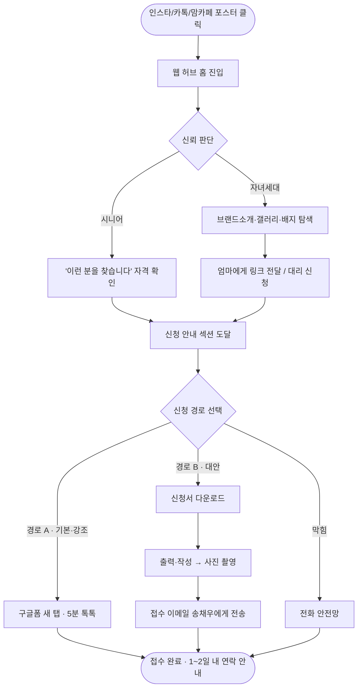
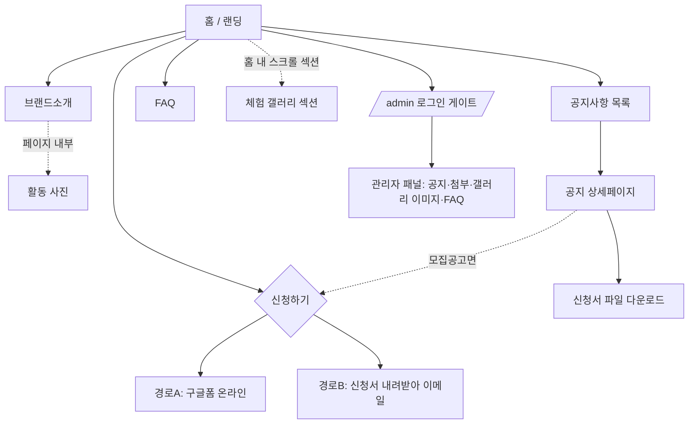
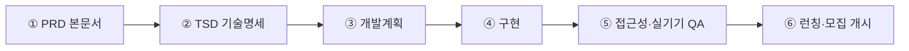

# 서울 이모삼촌 브랜드 웹사이트 — 제품 요구사항 명세서(PRD)

| 항목 | 값 |
|---|---|
| 문서명 | 서울 이모삼촌 브랜드 웹사이트 PRD |
| 버전 | v1.0 |
| 작성일 | 2026-07-22 |
| 상태 | 검토용 초안 |
| 관련 문서 | TSD.md (기술명세), 개발계획/일정표 |

> 문서 유형: Product Requirements Document (PRD)
> 프로젝트: 서울 이모삼촌 멀티채널 모집 퍼널 허브 웹사이트
> 작성 관점: Senior Product Manager
> 대상 릴리스: 2026년 하반기 공모 일정 내
> SDD 단계: **1단계 산출물(PRD)** — 이후 TSD(기술명세)·개발계획의 상위 기준 문서

---

## 1. 문서 개요 (Overview)

### 1.1 목적 (Purpose)

이 문서는 "서울 이모삼촌" 브랜드 웹사이트가 **무엇을, 누구를 위해, 왜** 제공해야 하는지를 정의한다. 디자인·UX·아키텍처 리서치를 제품 요구사항으로 통합해 **하나의 검증 가능한 기준선(single source of truth)**을 세우며, 후속 산출물(TSD, 개발계획)은 이 문서를 상위 근거로 삼는다.

이 사이트의 제품적 존재 이유는 한 문장으로 요약된다.

> **인스타·카톡·맘카페로 뿌려진 모집 포스터의 클릭을, "믿을 만한 브랜드 인상 + 실제 신청 완료"로 전환하는 허브.**

### 1.2 범위 (Scope)

| 구분 | 포함 여부 | 내용 |
|---|---|---|
| 공개 웹사이트 | ✅ In | 홈, 브랜드소개, 공지사항(목록/상세), FAQ, 신청 안내 |
| 체험 이벤트 갤러리 | ✅ In (축소) | **홈 스크롤 섹션 + 브랜드소개/공지 내부**의 관리자 큐레이션 이미지. 독립 `/gallery` 라우트·필터 CMS는 v2 (§6.2·§11) |
| 두 신청 경로 | ✅ In | (A) 구글폼 온라인, (B) 신청서 다운로드→이메일 |
| 관리자(/admin) | ✅ In | 비개발 창업자의 공지·첨부·갤러리 이미지·FAQ 셀프 운영 |
| 접근성/시니어 UX | ✅ In | WCAG 2.2 AA 최저선, 시니어 핵심요소 AAA 지향 |
| 측정·분석(경량, 쿠키리스) | ✅ In | KPI 측정을 위한 이벤트 트래킹 설계 필수(§3.2·§9.7) |
| 결제·예약·정산 시스템 | ❌ Out | 신청은 폼/이메일로만. 결제 없음 |
| 로그인 회원제(일반 사용자) | ❌ Out | 시니어/자녀에게 회원가입 요구하지 않음 |
| 다국어(영문) UI | ❌ Out (v1) | 한국어 우선. 향후 로드맵 |
| 손님(외국인) 예약 플로우 | ❌ Out (v1) | 본 사이트는 "시니어 모집"이 1차 목표 |

### 1.3 용어 정의 (Glossary)

| 용어 | 정의 |
|---|---|
| **시니어** | 만 60세 이상, 프로그램에 지원(취업)하려는 당사자. 본 사이트 1차 청중 |
| **자녀세대** | 시니어의 자녀·손주. 링크를 전달·대리 탐색·대리 신청하며 브랜드 신뢰를 판단하는 2차 청중 |
| **관리자(운영자)** | 비개발 운영자 **송채우**(로그인·접수 이메일 songchaewoo0@gmail.com). 공지·첨부·갤러리·FAQ를 직접 게시 |
| **대표자** | 팀 theOne 대표 **신승민**(harry147017@gachon.ac.kr). 사이트 하단(footer) 운영주체 정보로 표기 |
| **트랙1 / 트랙2** | 트랙1=쿠킹클래스(대표), 트랙2=나만의 특별함(로컬산책·트레킹·공예 등) |
| **경로 A / 경로 B** | 경로 A=구글폼 온라인 신청, 경로 B=신청서 파일 다운로드→작성→이메일 전송 |
| **모집 퍼널(funnel)** | 채널 노출 → 클릭 유입 → 브랜드 신뢰 → 신청 완료로 이어지는 전환 흐름 |
| **인앱 브라우저** | 카카오톡 등 앱 내부에서 링크를 여는 내장 브라우저(웹뷰) |
| **접수 이메일** | 경로 B 지원서(사진) 수신 = **songchaewoo0@gmail.com**(관리자 송채우). 개인 Gmail이므로 노출 최소화·향후 전용계정 전환 여지(§9.5) |
| **P0/P1/P2** | 개발 우선순위. P0=필수 선행, P1=핵심, P2=고도화 |

### 1.4 문서 상태 (Status)

| 항목 | 값 |
|---|---|
| 버전 | v1.0 (검토용 초안) |
| 상태 | **검토 대기** — §13 미해결 결정(⚠) 확정 후 v1.1로 승격 |
| 승인 필요자 | 팀 theOne 대표(신승민) |
| 후속 문서 | TSD(기술명세), 개발계획/일정표 |

---

## 2. 배경 & 문제 정의 (Background & Problem)

### 2.1 사업 맥락

- **서울 이모삼촌**은 만 60세 이상 시니어가 외국인 손님에게 전통시장 장보기 + 집밥 쿠킹클래스 + 로컬 체험을 제공하는 **유급 시니어 일자리 브랜드**(시급 2만원 수준 안). 무급 봉사가 아니다.
- 운영: 팀 theOne(대표 신승민, 3인), 개인사업자. 서울특별시50플러스재단 시니어일자리지원센터 후원, 2026 시니어 일자리 아이디어 경진대회 선정사업.
- 브랜드 서사: *"부엌은 빌릴 수 있어도 40년 단골 관계와 손맛, 평생의 이야기는 빌릴 수 없다. 60년을 살아야만 얻어지는 것만 판다."* 기반 지역은 망원시장(마포).

### 2.2 문제 정의 — 왜 웹 허브가 필요한가

모집은 여러 채널(인스타 피드 포스터+링크, 카톡·맘카페·밴드 공유)에서 시작되지만, 이 채널들은 **신뢰를 충분히 쌓거나 신청을 완결시키기에 부적합**하다.

| 채널만으로는 안 되는 이유 | 웹 허브가 해결하는 방식 |
|---|---|
| 포스터 한 장으로는 "유급 일자리"의 공신력·진정성을 전달 못 함 | 주최·후원 배지, 운영주체 투명 공개, 실제 활동 사진으로 신뢰 축적 |
| 인스타/카톡 안에서는 파일(신청서) 다운로드가 불안정·불가 | 공지 상세페이지에서 큰 버튼으로 안정적 다운로드 |
| 시니어가 "어디서 어떻게 신청?"을 잃어버림 | 두 신청 경로를 한 화면에 명확히, 전화 안전망까지 |
| 창업자가 새 공고·이슈를 계속 알릴 곳이 없음 | 관리자가 직접 공지 게시(살아있는 사이트) |

### 2.3 핵심 난제(제품적으로 가장 어려운 지점)

> 이 프로젝트의 진짜 난제는 "예쁜 화면"이 아니라 **두 개의 상반된 사용자(디지털 자신감 낮은 시니어 ↔ 세련됨을 요구하는 자녀세대)를 한 사이트로 동시에 만족**시키고, **비개발 창업자가 스스로 공지+첨부를 계속 올릴 수 있게** 하는 것이다.

리서치의 핵심 통찰: 두 청중은 **충돌하지 않는다.** 큰 글씨·명확한 CTA·넉넉한 여백은 접근성인 동시에 모던 랜딩의 미덕이다. 충돌 지점(작은 글씨·저대비·숨은 인터랙션)은 자녀세대에게도 사족이다. → **레이어링 전략**(상단=공통·따뜻, 중단=자녀 설득, 하단=시니어 실행)으로 해소한다.

> **현실 제약 추가 인식(신규):** 위 제품 난제와 별개로, **개발 리소스(누가·언제까지·얼마 예산으로 만드는가)가 확정되지 않은 것**이 전체 일정의 최상위 리스크다. 본 PRD는 이를 §13.2 가정에서 **명시적 확정 항목**으로 격상했다.

---

## 3. 목표 & 성공지표 (Goals & Success Metrics)

### 3.1 정성 목표 (Qualitative Goals)

1. **G1 — 신청 완결**: 65세 부모님이 자녀 도움 없이도 카톡 링크 → 신청 버튼까지 도달한다.
2. **G2 — 브랜드 신뢰**: 자녀세대가 3초 안에 "요즘 브랜드네, 믿을 만하다"고 느낀다.
3. **G3 — 셀프 운영 & 살아있는 사이트**: 비개발 창업자가 도움 없이 공지+첨부를 3분 내 게시하고, 게시 즉시(재빌드 대기 없이) 공개 페이지에 반영된다.
4. **G4 — 로컬 온기 유지**: 세련됨·접근성을 지키면서도 망원시장의 정(情)이 사라지지 않는다.

### 3.2 측정 가능 KPI (Measurable KPIs)

> **원칙 변경(중요):** 각 KPI에는 **측정 도구·이벤트 정의가 함께 정의되어야 한다**. 측정 설계가 없는 지표는 KPI로 채택하지 않는다. 아래 표의 "측정 방법"은 **요구사항**이며, 구현 명세는 §9.7(측정·분석 설계)에서 확정한다.

| # | 지표 | 목표값 | 측정 방법(요구) | 측정 가능성 |
|---|---|---|---|---|
| K1 | **신청 시작률**(웹 세션 → 신청 액션) | ≥ 15% | 신청 액션 = **구글폼 링크 클릭 이벤트** + **첨부 다운로드 클릭 이벤트**. 두 액션은 §9.7의 클라이언트 이벤트/프록시 라우트로 카운트(직링크만으로는 카운트 불가하므로 **다운로드는 앱 경유 링크 또는 클릭 이벤트로 계측**) | 측정 가능(계측 전제) |
| K2 | 신청 시작 → 완료(구글폼 제출) | ≥ 60% | 구글폼 응답 수 / 폼 클릭 이벤트 수 (근사) | 근사 측정 |
| K3 | **채널 유입**(인스타·카톡 등 외부 리퍼러) | 캠페인 기간 월 ≥ 500 세션 | 경량 분석 referrer/UTM | 측정 가능 |
| K4 | 모바일 세션 비율 | ≥ 80% | 경량 분석 디바이스 분류 | 측정 가능 |
| K5 | **첫 화면 로드**(느린 3G 기준 LCP) | ≤ 2.5s | Lighthouse / 실기기 | 측정 가능 |
| K6 | **접근성 점수** | Lighthouse a11y ≥ 95, 본문 대비 ≥ 7:1 | Lighthouse + WebAIM Contrast Checker + §10.4 실측표 | 측정 가능 |
| K7 | **첨부 다운로드 클릭 수** | 참고 지표(목표 미설정) | §9.7 다운로드 클릭 이벤트(직링크가 아닌 계측 경로) | 측정 가능(계측 전제) |
| K8 | **관리자 게시 성공률** | 창업자 단독 게시 성공 100% | 사용성 테스트 관찰 | 측정 가능 |
| K9 | 시니어 실사용 통과율 | 60세+ 관찰 테스트 1~2명 "신청 완료" 도달 | 유저 테스트 | 측정 가능 |

> **채택 제외:** 초안의 "이탈률(홈 3초 이내 이탈)"은 쿠키리스·저계측 환경에서 신뢰도 있게 측정하기 어렵고 개인정보 최소수집 원칙과 충돌하므로 **정식 KPI에서 제외**한다(정성 관찰로만 참고). 정밀 퍼널 추적 도구는 도입하지 않는다.
>
> **필수 전제:** K1·K2·K7은 §9.7의 계측이 구현되어야 성립한다. **첨부를 Storage 공개 URL 직링크로만 노출하면 다운로드 카운트가 원천 불가**하므로, 다운로드는 클릭 이벤트 계측 또는 앱 경유 다운로드 링크로 설계할 것(§7.4·§9.7). 분석 도구는 개인정보 최소·쿠키리스(예: Plausible / Vercel Analytics류)로 한정하며, 최종 선정은 §13 미해결.

---

## 4. 사용자 페르소나 (Personas)

### 4.1 페르소나 ① — 시니어 본인 "김순자 (67세)"

| 항목 | 내용 |
|---|---|
| 상황 | 망원동 거주. 40년 살림·손맛에 자신. 은퇴 후 "쓸모"와 약간의 수입을 원함 |
| 기기/환경 | 안드로이드 보급형폰, 시스템 글자 크게 켜둠, 카톡 인앱 브라우저로 링크 열람 |
| 디지털 수준 | 카톡·전화·사진은 능숙, 웹폼·파일 다운로드·이메일 첨부는 낮은 자신감 |
| **목표** | "내가 할 수 있는 일인지" 확인하고, 헤매지 않고 신청하기 |
| **불안** | 잘못 눌러 망칠까 봐 / 영어 못 하는데 되나 / 봉사인지 유급인지 / 폼 쓰다 막힐까 |
| 대표 시나리오 | 딸이 보낸 카톡 링크 클릭 → 큰 글씨로 "유급·영어 몰라도 OK" 확인 → "휴대폰으로 신청하기" 큰 버튼 → 구글폼 톡톡 → 완료. 막히면 전화 |
| 성공 조건 | 큰 글씨·고대비·한 화면 한 행동·**모바일 상단 상시 노출 글자크게 토글**·전화 안전망·"천천히 하셔도 돼요" 톤 |

### 4.2 페르소나 ② — 자녀세대 "이지현 (38세)"

| 항목 | 내용 |
|---|---|
| 상황 | 직장인. 은퇴한 엄마에게 어울릴 일자리를 대신 찾아봄 |
| 기기/환경 | 아이폰·데스크톱 병행, 인스타에서 포스터 발견 |
| **목표** | "이거 진짜 믿을 만한가? 사기·헛수고 아닌가"를 빠르게 판단하고 엄마 설득 |
| **불안** | 수상한 데 아닐까 / 무급 착취 아닐까 / 엄마가 상처받지 않을까 |
| 대표 시나리오 | 인스타 링크 → 세련된 랜딩·에디토리얼 갤러리·주최기관 배지 확인 → "유급 시급 2만원·서울시50플러스재단 선정" 근거 확인 → 엄마에게 링크 전달 또는 대리 신청 |
| 성공 조건 | 모던 미감·실제 활동 사진(스톡 금지)·공신력 배지·투명한 운영주체 정보 |

### 4.3 페르소나 ③ — 관리자/운영자 "송채우" (대표자: 신승민, footer 표기)

| 항목 | 내용 |
|---|---|
| 상황 | 팀 theOne 운영자(관리자). 개발자 아님. 공모 일정에 쫓김. 로그인·접수 이메일 songchaewoo0@gmail.com |
| 기기/환경 | 노트북·모바일. 카톡·구글 문서 수준의 IT 숙련 |
| **목표** | 새 모집공고·이슈가 생기면 스스로 빠르게 공지+신청서 파일을 올리기 |
| **불안** | 개발자 없이 못 고치면 어쩌나 / 실수로 사이트 깨질까 / 비용 폭탄 |
| 대표 시나리오 | /admin 로그인 → "새 공지 쓰기" → 제목·본문·카테고리 입력 → 신청서.pdf 드래그&드롭 → 게시 → 상세페이지에서 시니어가 다운로드 |
| 성공 조건 | 최소 필드·큰 라벨·드래그&드롭·미리보기·확인창·큰 한국어 토스트·**게시 즉시 반영**·1페이지 매뉴얼 |

---

## 5. 사용자 여정 맵 (User Journey)

### 5.1 전체 여정 — 인스타 유입 → 신청 완료



### 5.2 감정 곡선 & 이탈 위험 지점

| 단계 | 시니어 감정 | 이탈 위험 | 설계 대응 |
|---|---|---|---|
| 유입 직후 | "글씨 작아 안 보이면 나감" | ★★★ | 기본값 큰 글씨(19px)·고대비·**모바일 상단 글자크게 토글 상시 노출** |
| 신뢰 판단 | "봉사인가? 사기인가?" | ★★ | 히어로 근처 "유급·주최기관" 즉시 노출 |
| 자격 확인 | "영어 못 하는데…" | ★★ | "영어 못 해도 됩니다" 선제 해소 |
| 경로 선택 | "둘 중 뭘 눌러?" | ★★★ | A=강조 채움 / B=보조 아웃라인, 동시에 하나만 강조 |
| 폼 작성/전송 | "막히면 포기" | ★★★ | 전화 안전망 상시, "새 창이 열립니다" 예고 |
| 완료 | "된 건가?" | ★ | "1~2일 내 연락드려요" 확인 문구(자동 접수확인은 §7.6 참조) |

---

## 6. 정보구조(IA) & 사이트맵

### 6.1 상단 내비게이션 (요구 항목 유지, 최대 4 + CTA)

```
[ 서울 이모삼촌 로고 ]   브랜드소개 · 공지사항 · FAQ      가 | 가+ | [ 신청하기 ]
```

- 데스크톱: 로고 + 3개 메뉴 + 글자크게 토글 + **[신청하기]** 강조 버튼(라임그린 #D3E298 채움·어두운 글자).
- **모바일: 로고 + [신청하기] 상시 노출 + [가 / 가+] 글자크게 토글 상단 바 상시 노출 + "메뉴"(햄버거 아이콘 옆 글자 병기).**
  - **글자크게 토글은 햄버거 메뉴 안에 숨기지 않는다(§9.1 강행 규칙).** 저시력 시니어가 작은 글씨를 먼저 읽어야 토글에 도달하는 역설을 방지한다.
  - 햄버거를 열면 56px 높이 큰 목록 + 신청 버튼 반복.
- 활성 페이지: 밑줄+굵게+브랜드색. 라벨은 생활어 병기 검토(브랜드소개≈"우리 이야기", §13 미해결).
- **네비 클릭 = 별도 페이지 이동**(홈 내 앵커 스크롤 아님). 각 항목은 독립 라우트(`/about`·`/notice`·`/faq`)로 이동하고, 공지 상세도 별도 URL(`/notice/[id]`)을 갖는다(TSD §7.1 라우트 맵). *2026-07-22 피드백 반영.*

### 6.2 사이트맵 (깊이 최대 2단계) — **갤러리 = 홈 섹션으로 최종 확정**



**IA 확정 사항(TSD와 일치화):**
- **갤러리는 독립 `/gallery` 라우트를 신설하지 않는다.** 상단 내비 항목은 **4개 이하 + CTA 1개**로 고정하고, 갤러리는 **홈 스크롤 섹션 + 브랜드소개/공지 내부**에 배치한다.
- **v1 갤러리 = 관리자 큐레이션 이미지 수준으로 축소.** 별도 events 테이블·다중이미지·독립 필터 CMS·전용 라우트는 **v2 로드맵**으로 이동(§11). (초안 IA 원칙 ↔ 과설계 지적을 이 결정으로 동시 해소)
- 모든 페이지 상단에 큰 h1 페이지 제목. 상세페이지엔 브레드크럼("공지사항 › 시니어 모집공고") + "← 목록으로" 큰 버튼. 푸터에 "처음으로(홈)" 명시.

---

## 7. 페이지별 기능 요구사항

> 각 페이지: **목적 / 핵심요소 / 기능 / 수용기준(AC) / 우선순위(MoSCoW)**. AC는 Given–When–Then 또는 체크리스트.

### 7.0 전역 요구사항 (모든 페이지 공통)

| ID | 요구사항 | MoSCoW |
|---|---|---|
| GL-1 | 상단 스티키 내비(로고·3메뉴·**글자크게 토글**·신청 CTA), 모바일 상단 바에 글자크게 토글 상시 노출 | **Must** |
| GL-2 | "글자 크게(가/가+)" 2단계 토글, localStorage 유지, `aria-pressed` | **Must** |
| GL-3 | 푸터(운영주체 팀 theOne·**대표자 신승민**·**문의 harry147017@gachon.ac.kr**·**후원·협력 로고 마퀴**·사이트맵·"처음으로") | **Must** |
| GL-3b | **후원·협력 로고 배너**(무한 스크롤·회색→컬러 hover·hover 정지·`prefers-reduced-motion` 정지) — 서울시50플러스재단 등 | Should |
| GL-4 | 전역 접근성 토큰(폰트·대비·터치타깃) 기본 적용(§9.1) | **Must** |
| GL-5 | `prefers-reduced-motion` 존중, 자동재생·깜빡임 없음 | **Must** |
| GL-6 | 외부 이동(구글폼·메일) 시 "새 창이 열립니다" 예고 | **Should** |
| GL-7 | 에러·빈 상태·로딩·404 상태 화면 정의, 목록→상세 뒤로가기 시 **스크롤 위치 복원** | **Should** |

**전역 AC**
- [ ] 모든 페이지 본문 ≥ 18px(권장 19px), 캡션 ≥ 16px, 14px 이하 텍스트 없음
- [ ] 본문:배경 대비 ≥ 7:1, 모든 텍스트 ≥ 4.5:1, UI 경계 ≥ 3:1
- [ ] 모든 버튼/링크 터치타깃 ≥ 56px(하한 48px), 인접 간격 ≥ 12px
- [ ] 아이콘 단독 버튼 없음(텍스트 라벨 병기), 얇은 웨이트(≤300)·양쪽정렬 없음
- [ ] 360px 폭에서 가로 스크롤 없음, 200% 확대 시 요소 겹침 없음
- [ ] GL-2 글자크게 토글은 모바일에서도 상단 바에 노출(햄버거 매몰 금지)

---

### 7.1 홈 (Landing) — **Must**

**목적**: 3초 안에 정체성+행동 전달. 두 청중을 레이어링으로 동시 만족, 신청까지 2클릭 이내.

**렌더링 요구(중요):**
- 홈은 **최신 공지 3건·FAQ 핵심 등 동적 콘텐츠**를 담으므로 **순수 SSG를 사용하지 않는다.** 관리자가 공지를 게시하면 **재빌드 없이 반영**되도록 **ISR(Incremental Static Regeneration) 또는 동등한 재검증 전략**을 사용한다(G3 "살아있는 사이트" 요구와 정합). 구체 revalidate 전략·태그는 TSD에서 **하나로 통일**하여 확정.

**핵심요소 / 섹션 순서**

| # | 섹션 | 목적 | MoSCoW |
|---|---|---|---|
| 1 | **로고 히어로(애플 미니멀·중앙정렬)** — 대형 로고 + 아이브로우(`SEOUL 50+ 선정사업`) + 서사 헤드라인 + 서브카피 + 채운 CTA + 텍스트 링크 | 진입 즉시 로고·정체성·공신력 | Must |
| 2 | **최신 공지사항 카드**(포털형 카드 그리드·hover 반응·3~4건 + "공지 전체보기") | 살아있는 사이트·핵심 전환 | **Must** |
| 3 | 두 트랙 간단 소개(쿠킹클래스 / 나만의 특별함) | 참여방식 이해 | Should |
| 4 | 체험 갤러리 티저(현장 사진 그리드, 관리자 큐레이션) | 활기·현장 증명 | Should |
| 5 | 신청 CTA 밴드(두 경로 요약) | 전환 마무리 | Must |
| 6 | 푸터(운영주체·대표자·후원·바로가기) | 신뢰·연락 | Must |

> **디자인 방향(2026-07-22 피드백 반영):** ① 진입 시 **로고가 가장 먼저·크게** 보인다 — 대형 명조 서사 헤드라인은 배제(AI스러운 인상 회피). ② 로고 바로 아래 **일자리몽땅 스타일의 공지 카드**(hover 반응)로 최신 소식을 노출. ③ 배경은 **흰색 + 따뜻한 포인트** 톤(공공포털급 공신력 + 로컬 온기). ④ 상단 네비는 **별도 페이지로 이동**(홈 내 스크롤 아님, §6·§7 각 페이지).

**기능**
- 히어로(**애플 미니멀·중앙정렬 확정**, 2026-07-22 사용자 선택 = 시안 C): 대형 로고 → 아이브로우(`SEOUL 50+ 선정사업`) → **서사 헤드라인** → 서브카피 → CTA. **알약 배지 나열·문장 중간 볼드 제거**(AI스러운 인상 회피).
  - **헤드라인(확정 문구)**: "여러분만이 알고 있는 서울의 **‘로컬함’**을 알려주세요" (‘로컬함’=브랜드 키워드, 딥그린 강조).
  - **서브카피**: "만 60세 이상 시니어와 함께하는 유급 로컬 체험."
  - **CTA**: [신청하기](**딥그린 #4E6A18 채움·흰 글자·pill**) + "모집 공고 보기 ›"(텍스트 링크·딥그린). 큰 타이포·타이트한 자간·넉넉한 여백. *(2026-07-22: 솔리드 CTA는 딥그린 pill로 확정 = 시안 C 그대로.)*
- **최신 공지 카드(포털형)**: 태그(모집공고/안내/공지) + 제목 + 메타(대상·보수·마감 D-day) + 첨부 표시. **쉬는 상태에도 은은한 그림자로 떠 있는 느낌 + 둥근 모서리(22px)**, **hover 시 더 떠오름·하단 바 강조**(일자리몽땅형). 카드 클릭 → 공지 상세(§7.4)로 **페이지 이동**. + "공지 전체보기"(§7.3).
- 체험 갤러리 티저: 정돈된 카드 그리드, 클릭 시 라이트박스(좌우 화살표·닫기 48px+·ESC·바깥클릭, **버튼 대안 필수**). 필터는 v2.
- 은은한 스크롤 리빌(fade+up, ~400ms, 1회) — 모션 없이도 전 콘텐츠 도달.

**수용기준 (AC)**
- Given 카톡 인앱 브라우저 진입, When 첫 화면 렌더, Then **로고·헤드라인·[신청하기]**가 스크롤 없이 보인다.
- Given 관리자가 새 공지를 게시, When 시니어/자녀가 홈에 재진입, Then **재빌드 대기 없이** 최신 공지 3건에 반영된다.
- Given 홈 도달, When 사용자가 [신청하기]를 누른다, Then 2클릭 이내 신청 안내(§7.6)에 도달한다.
- [ ] 갤러리 각 이미지 alt 존재, 라이트박스 키보드 포커스 트랩
- [ ] `prefers-reduced-motion: reduce`에서 모든 정보·CTA 동일하게 접근 가능
- [ ] 사진 미로딩 시에도(alt) 의미 전달, 히어로 이미지 ≤ 300KB

---

### 7.2 브랜드소개 (About) — **Must**

**목적**: 자녀세대에게 신뢰를, 시니어에게 "나를 뽑는 곳"임을 전달. 브랜드 서사·운영주체·두 트랙 심화.

**핵심요소**: 큰 명조 헤드라인 서사, 팀 theOne·대표·개인사업자 정보, 주최·후원 로고, 두 트랙 상세, 실제 활동 사진.

**기능**: 스토리텔링 스크롤, 트랙별 설명 카드, 하단 신청 CTA 반복.

**수용기준**
- Given 자녀세대 방문, When 페이지를 읽는다, Then 운영주체·후원기관·"유급 시급 2만원 수준"이 명시되어 있다.
- [ ] "봉사가 아닌 유급 일자리"가 페이지 상단부에서 명확
- [ ] 스톡 외국인 모델 사진 미사용(진정성) — 초기 미확보 시 §10.4의 대체 규칙 적용
- [ ] 페이지 상단 큰 h1, 본문 대비 ≥ 7:1

---

### 7.3 공지사항 목록 (Notice List) — **Must**

**목적**: 모집공고·안내 이슈를 시니어가 스캔 가능하게. 모집 퍼널의 상세페이지 진입점.

**핵심요소**: 카드형 리스트(표 아님), 항목당 제목(H3)·날짜·카테고리 배지(모집공고/일반공지/이벤트)·📎첨부 표시.

**기능**
- 중요 모집공고 상단 고정(pin) + 강조 배지.
- 페이지네이션은 "더 보기" 버튼(무한스크롤 아님 — 시니어 통제감).
- 카테고리로 "모집공고"만 필터(선택).

**수용기준**
- Given 공지 목록, When 모집공고가 존재, Then 핀 고정 항목이 최상단에 강조 표시된다.
- [ ] 각 카드 터치타깃 ≥ 56px, 제목·날짜·배지가 색 외 신호(텍스트)로도 구분
- [ ] 첨부 있는 글은 📎 + "첨부" 텍스트 병기
- [ ] 목록 → 상세 이동 후 브라우저 뒤로가기로 **스크롤 위치 안전 복귀**(GL-7, TSD에 scroll restoration 대응 명시)

---

### 7.4 공지 상세 (Notice Detail + 첨부 다운로드) — **Must**

**목적**: 경로 B(신청서 다운로드)의 실제 종착점. 시니어 원클릭 다운로드.

**핵심요소**: 큰 제목·날짜·본문(Body-L), **첨부 다운로드 블록**, 신청 CTA 병기, 브레드크럼·"← 목록으로".

**본문 렌더링(신규 명시):** 관리자가 입력한 본문(마크다운/간단 서식)은 **마크다운 파서 + 새니타이저(sanitize)** 파이프라인을 거쳐 안전 HTML로 렌더한다. XSS 방어를 "문장 선언"이 아닌 **구현 라이브러리·렌더 경로로 TSD에 명시**한다.

**기능**
- 첨부 블록: 파일 아이콘 + 파일명 + **형식·용량 표기** + 큰 "내려받기" 버튼(48px+). 여러 개면 세로 리스트, **신청서를 최상단**에 노출.
  - 예: `📄 시니어 지원 신청서 양식 (PDF, 320KB) [ 내려받기 ▸ ]`
- **다운로드 파일명 요구(강화):** 사용자는 **원본(한글) 파일명**으로 저장받아야 한다. Storage 직링크의 HTML `download` 속성은 cross-origin에서 무시되므로, **Content-Disposition을 세팅하는 다운로드 링크**(예: Supabase `?download=<RFC 5987 인코딩 한글명>`)로 구현한다. UUID 파일명 노출 금지.
- **계측 요구(신규):** 다운로드 클릭은 §9.7 이벤트로 카운트 가능해야 한다(순수 직링크로만 두면 K1·K7 붕괴).
- HWP/HWPX 허용하되 "다운로드 후 한글/뷰어로 열기" 안내 병기.
- 모집공고 글은 하단에 "양식 없이 바로 신청" 구글폼 CTA 병기. 경로 B 절차 ①②③④ 크게.

**수용기준 (AC)**
- Given 첨부가 있는 공지, When 시니어가 "내려받기"를 누른다, Then **카톡 인앱 브라우저에서도** 파일이 실제 다운로드된다.
- Given 한글 파일명의 신청서, When 다운로드가 완료된다, Then 저장 파일명이 **원본 한글명**이다(UUID 아님).
- Given 여러 첨부, When 목록이 표시된다, Then **신청서가 최상단**에 온다(정렬 규칙은 TSD에서 파일유형 우선/정렬 UI로 보장).
- [ ] 다운로드 버튼에 형식·용량 자동 표기
- [ ] 파일명 XSS 방지(표시명 이스케이프)
- [ ] "다운로드 폴더에서 열기" 한 줄 안내(모바일)
- [ ] 상세 상단 브레드크럼 + "← 목록으로" 큰 링크 존재

**⚠ 릴리스 게이트 필수(§13.4 승격):**
- [ ] **카톡 인앱(iOS/안드로이드) 실기기에서 첨부 다운로드 성공** — 실패 시 "기본 브라우저로 열기" 탈출(스킴/intent) 실구현 (TSD 소관)
- [ ] **원본(한글) 파일명으로 저장 확인**
- [ ] **HWP/HWPX는 확장자 기준으로 허용**(빈 MIME/octet-stream이 정상 HWP를 반려하지 않아야 함)

---

### 7.5 FAQ — **Should**

**목적**: 시니어 핵심 불안(급여·자격·언어·안전) 선제 해소로 마지막 저항 제거.

**핵심요소**: 아코디언(질문 H3, 헤더 전체 탭영역 48px+, +/− 아이콘+색 변화). 시니어 핵심 질문 상단.

**기능**: 한 번에 하나만 열림 권장, 짧은 펼침(200ms). (audience 탭으로 시니어용/자녀용 분리는 **v1.1 이후**, P0 제외)

**대표 질문**: "영어 못 해도 되나요?" "급여는 얼마인가요?" "만 나이 상한 있나요?" "스마트폰 서툴러도 되나요?" "어디서 활동하나요?"

**수용기준**
- Given FAQ 페이지, When 헤더를 탭한다, Then 색+아이콘 변화로 열림/닫힘이 명확하다(색 단독 아님).
- [ ] 급여·자격·언어·안전 질문이 상단 배치
- [ ] 키보드로 아코디언 조작 가능, 포커스 표시 대비 ≥ 3:1

---

### 7.6 신청 안내 (Apply — 두 경로) — **Must**

**목적**: "헷갈리지 않게" 두 경로 제시. **쉬운 길 A를 기본·크게, B는 명확한 대안**. 전화 안전망.

**핵심요소 / 패턴**: Primary + Escape hatch

```
신청 방법을 골라 주세요. 둘 중 편한 방법이면 됩니다.

✅ 방법 1  가장 쉬워요 (휴대폰 5분)      ← 강조·채움(라임그린 #D3E298), 62px CTA
   [ 휴대폰으로 신청하기 ▶ ]  → 구글폼 새 탭

── 또는 ──

📄 방법 2  종이로 하고 싶으면            ← 보조·아웃라인
   ① [ 신청서 내려받기 ] (한글/PDF · 120KB)
   ② 작성 → ③ 사진 촬영
   ④ songchaewoo0@gmail.com 로 사진 전송
   [ 이메일 앱 열기 ]  [ 주소 복사 ]

☎ 어려우면 전화 주세요: 010-XXXX-XXXX    ← 최후 안전망
```

**기능**
- 경로 A: 구글폼 **새 탭 링크**(iframe 임베드 금지 — 모바일 이중 스크롤 회피), `target="_blank" rel="noopener"`. **카톡 인앱 웹뷰에서 `_blank`가 새 창으로 열리지 않거나 막힐 수 있으므로**, 진입 실패 시 "기본 브라우저로 열기" 유도/폴백을 TSD에서 실구현.
- 경로 B: 신청서 다운로드 + `mailto:` 프리필(제목·수신자 자동, **한글 완전 percent-encoding**) + **"주소 복사" 버튼 1순위**(mailto 실패 대비). 절차 ①②③④ 번호+아이콘.
  - **"주소 복사" 폴백은 조용히 실패하지 않는다:** 복사 성공/실패를 큰 한국어 토스트로 피드백(빈 catch 금지, clipboard 제약 환경 대비 대체 경로). (TSD 소관)
- 접수 이메일 = **songchaewoo0@gmail.com**(관리자 송채우), env·복사 버튼으로 노출(§9.5).
- 완료 안내: 두 경로 모두 "접수되면 1~2일 안에 전화/문자로 연락드려요". **자동 접수확인(자동응답 등) 제공 여부는 §13 미해결**(현재는 문구 안내만).

**수용기준 (헷갈림 방지 규칙 반영)**
- Given 신청 섹션, When 두 경로가 표시된다, Then A와 B는 **같은 크기·색으로 나란히 있지 않다**(A=강조, B=보조).
- Given mailto 미동작 환경, When 사용자가 이메일 전송을 원한다, Then "주소 복사" 버튼으로 주소를 복사할 수 있고 **성공/실패 피드백이 뜬다**.
- [ ] "누르면 새 창(구글폼/신청서)이 열립니다" 예고
- [ ] 이메일 주소를 타이핑하지 않고 복사/자동채움으로 처리
- [ ] 전화번호 안전망 상시 노출
- [ ] 외부로 나갔다 돌아와도 안내가 그대로(상태 유지)

---

### 7.7 관리자 (/admin) — **Must**

**목적**: 비개발 창업자가 도움 없이 공지+첨부+갤러리 이미지+FAQ를 게시·관리.

**핵심요소 / 기능**
- 로그인 게이트: Supabase Auth 이메일/비밀번호(관리자 계정 대시보드 수동 생성, 회원가입 UI 없음). 미들웨어 세션 가드 + **허용 관리자 이메일은 단일 소스로 관리**(미들웨어·서버 로직·DB 정책이 제각각 하드코딩되지 않도록, 팀 3인 확장 시 재배포 없이 확장 가능하게 — TSD에서 DB admins 테이블 또는 env 파싱 일원화로 확정).
- 공지 폼: 제목 · 본문(간단 서식/마크다운 미리보기) · 카테고리 · **파일 첨부(드래그&드롭 + 파일 선택)** · [게시]. 목록에서 [수정][숨김][삭제(확인창)].
- **첨부 생애주기 관리:** 편집 시 첨부 **추가/삭제/정렬 UI** 제공, 삭제·교체 시 **Storage 원본 객체도 함께 정리**(고아 파일 방지 — 무료 티어 잠식 대응). "신청서 위로" 정렬 규칙 확정.
- 갤러리 이미지·FAQ도 같은 단순 폼 패턴(v1 갤러리는 큐레이션 이미지 수준).
- 큰 한국어 성공/실패 토스트. 저장 전 미리보기.
- **게시 즉시 반영:** 게시 후 공개 페이지가 ISR/재검증으로 곧바로 갱신(§7.1).

**수용기준**
- Given 창업자 로그인, When "새 공지 쓰기"로 제목·본문·신청서.pdf를 넣고 게시, Then **도움 없이 3분 내** 완료되고 상세페이지에서 다운로드 가능하다.
- Given 10MB 이하 첨부, When 업로드한다, Then **실제로 업로드가 성립한다**(플랫폼 요청 본문 한계로 실패하지 않도록 TSD에서 클라이언트→Storage 직접 업로드로 설계).
- Given 비인가 접근, When /admin/* 요청, Then 로그인+이메일 화이트리스트로 차단(DB RLS로 이중 방어).
- Given 팀 관리자 2명 이상 등록, When 각 관리자가 로그인, Then **모두 정상 인가**된다(문자열 전체 비교 버그로 거부되지 않음).
- [ ] 파일 검증: **확장자 화이트리스트 1차**(.pdf .doc .docx .hwp .hwpx .jpg .png), MIME은 보조, 최대 10MB, 서버 최종 검증
- [ ] 삭제는 확인창, 실수 방지 문구, Storage 객체 동반 정리
- [ ] service role 키 클라이언트 미노출, 업로드는 인증된 사용자 세션으로 수행
- [ ] 1페이지 캡처 운영 매뉴얼 동반

---

## 8. 콘텐츠 모델 (제품 관점)

> 저장 항목을 "제품이 담아야 할 정보"로 정의. 물리 스키마는 TSD 소관.

### 8.1 공지 (Notice)

| 항목 | 설명 | 필수 |
|---|---|---|
| 제목 | 공지 제목 | ✅ |
| 본문 | 공지 내용(마크다운/간단 서식, 렌더 시 sanitize) | ✅ |
| 카테고리 | 모집공고 / 일반공지 / 이벤트 | ✅ |
| 게시 여부 | 공개/숨김 | ✅ |
| 상단 고정 | 중요 공고 핀 | — |
| 게시일 | 정렬·표시 기준 | ✅ |
| 첨부파일 | 0~N개(아래) | — |

### 8.2 첨부파일 (Attachment)

| 항목 | 설명 | 필수 |
|---|---|---|
| 원본 표시명 | 화면 노출 + **다운로드 파일명(한글)** 기준 | ✅ |
| 저장 경로 | 스토리지 내 위치(UUID 저장, 단일 버킷 + prefix 권장) | ✅ |
| 형식(MIME/확장자) | 검증은 확장자 우선, 표기용 | ✅ |
| 용량 | 다운로드 버튼 표기용 | ✅ |
| 파일 유형/정렬순서 | **신청서 우선** 정렬 보장 | ✅ |

### 8.3 체험 이벤트 이미지 (Gallery, v1 축소)

| 항목 | 설명 | 필수 |
|---|---|---|
| 이미지 | 큐레이션 사진 | ✅ |
| 캡션/alt | 대체텍스트·짧은 설명 | ✅ |
| 트랙(선택 태그) | 쿠킹클래스 / 나만의 특별함 | — |
| 정렬순서 | 노출 순서 | — |
| 게시 여부 | 공개/숨김 | ✅ |

> v1은 위 수준으로 축소한다. **다중이미지 jsonb·진행일·독립 events 도메인은 v2**(§11).

### 8.4 FAQ

| 항목 | 설명 | 필수 |
|---|---|---|
| 질문 | 질문 텍스트 | ✅ |
| 답변 | 답변 텍스트 | ✅ |
| 대상 | 시니어 / 자녀세대 / 공통 (audience 탭 노출은 v1.1) | — |
| 정렬순서 | 노출 순서 | — |
| 게시 여부 | 공개/숨김 | ✅ |

---

## 9. 비기능 요구사항 (NFR)

### 9.1 접근성 (시니어 친화 상세 — WCAG 2.2 AA 최저선, 핵심요소 AAA 지향)

| 영역 | 기준 | MoSCoW |
|---|---|---|
| 본문 폰트 | ≥ 18px(권장 19px), 캡션 ≥ 16px, 라인하이트 1.6~1.75 | Must |
| 폰트 | Pretendard 우선(무료, self-host), 얇은 웨이트(≤300) 금지, fallback 스택 | Must |
| 대비 | 본문:배경 ≥ 7:1, 텍스트 ≥ 4.5:1, UI 경계 ≥ 3:1 | Must |
| 색 사용 | 색 단독 의미전달 금지(링크=밑줄, 에러=아이콘+텍스트, 필수="필수" 배지) | Must |
| 터치타깃 | ≥ 56px(하한 48px), 간격 ≥ 12px, 채운 버튼 | Must |
| 폼 | 라벨 상시(placeholder 라벨 대용 금지), tel/email/inputmode/autocomplete, 에러 필드 아래 구체 문장+첫 에러 포커스 | Must |
| **글자크게 토글(강행 규칙)** | 2단계(기본↔125%), localStorage, `aria-pressed`. **모바일 상단 바에 상시 노출(햄버거 안에 매몰 금지)**. 시스템 확대 존중(rem+%). **vw 지배 헤딩도 토글 확대가 비례 반영되도록 처리**(clamp의 vw 구간이 토글을 무시하지 않게 — TSD 소관) | Must |
| 시맨틱/SR | h1~h3 위계, nav/main/footer, 모든 이미지 alt, 키보드 전탐색, 포커스 링 ≥ 3:1, `lang="ko"` | Must |
| 모션 | `prefers-reduced-motion` 존중, 자동재생·깜빡임 없음, 모션=장식 한정 | Must |
| 3단계 확대 검토 | 시니어 대상 특성상 150% 3단계 토글 v1.1 검토 | Could |

### 9.2 성능

| 항목 | 목표 | MoSCoW |
|---|---|---|
| LCP(느린 3G) | ≤ 2.5s | Must |
| 공개 페이지 | **동적 콘텐츠 페이지는 ISR**(홈·공지), 정적 페이지는 SSG. 순수 SSG로 살아있는 콘텐츠를 막지 않는다 | Must |
| 이미지 | webp(폴백 jpg), 히어로 ≤ 300KB·썸네일 ≤ 120KB, `loading="lazy"` | Must |
| JS | 과다 모션 라이브러리 지양(시니어 저사양폰 버벅임 방지), 모션 스택 단일화(IO+CSS) | Should |
| Lighthouse | Performance ≥ 90, a11y ≥ 95 | Should |

### 9.3 모바일/반응형

- **모바일 우선**(360px~). 세로 스크롤 랜딩 구조. 가로 제스처 의존 금지(버튼 대안).
- **카톡 인앱 브라우저 실기기 검증 필수**(폰트·레이아웃·다운로드·mailto·`_blank` 동작).
- 데스크톱은 12컬럼 max-width 1160~1240px.

### 9.4 브라우저 지원

| 대상 | 지원 |
|---|---|
| 모바일 | 안드로이드 Chrome(보급형폰), iOS Safari, **카카오톡 인앱 브라우저** |
| 데스크톱 | 최신 Chrome/Edge/Safari/Firefox |
| 정책 | `color-scheme: light` 고정(다크 강제반전 방지, MVP 라이트 단일) |

### 9.5 보안 · 개인정보 (재기술 — "미저장"이 의무 면제가 아님)

| 항목 | 요구 | MoSCoW |
|---|---|---|
| 개인정보 저장 최소화 | 사이트 DB에 지원자 개인정보 **미저장**(구글폼=Google, 경로B=이메일 수신). **단, 이는 컨트롤러 의무의 면제가 아니다** | Must |
| **수집주체 고지·동의** | 지원자 PII는 실제로 **구글폼(Google)·접수 이메일**에 수집됨. 공공 지원사업 요건에 따라 **수집·이용 동의, 위탁/제3자(Google) 고지, 개인정보처리방침**을 신청 경로에 제공 | **Must** |
| **접수 이메일 정책** | 접수 = **songchaewoo0@gmail.com**(관리자 송채우). 개인 Gmail이므로 코드·mailto에 평문 산재 없이 **env(`NEXT_PUBLIC_APPLICATION_EMAIL`) + 난독/복사 버튼**으로만 노출(봇 수집 최소화), 향후 전용계정 전환 여지 유지 | **Must** |
| RLS | 공개 콘텐츠 읽기=anon, 쓰기/삭제=관리자만. Storage 정책 동일 | Must |
| 관리자 인증 | 회원가입 UI 없음, 관리자 이메일 **단일 소스**, service role 키 클라 미노출, 로그인 레이트리밋 검토 | Must |
| 파일 검증 | **확장자 화이트리스트 1차** + MIME 보조 + 용량(≤10MB) 서버 최종 검증, UUID 저장명 | Must |
| 첨부 공개 | 신청서·공고문은 **public**(배포 목적, 민감정보 아님) — 단일 버킷 + 경로 prefix | Must |
| 보안 헤더 | **CSP·X-Frame-Options 등 보안 헤더 설정**, 마크다운 렌더 sanitize와 함께 명시 | Should |

> **⚠ 미해결(§13):** 개인정보처리방침·이용약관 페이지 필요 범위 / 분석 도구(개인정보 최소) 선정. *(접수·관리자 이메일 songchaewoo0@gmail.com·관리자 송채우·대표자 신승민은 확정됨)*

### 9.6 SEO / OG (인스타·카톡 유입)

| 항목 | 요구 | MoSCoW |
|---|---|---|
| OG 태그 | 카톡·인스타 공유 시 썸네일·제목·설명 정상 노출. **v1은 정적 1200×630 OG 이미지로 충분**(동적 OG 생성은 v2) | Must |
| 메타 | `<title>` 페이지별 명확, description, `lang="ko"` | Must |
| 구조 | 시맨틱 HTML, 정적/ISR 렌더로 크롤 용이 (JSON-LD 구조화 데이터는 P0 제외) | Should |
| 도메인 | 신뢰 도메인(.com/.co.kr) | Should |

### 9.7 측정 · 분석 설계 (신규 — KPI 실측을 위한 필수 요구)

> §3.2 KPI가 실제로 측정되려면 아래 계측이 **구현되어야 한다**. 계측 없는 KPI는 폐기한다.

| 항목 | 요구 | MoSCoW |
|---|---|---|
| 분석 도구 | **쿠키리스·개인정보 최소** 분석(예: Plausible / Vercel Analytics류). 정밀 리타게팅·크로스사이트 추적 금지 | **Must** |
| 구글폼 클릭 이벤트 | 경로 A CTA 클릭을 이벤트로 카운트(K1·K2) | **Must** |
| 다운로드 클릭 이벤트 | 첨부 "내려받기" 클릭을 이벤트로 카운트(K1·K7). **순수 Storage 직링크로만 두지 않는다**(클릭 이벤트 또는 앱 경유 다운로드 링크로 계측) | **Must** |
| 유입/디바이스 | referrer/UTM·디바이스 분류(K3·K4) | Must |
| 개인정보 고지 | 분석이 개인정보 수집을 최소화함을 처리방침에 반영 | Should |

---

## 10. 디자인 원칙 & 브랜드 톤앤매너

### 10.1 North Star

> **"손주가 봤을 때 '요즘 브랜드네' 싶고, 그 폰을 넘겨받은 60세 어머니가 헤매지 않고 '신청' 버튼을 누를 수 있는가?"**

### 10.2 절대 원칙 3가지

1. 멋을 위해 가독성을 희생하지 않는다(본문 ≥ 18px, CTA ≥ 20px).
2. 모션은 "은은한 활기"까지만. 시니어가 어지럽거나 놓치면 실패.
3. 신청까지 항상 2클릭 이내.

### 10.3 레이어링(같은 페이지, 위→아래로 청중 분화)

| 레이어 | 청중 | 톤 |
|---|---|---|
| 상단(히어로) | 공통 | 큰 헤드라인·따뜻한 사진·명확 CTA |
| 중단(서사·갤러리) | 자녀세대 | 에디토리얼·은은한 모션·감성 카피 |
| 하단(자격·신청·FAQ) | 시니어 | 큰 버튼·단계 안내·전화번호 |

### 10.4 브랜드 톤앤매너 & 배색 대비 실측 의무

- **무드**: 공공기관처럼 믿음직한 **흰 배경** 위에, 서울이모삼촌의 **대표 컬러 라임그린**(#D3E298 — 제철 채소·시장의 싱그러움, 시니어의 활기)을 얹는다. '일자리몽땅' 같은 공신력 + 로컬 온기. (2026-07-22 피드백: **대표 컬러 = #D3E298**)
- **컬러**: 흰색 배경(#FFFFFF) 메인 + 옅은 라임 보조면(#F4F7EA, 교차 섹션) + **대표 라임그린 #D3E298**(배지·태그·하이라이트 **배경**, 반드시 **어두운 글자** 동반) + **진한 라임(딥그린) #4E6A18**(**솔리드 CTA 버튼**·흰 글자·pill / 링크·라벨·흰글자 바) + 차콜 텍스트(#23201C). 골드(#C79438)는 보조 악센트(안내 태그). 순흑 지양. *역할 분담: 라임=브랜드 액센트 배경, 딥그린=액션(버튼·링크).*
- **⚠ 라임그린 사용 규칙(접근성 필수):** #D3E298은 밝아 **흰 글자(1.4:1)·텍스트색(1.4:1) 모두 불가**. 반드시 **배경으로만** 쓰고 그 위 글자는 어두운색(#24310D, ≈11.7:1). 링크·텍스트가 라임이어야 하는 곳은 **딥그린 #4E6A18**(≈6.2:1)로 대체.
- **배색 대비 실측 의무(강화):** 아래 **모든 전경/배경 조합의 실측 대비값을 TSD 디자인 토큰에 기재**하고, **텍스트로 쓰는 색은 4.5:1(본문 7:1) 미달 시 텍스트색으로 사용 금지**한다.

| 전경 | 배경 | 용도 | 요구 | 실측값(TSD §9.3 확정) |
|---|---|---|---|---|
| 차콜 #23201C | 흰색 #FFFFFF | 본문 | ≥ 7:1 | ≈ 16:1 ✅ AAA |
| 딥올리브 #24310D | 라임 #D3E298 | **대표 버튼·배지 글자** | ≥ 4.5:1 | ≈ 11.7:1 ✅ AAA |
| 흰색 #FFFFFF | 라임 #D3E298 | ❌ CTA 흰 글자 | ≥ 4.5:1 | ≈ 1.4:1 ✗ 금지 |
| 라임 #D3E298 | 흰색 | ❌ 링크·텍스트색 | ≥ 4.5:1 | ≈ 1.4:1 ✗ 금지 |
| 딥그린 #4E6A18 | 흰색 | 링크·라벨·강조 텍스트 | ≥ 4.5:1 | ≈ 6.2:1 ✅ AA |
| 흰색 #FFFFFF | 딥그린 #4E6A18 | 흰글자 바·활성 토글 | ≥ 4.5:1 | ≈ 6.2:1 ✅ AA |
| 골드 #C79438 | 흰색 | 배지/악센트 | **텍스트 사용 시 미달 → 배경/보더로만** | ≈ 2.4:1 ✗(텍스트 금지) |
| 서브텍스트 #6E665C | 흰색 | 캡션/보조(≥16px) | ≥ 4.5:1 | ≈ 5.7:1 ✅ AA |

- **타이포**: 전 사이트 **Noto Sans KR 단일 통일**(가변 100–900, 2026-07-22 사용자 결정) — 본문·헤딩·버튼·브랜드명 모두 하나의 폰트. 브랜드명은 700. 폴백 Pretendard. 명조·대형 서사 헤드라인은 쓰지 않는다(AI스러운 인상 회피).
- **카피**: 헤드라인은 감성("빌릴 수 없는 것을 팝니다"), 실행 안내는 다정한 구어("천천히 하셔도 돼요").
- **사진**: 손·표정 클로즈업, 시니어↔손님 상호작용, 망원시장 장소성. 다큐·리포타주 질감. **스톡·과보정 금지**(진정성=브랜드 자산). 초상권 확보 컷만. **미확보 시 대체 규칙**: 손·음식·현장(장소성) 위주 컷으로 운용.

---

## 11. 범위 밖 (Out of Scope) & 향후 로드맵

### 11.1 v1 범위 밖

| 항목 | 사유 |
|---|---|
| 결제·예약·정산 시스템 | 신청은 폼/이메일로만. 사업 단계상 불필요 |
| 손님(외국인) 예약·다국어 UI | 1차 목표는 시니어 모집. 영문화는 후속 |
| 일반 사용자 회원제/로그인 | 시니어·자녀에게 가입 부담 지우지 않음 |
| 다크모드 | 시니어 대비 예측 불가. 라이트 단일 |
| **독립 갤러리 CMS**(events 도메인·다중이미지·필터·전용 라우트) | v1은 홈 섹션 큐레이션으로 축소(§6.2) |
| **동적 OG 이미지·JSON-LD·FAQ audience 탭** | 복잡도 대비 효용 낮음. 정적/후속으로 |
| 고급 CMS 서식(임베드·복잡 레이아웃) | 관리 단순성 우선 |
| 정밀 마케팅 분석/리타게팅 | 개인정보 최소수집 원칙(쿠키리스 경량 분석만 §9.7) |

### 11.2 향후 로드맵

| 단계 | 후보 기능 |
|---|---|
| v1.1 | 고대비/3단계 글자크게 토글, FAQ audience 탭 분리 |
| v2 | **독립 갤러리 CMS**(필터·다중이미지·전용 라우트), 동적 OG, JSON-LD |
| v2 | 영문(손님용) 페이지, 손님 예약/문의 플로우 |
| v2 | 후기·인터뷰 콘텐츠, 카카오 채널 연동 문의 창구 |
| v2 | 팀 3인 공동 관리(관리자 단일 소스 기반 확장) |
| v3 | 다크 토큰(자녀세대 대응, 대비 재검증 전제) |

---

## 12. 마일스톤 / 일정 (공모 일정 정렬 · SDD 단계)

### 12.1 SDD 산출물 흐름



### 12.2 개발 마일스톤

| 단계 | 산출물 | 핵심 내용 | 우선순위 |
|---|---|---|---|
| M0 | 확정 | **§13 미해결 결정 확정(특히 개발 리소스·호스팅·도메인)**, TSD 착수 | — |
| M1 | 기반 | 접근성 토큰·상단 내비(**모바일 글자크게 토글 상시**)·홈 골격(ISR)·신뢰 배지 | **P0** |
| M2 | 퍼널 핵심 | 공지 목록/상세 + **첨부 다운로드(원본 파일명·계측)** + **관리자 업로드(직접 업로드·10MB 성립·생애주기)** | **P0** |
| M3 | 전환 | 신청 두 경로 안내(A 강조/B 대안) + 전화 안전망 + **카톡 인앱 폴백** | **P0** |
| M4 | 콘텐츠 | 브랜드소개·체험 갤러리 섹션·FAQ + 관리자 폼 확장 | P1 |
| M5 | 신뢰·검증 | **측정·분석 계측 검증**, **카톡 인앱·실기기 QA**, 60세+ 관찰 테스트 | P1 |
| M6 | 고도화 | 갤러리 모션·에디토리얼 레이어 심화·고대비 토글 | P2 |
| M7 | 런칭 | 도메인 연결·배포·1페이지 운영 매뉴얼·모집 개시 | P0 |

> **마감 리스크 대응(한 방향 확정 권장):** 개발 리소스 부족 시 **1차 릴리스=공지+첨부+구글폼(M1~M3)만으로 모집 개시**, 갤러리·FAQ는 후속(M4~) 병행. **"노코드 임시 런칭 후 커스텀 이관"은 사실상 두 번 만드는 전략**이므로, M0에서 **커스텀 vs 노코드를 한 방향으로 확정**한다(재작업 비용 명기). 호스팅 이관(예: Cloudflare)도 드롭인이 아니므로 착수 전 결론.

---

## 13. 리스크 & 가정 & 미해결 결정

### 13.1 리스크 매트릭스

| 리스크 | 영향 | 가능성 | 완화 |
|---|---|---|---|
| **개발 리소스 미확정(누가·언제·예산)** | **높음** | **높음** | **M0에서 개발 담당·예산·가용 공수 확정(§13.2). 최상위 리스크** |
| 시니어 파일 다운로드/열기 실패(카톡 인앱·HWP) | 높음 | 중 | PDF 우선 배포, 뷰어 안내, 인앱 실기기 검증, **기본 브라우저 탈출 실구현**, **HWP 확장자 기준 허용** |
| 10MB 업로드 플랫폼 한계로 실패 | 높음 | 중 | **클라이언트→Storage 직접 업로드**로 설계(플랫폼 요청 본문 한계 회피) |
| 다운로드가 UUID 파일명으로 저장 | 중 | 중 | **Content-Disposition + 한글 인코딩**으로 원본명 지정 |
| 고아 Storage 파일 누적(무료 티어 잠식) | 중 | 중 | 삭제·교체 시 Storage 정리 로직 |
| 비개발 관리 UI 실사용 실패 | 높음 | 중 | 폼 극단 단순화 + 1페이지 매뉴얼 + 창업자 사용성 테스트 |
| `mailto`/"주소 복사" 무반응 → 경로 B 이탈 | 중 | 중 | 복사 성공/실패 피드백 구현, 전화 안전망 |
| KPI 측정 불가(계측 부재) | 중 | 중 | §9.7 이벤트 계측 필수화 |
| 무료 티어 제약(자동 일시정지·상업성 약관) | 높음 | 중 | 헬스핑 크론 실행주체 지정, 호스팅 상업성 착수 전 결론(TSD) |
| 개인정보 고지 미비(공공 요건) | 중 | 중 | 처리방침·수집동의·위탁고지, 접수=songchaewoo0@gmail.com(env·복사 버튼) |
| 실제 활동 사진(초상권) 미확보 | 중 | 중 | 동의 확보 컷만, 미확보 시 손·음식·현장 위주 |
| 세련됨↔접근성 균형 실패 | 중 | 저 | 레이어링 원칙·릴리스 게이트 체크리스트 |

### 13.2 가정 (Assumptions)

- 구글폼은 팀이 별도 구성·유지하며 URL을 사이트에 연결한다(폼 문항 설계는 본 문서 밖).
- 신청서 양식(한글/PDF) 원본은 팀이 제작해 관리자로 업로드한다.
- 관리자(운영자)는 **송채우 단독**(songchaewoo0@gmail.com). 대표자는 **신승민**(harry147017@gachon.ac.kr, footer 표기). 팀 3인 공동은 후속 확장(관리자 이메일 단일 소스 전제).
- 인프라비는 지원금 375만원 내 무료/저비용으로 감당, 예산은 개발·디자인 공수에 집중.
- **⚠ 개발 리소스(신규·최상위 확정 항목):** **개발 담당자(내부/외주), 개발 예산 배분, 마감까지 가용 공수**를 M0에서 명시적으로 확정한다. 이 항목이 미확정이면 §12 일정 전체의 신뢰도가 성립하지 않는다.

### 13.3 미해결 결정 (⚠ 확정 필요 — 승인 전 clarify)

- [ ] ⚠ **개발 리소스**: 개발 담당(내부/외주)·예산·마감까지 가용 공수. **(최상위)**
- [ ] ⚠ **호스팅 상업성/일시정지 대응**: Vercel Hobby 상업성 결론, Supabase 7일 정지 방지 헬스핑 실행주체(Vercel Cron/GitHub Actions), CF 이관 여부(재작업 비용 전제) — 착수 전 확정.
- [x] ✅ **접수/관리자 이메일 확정**: songchaewoo0@gmail.com(관리자 송채우). 개인 Gmail — 노출 최소화, 향후 전용계정 전환 여지.
- [x] ✅ **관리자/대표자 확정**: 운영자 송채우 단독(로그인·접수), 대표자 신승민(footer). 팀 3인 공동은 v2.
- [x] ✅ **화면 표기 브랜드명 확정**: **"서울이모삼촌"**(붙여쓰기). 헤더·히어로·푸터·OG 표기 일원화.
- [x] ✅ **브랜드 로고 이미지 확보**: 원본 1024² 투명 PNG (`08_개발/assets/logo.png`), 시안 적용 완료. 빌드 시 favicon·OG·반응형 파생 최적화.
- [ ] ⚠ **후원·협력사 로고**: 서울시50플러스재단 로고 확보·적용(`08_개발/assets/Seoul50plus_logo.png`). 그 외 협력사(시니어일자리지원센터·서울시·마포구·망원시장 등)는 실제 확정·로고 수급 필요 — 시안은 텍스트 placeholder.
- [ ] ⚠ **공지 본문 서식 수준**: 마크다운/간단 서식 충분 vs 이미지 삽입·풍부 서식.
- [ ] ⚠ **신청서 파일 포맷**: PDF 단일 vs HWP 동시 배포.
- [ ] ⚠ **경로 B 대체 문의 창구**: 이메일 외 카카오 채널/전화 추가 여부, 노출 전화번호 확정.
- [ ] ⚠ **자동 접수확인**: 구글폼/이메일 자동응답 제공 여부.
- [ ] ⚠ **도메인**: 도메인명·구매 주체(명의) 확정.
- [ ] ⚠ **개인정보 고지 범위**: 개인정보처리방침·이용약관 페이지 필요 여부(공공 요건).
- [ ] ⚠ **분석 도구**: KPI 측정용 경량·쿠키리스 분석 도구 선정.
- [ ] ⚠ **네비 라벨**: "브랜드소개" 표준어 유지 vs "우리 이야기" 생활어 병기/대체.

### 13.4 릴리스 게이트 체크리스트 (승인 전 최종 검증)

- [ ] 본문 ≥18px·CTA ≥20px·얇은 웨이트 미사용, 텍스트 대비 AA(본문 AAA 지향), **배색 실측표 기재 완료**
- [ ] 색 단독 정보전달 없음, 탭 타깃 ≥48px, 신청 2클릭 이내·두 경로 노출
- [ ] **모바일 상단 바에 글자크게 토글 상시 노출**(햄버거 매몰 없음)
- [ ] `prefers-reduced-motion` 대응·자동재생 없음, 키보드/포커스/라이트박스 트랩
- [ ] 모든 이미지 alt·폼 라벨, 360px 가로 스크롤 없음, 목록↔상세 스크롤 복원
- [ ] 다운로드 버튼 형식·용량 표기, **카톡 인앱 실기기 다운로드 성공**, **원본(한글) 파일명 저장 확인**, **HWP 확장자 기준 허용**
- [ ] 10MB 첨부 업로드 실제 성립(직접 업로드), 삭제·교체 시 Storage 정리
- [ ] **KPI 계측(구글폼 클릭·다운로드 클릭·referrer) 동작 확인**
- [ ] 개인정보 처리방침·수집동의·위탁고지 노출, **접수처=songchaewoo0@gmail.com(env·복사 버튼)**
- [ ] "도와드립니다" 오프라인 지원 채널(전화) 상시 노출
- [ ] 관리자 3분 내 게시 성공(창업자 사용성 테스트 통과), 게시 즉시 반영(ISR)
- [ ] 60세+ 실사용자 관찰 테스트에서 "신청 완료" 도달

---

*본 PRD(v1.0, 검토용 초안)는 SDD 흐름의 첫 산출물이며, §13.3의 미해결 결정 확정 후 v1.1로 승격하여 TSD·개발계획의 상위 기준으로 사용한다. 상세 구현 명세(업로드 아키텍처·다운로드 파일명·MIME 검증·관리자 이메일 단일 소스·분석 계측·본문 sanitize·보안 헤더·카톡 인앱 폴백·접근성 토큰 보정·과설계 축소)는 TSD 최종본에서 확정한다.*