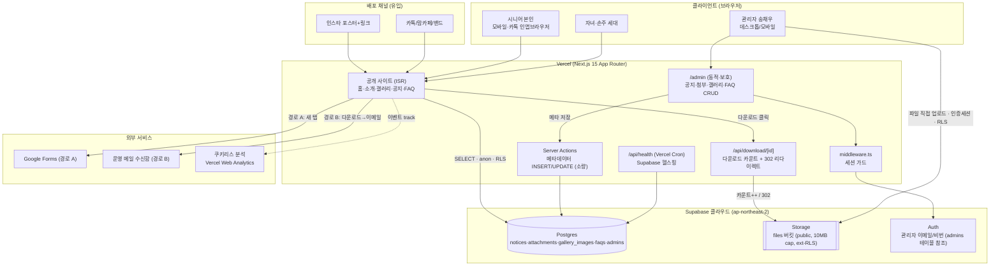
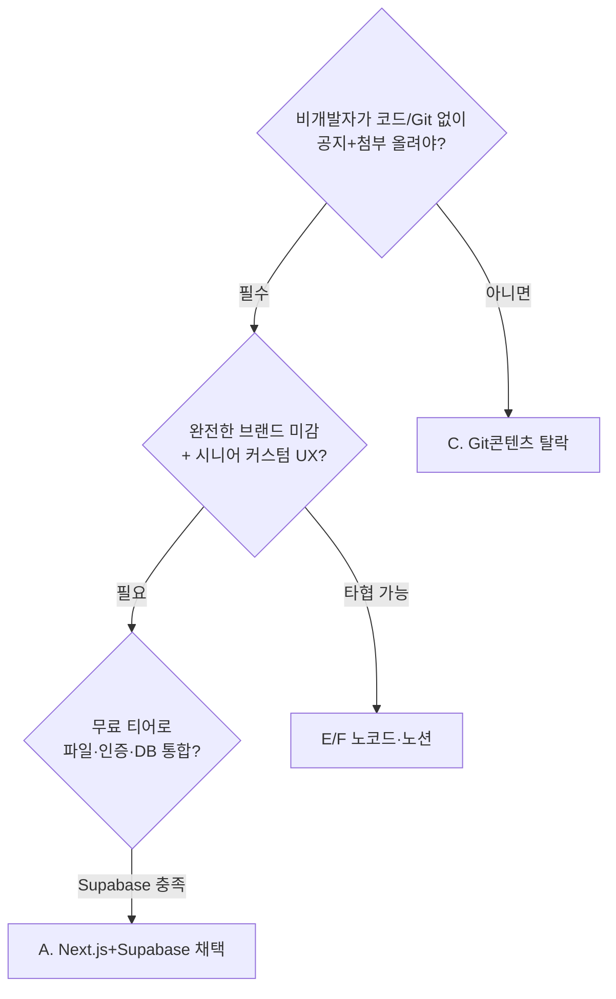
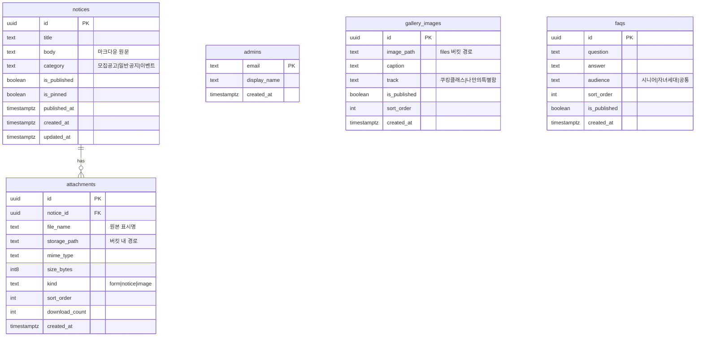
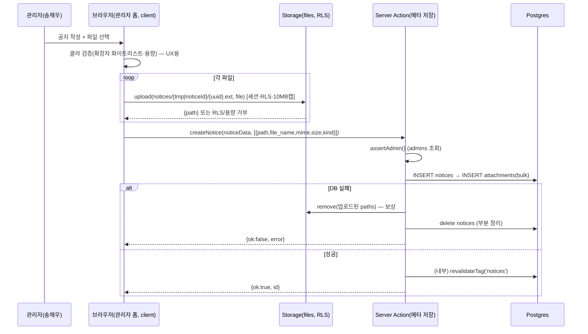
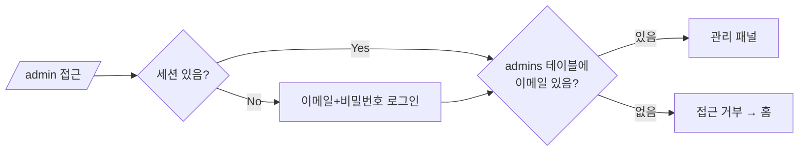
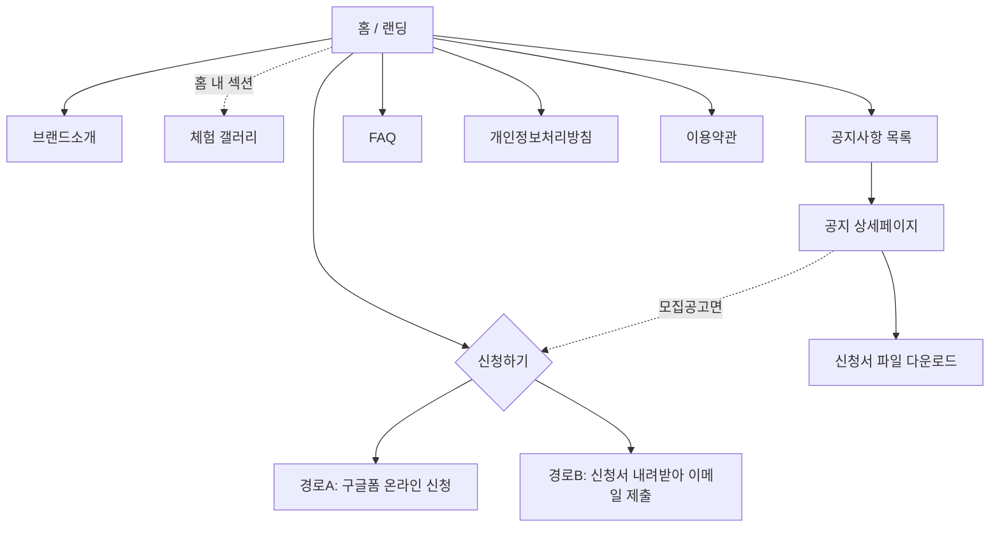
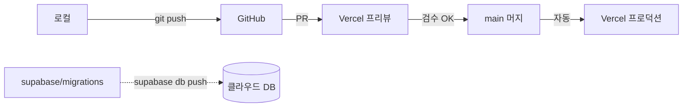

# 서울 이모삼촌 — 웹사이트 기술 명세서 (TSD)

| 항목 | 값 |
|---|---|
| 문서명 | 서울 이모삼촌 브랜드 웹사이트 기술 명세서 (Technical Specification Document) |
| 버전 | **v1.0** |
| 작성일 | 2026-07-22 |
| 상태 | **검토용 초안 (Draft for Review)** — §20 미해결 결정 확정 후 v1.1 승격 |
| 관련 문서 | `PRD.md` (상위 기준), 아키텍처 리서치 노트, 시니어 UX 리서치 노트, 디자인 방향서 |
| 대상 릴리스 | 2026년 하반기 공모 일정 내 |
| 접근성 기준선 | **WCAG 2.2 AA 최저선, 시니어 핵심 요소 AAA 목표** |

> 문서 성격: PRD를 구현 가능한 기술 설계로 번역하는 **Technical Specification Document**.
> 핵심 제약: 비개발 창업자 셀프 운영 · 무료 티어 우선 · 유지보수 최소 · 시니어 접근성 + 자녀세대 브랜드 신뢰.
> **v1.0 개정 요지**: 초안 대비 (1) 업로드를 클라이언트 직접 업로드로 재설계(Vercel 4.5MB 한계 회피, 10MB 실성립), (2) 다운로드 파일명·MIME·카톡 인앱 대응 실구현, (3) 관리자 이메일 단일 소스화(DB `admins`), (4) 홈 ISR 정정 및 on-demand revalidate 단일화, (5) 본문 마크다운 렌더·CSP·분석 계측·상태처리·백업 신설, (6) 과설계(events CMS·동적 OG·JSON-LD·Framer Motion·이중 버킷) 축소.

---

## 목차

1. [개요 & 아키텍처](#1-개요--아키텍처)
2. [기술 스택 결정 & 근거](#2-기술-스택-결정--근거)
3. [시스템 구성](#3-시스템-구성)
4. [데이터 모델 & 스키마](#4-데이터-모델--스키마)
5. [파일 업로드·다운로드 시스템 (재설계)](#5-파일-업로드다운로드-시스템-재설계)
6. [관리자 인증 & 권한](#6-관리자-인증--권한)
7. [라우팅 & 페이지/컴포넌트 구조](#7-라우팅--페이지컴포넌트-구조)
8. [신청 흐름 구현 (카톡 인앱 대응 포함)](#8-신청-흐름-구현-카톡-인앱-대응-포함)
9. [접근성 구현 스펙](#9-접근성-구현-스펙)
10. [반응형 & 성능](#10-반응형--성능)
11. [모션/인터랙션 구현](#11-모션인터랙션-구현)
12. [SEO & 메타/OG 태그](#12-seo--메타og-태그)
13. [분석 & 측정 설계 (KPI 계측)](#13-분석--측정-설계-kpi-계측)
14. [상태 처리: 로딩·에러·빈·404·스크롤 복원](#14-상태-처리-로딩에러빈404스크롤-복원)
15. [보안 & 개인정보](#15-보안--개인정보)
16. [배포·환경·가용성·백업](#16-배포환경가용성백업)
17. [폴더 구조 & 개발 컨벤션](#17-폴더-구조--개발-컨벤션)
18. [개발 단계 계획](#18-개발-단계-계획)
19. [테스트 & QA 전략](#19-테스트--qa-전략)
20. [미해결 기술 결정 / 확인 필요 항목](#20-미해결-기술-결정--확인-필요-항목)

---

## 1. 개요 & 아키텍처

### 1.1 프로젝트 한 줄 정의

멀티채널(인스타·카톡·맘카페·밴드) 모집 퍼널의 **허브 웹사이트**. 브랜드를 신뢰감 있게 소개하고(자녀세대 설득), 체험 갤러리·공지사항을 보여주며, 만 60세 이상 시니어가 **두 경로(구글폼 / 신청서 다운로드→이메일)** 중 하나로 실제 지원까지 완료하게 만든다. 비개발 창업자가 공지글과 첨부파일을 스스로 올릴 수 있어야 한다.

### 1.2 시스템 아키텍처 다이어그램



> **초안 대비 핵심 변경**: 파일 업로드가 Server Action(=서버리스 함수)을 경유하지 않고 **관리자 브라우저 → Storage 직접 업로드**로 바뀌었다. Server Action은 파일 바이트가 아닌 **메타데이터(경로·파일명·용량)만** 받는다. 다운로드는 공개 URL 직링크가 아니라 **`/api/download/[id]` 리다이렉트 라우트**를 거쳐 카운트되고 원본 파일명이 부여된다.

### 1.3 핵심 판단 (리서치 계승)

> 이 프로젝트의 진짜 난제는 "화면"이 아니라 **비개발자가 스스로 공지글+첨부파일을 계속 올릴 수 있는가**이다. 그래서 순수 정적사이트(Git 콘텐츠)나 노코드보다 **커스텀 `/admin` 폼 + Supabase**가 장기 운영 총비용(TCO)에서 가장 유리하다.

### 1.4 데이터 흐름 요약

| 흐름 | 주체 | 경로 | 인증 |
|---|---|---|---|
| 공개 열람 | 시니어/자녀 | 브라우저 → Vercel(ISR) → Postgres SELECT(RLS) | 없음(anon) |
| 첨부 다운로드 | 시니어/자녀 | `/api/download/[id]` → 카운트++ → 302 → Storage 공개 URL(`?download=원본명`) | 없음 |
| 공지·첨부 게시 | 관리자 | (a) 브라우저 → Storage 직접 업로드(세션·RLS) → (b) Server Action → notices/attachments INSERT | 세션 필수 |
| 신청 A | 시니어/자녀 | CTA(track 이벤트) → 새 탭 Google Forms | 없음 |
| 신청 B | 시니어 | 상세페이지 첨부 다운로드 → 작성 → 이메일 전송 | 없음 |
| 가용성 유지 | 시스템 | Vercel Cron(1일 1회) → `/api/health` → Postgres 경량 SELECT | 시크릿 헤더 |

---

## 2. 기술 스택 결정 & 근거

### 2.1 확정 스택 (TL;DR)

| 레이어 | 최종 확정안 | 버전/구성 | 한 줄 근거 |
|---|---|---|---|
| 프론트엔드 | **Next.js App Router** | Next.js 15 · React 19 · TypeScript strict | 공개 ISR + `/admin` 동적 CRUD를 한 코드베이스에서 |
| 스타일링 | **Tailwind CSS + shadcn/ui** | Tailwind v4 · shadcn/ui | 모던 미감 + 시니어 접근성 토큰화 |
| DB/스토리지/인증 | **Supabase** | Postgres + Storage + Auth | 콘텐츠 + 파일 공개 URL + 관리자 인증 통합 |
| 프론트 호스팅 | **Vercel** (v1 확정) | Hobby/Free | Git push 자동배포. 상업성 약관은 §20-6 착수 전 확정 |
| 백엔드 호스팅 | **Supabase 클라우드** | Free tier · `ap-northeast-2`(서울) | 무료 티어로 충분 |
| 폼/검증 | **React Hook Form + Zod** | 최신 | 관리자 폼 검증 + 타입 안전 |
| 마크다운 렌더 | **react-markdown + remark-gfm + rehype-sanitize** | 최신 | 공지 본문 안전 렌더(원시 HTML 차단) |
| 모션 | **CSS transition + IntersectionObserver** | (Framer Motion 미사용) | JS 최소, `prefers-reduced-motion` 존중 |
| 분석 | **Vercel Web Analytics(쿠키리스)** + 커스텀 이벤트 | 최신 | KPI 계측(§13), 개인정보 최소 |
| 신청 A | **Google Forms 새 탭 링크** | 임베드 아님 | iframe 스크롤 지옥 회피 |
| 신청 B | **다운로드 라우트 + 이메일 안내 카드** | `/api/download` + clipboard/mailto | 구글폼 못 하는 시니어 대안 |

### 2.2 대안 비교표

| 스택 | 핵심 구성 | 장점 | 단점 | 비개발자 관리 | 비용 | 적합도(10) |
|---|---|---|---|---|---|---|
| **A. Next.js + Supabase (확정)** | Next/Vercel + PG/Storage/Auth | 공개 정적+관리자 동적 통합, 첨부·인증 완비, 완전 커스텀 미감 | 초기 관리자 UI 개발 공수 | 중(개발 후 낮음) | 무료(초기) | **9** |
| B. Astro + Supabase | Astro SSG + Supabase | 공개 성능 최상 | 관리자 CRUD 별도 서버 로직 필요 | 중 | 무료 | 7.5 |
| C. 정적 + Git 콘텐츠(MDX) | Astro/Next 정적 | 초저비용·버전관리 | **공지마다 Git 커밋 → 비개발자 불가** | 매우 높음(불가) | 무료 | 3 |
| D. 헤드리스 CMS(Sanity) | Sanity + Next | 관리자 UI 기성품 | 학습곡선·무료 한도 과금 | 중 | 무료~유료 | 7 |
| E. Notion as CMS | Notion API + 렌더 | 학습 0 | 첨부 UX·속도·미감 타협 | 매우 낮음 | 무료~저가 | 6 |
| F. 노코드(아임웹/Framer) | 아임웹 등 | 게시판·첨부 기성 | 월 구독 고정비, 미감·확장 제약 | 낮음 | 유료 | 6.5 |

### 2.3 결정 논리



> **폴백에 관한 정정(과설계 제거)**: 초안의 "1차 아임웹 → 2차 커스텀 이관" 2단계 폴백은 **두 번 만드는 전략**이라 채택하지 않는다. 방향을 **A 단일로 확정**하고, 마감 리스크는 §18의 **P0 범위 축소(공지+첨부+구글폼만 우선 릴리스)**로 흡수한다. "Vercel → Cloudflare Pages 이관"도 Server Actions·직접 업로드·라우트 핸들러의 edge 제약으로 **드롭인이 아니며 상당한 재작업**임을 명시한다(§16.4).

### 2.4 Astro 대비 왜 Next.js인가

이 프로젝트는 **로그인 관리자 CRUD + 라우트 핸들러(다운로드/헬스핑) + Server Actions**가 필수라, "공개는 정적(ISR), 관리자는 동적"을 **한 프레임워크로 끝내는 것**이 유지보수 최소화에 유리하다.

---

## 3. 시스템 구성

### 3.1 3계층 논리 구성

```mermaid
flowchart LR
    subgraph L1["① 공개 사이트 (Public · ISR)"]
      direction TB
      P1[홈/랜딩 · ISR]
      P2[브랜드소개 · ISR]
      P3[공지 목록/상세 · ISR]
      P4[FAQ · ISR]
      P5[개인정보처리방침/이용약관 · SSG]
    end
    subgraph L2["② 관리자 (Admin · 동적·보호)"]
      direction TB
      A1[로그인]
      A2[공지·첨부 관리]
      A3[갤러리 이미지 관리]
      A4[FAQ 관리]
    end
    subgraph L3["③ 데이터·스토리지 레이어"]
      direction TB
      D1[(Postgres + RLS)]
      D2[[files 버킷 (public)]]
      D3[Auth + admins 테이블]
    end
    L1 -->|읽기 anon| L3
    L2 -->|CRUD 인증| L3
```

> **렌더링 정정**: 홈(`/`)은 초안의 SSG가 아니라 **ISR**이다. 홈에 "최신 공지 3건"이 노출되므로(PRD §7.1) SSG면 관리자가 공지를 올려도 재빌드 전까지 반영되지 않아 "살아있는 사이트"(PRD G3)와 충돌한다. 갱신 전략은 **on-demand `revalidateTag`로 단일화**(§7.5).

### 3.2 공개 사이트 (Public)

| 특성 | 설계 |
|---|---|
| 렌더링 | **전 페이지 ISR**. 정적 콘텐츠도 태그 기반 on-demand revalidate로 통일(§7.5). `revalidate=60` 등 시간 기반 병기는 제거 |
| 데이터 접근 | `anon` 키 + RLS(`is_published = true`만 노출)로 SELECT |
| 파일 접근 | `/api/download/[id]` 리다이렉트(카운트+원본명) → Storage 공개 URL(CDN 캐싱) |
| 성능 목표 | 시니어 저사양폰·카톡 인앱 대응 → 최소 JS, 이미지 최적화 |

### 3.3 관리자 (Admin)

| 특성 | 설계 |
|---|---|
| 렌더링 | 동적 서버 컴포넌트 + **Server Actions**(메타데이터 저장) |
| 파일 업로드 | **클라이언트 → Storage 직접 업로드**(인증 세션, RLS로 admin·확장자·용량 강제). 서버 함수 본문 한계(4.5MB) 회피 |
| 접근 통제 | `middleware.ts` 세션 가드 → 관리자 레이아웃 `is_admin()` 확인 → RLS DB단 재차단(3중 방어, **단일 소스 = `admins` 테이블**) |
| UI 철학 | 비개발자용 극단적 단순화 — 큰 라벨, 드래그&드롭, 미리보기, 큰 한국어 토스트 |

### 3.4 데이터·스토리지 레이어

| 구성 | 내용 |
|---|---|
| Postgres | `notices`, `attachments`, `gallery_images`, `faqs`, `admins` 5개 테이블 |
| Storage | **단일 `files` 버킷**(public). 경로 prefix로 분리: `notices/{id}/…`, `gallery/…` (초안의 2버킷 → 1버킷) |
| Auth | 이메일/비밀번호. 관리자 판별은 `admins` 테이블 조회(대시보드 수동 계정 생성, 가입 UI 없음) |
| 보안 | 전 테이블 RLS 활성, Storage 정책(select=public, insert/update/delete=authenticated+admin+확장자 화이트리스트) |

---

## 4. 데이터 모델 & 스키마

### 4.1 ER 다이어그램



> **과설계 축소**: 초안의 `events`(다중 이미지 jsonb·독립 `/gallery` CMS)를 제거하고, PRD §6.2("갤러리는 홈 스크롤 섹션")에 맞춰 **`gallery_images`(단일 이미지 큐레이션)** 로 단순화. 풀 갤러리 CMS는 v2 로드맵.
> **첨부 정렬 규칙 확정**: `attachments.kind`(form/notice/image) 추가. 목록 정렬은 `kind = 'form'`(신청서) 최우선 → `sort_order` → `created_at`. "신청서를 위로"가 업로드 순서와 무관하게 보장된다.
> **다운로드 카운트**: `attachments.download_count`로 K1/K7 근사 계측(§13).

### 4.2 스키마 SQL (마이그레이션)

`supabase/migrations/0001_init.sql`:

```sql
create extension if not exists "pgcrypto";

-- 관리자 화이트리스트 (단일 소스)
create table public.admins (
  email        text primary key,
  display_name text,
  created_at   timestamptz not null default now()
);

create table public.notices (
  id            uuid primary key default gen_random_uuid(),
  title         text not null,
  body          text not null default '',          -- 마크다운 원문 저장
  category      text not null default '일반공지'
                check (category in ('모집공고','일반공지','이벤트')),
  is_published  boolean not null default false,
  is_pinned     boolean not null default false,
  published_at  timestamptz,
  created_at    timestamptz not null default now(),
  updated_at    timestamptz not null default now()
);

create table public.attachments (
  id             uuid primary key default gen_random_uuid(),
  notice_id      uuid not null references public.notices(id) on delete cascade,
  file_name      text not null,                     -- 원본 표시명(보존)
  storage_path   text not null,                     -- notices/{noticeId}/{uuid}.ext
  mime_type      text not null default '',
  size_bytes     bigint not null,
  kind           text not null default 'notice'
                 check (kind in ('form','notice','image')),
  sort_order     int not null default 0,
  download_count int not null default 0,
  created_at     timestamptz not null default now()
);

create table public.gallery_images (
  id            uuid primary key default gen_random_uuid(),
  image_path    text not null,                      -- gallery/{uuid}.ext
  caption       text not null default '',
  track         text not null default '쿠킹클래스'
                check (track in ('쿠킹클래스','나만의특별함')),
  is_published  boolean not null default true,
  sort_order    int not null default 0,
  created_at    timestamptz not null default now()
);

create table public.faqs (
  id            uuid primary key default gen_random_uuid(),
  question      text not null,
  answer        text not null,
  audience      text not null default '공통'
                check (audience in ('시니어','자녀세대','공통')),
  sort_order    int not null default 0,
  is_published  boolean not null default true,
  created_at    timestamptz not null default now()
);

-- 인덱스
create index idx_notices_published  on public.notices (is_published, is_pinned desc, published_at desc);
create index idx_notices_category   on public.notices (category, published_at desc);
create index idx_attachments_notice on public.attachments (notice_id, sort_order);
create index idx_gallery_published  on public.gallery_images (is_published, sort_order);
create index idx_faqs_published     on public.faqs (is_published, audience, sort_order);

-- updated_at 자동 갱신
create or replace function public.set_updated_at()
returns trigger language plpgsql as $$
begin new.updated_at = now(); return new; end $$;

create trigger trg_notices_updated
  before update on public.notices
  for each row execute function public.set_updated_at();

-- 다운로드 카운트 원자적 증가 (다운로드 라우트에서 RPC 호출)
create or replace function public.increment_download(att_id uuid)
returns void language sql as $$
  update public.attachments set download_count = download_count + 1 where id = att_id;
$$;
```

### 4.3 RLS 정책

`supabase/migrations/0002_rls.sql`:

```sql
alter table public.admins         enable row level security;
alter table public.notices        enable row level security;
alter table public.attachments    enable row level security;
alter table public.gallery_images enable row level security;
alter table public.faqs           enable row level security;

-- 관리자 판별: 하드코딩 이메일 제거, admins 테이블 참조 (단일 소스)
-- security definer로 admins 테이블 RLS를 우회하여 안전하게 조회
create or replace function public.is_admin()
returns boolean
language sql stable security definer set search_path = public as $$
  select exists (
    select 1 from public.admins a
    where a.email = coalesce(auth.jwt() ->> 'email', '')
  );
$$;

-- admins: 관리자만 열람/편집 (팀 확장 시 여기에 INSERT — SQL 재배포 불필요, 행만 추가)
create policy "admins self read"   on public.admins for select using (public.is_admin());
create policy "admins admin write" on public.admins for all    using (public.is_admin()) with check (public.is_admin());

-- notices
create policy "notices public read" on public.notices for select using (is_published = true);
create policy "notices admin all"   on public.notices for all    using (public.is_admin()) with check (public.is_admin());

-- attachments (공개 공지의 첨부만 읽기)
create policy "attachments public read" on public.attachments for select
  using (exists (select 1 from public.notices n where n.id = attachments.notice_id and n.is_published = true));
create policy "attachments admin all"   on public.attachments for all
  using (public.is_admin()) with check (public.is_admin());

-- gallery_images
create policy "gallery public read" on public.gallery_images for select using (is_published = true);
create policy "gallery admin all"   on public.gallery_images for all    using (public.is_admin()) with check (public.is_admin());

-- faqs
create policy "faqs public read" on public.faqs for select using (is_published = true);
create policy "faqs admin all"   on public.faqs for all    using (public.is_admin()) with check (public.is_admin());
```

> `download_count` 증가는 anon이 `increment_download()` RPC를 호출한다. RPC는 `security invoker` 기본이므로 attachments의 UPDATE 정책이 필요 → 카운트 컬럼만 갱신하는 별도 정책 대신, `increment_download`를 `security definer`로 선언해 안전하게 우회(운영상 남용 방지를 위해 함수 인자를 uuid로 제한). 실제 배포 SQL에서 `security definer`를 부여한다.

### 4.4 Storage 버킷 정책 (단일 버킷 · 확장자 서버 강제)

`supabase/migrations/0003_storage.sql`:

```sql
-- 단일 버킷: public read, 서버 강제 용량 상한 10MB
insert into storage.buckets (id, name, public, file_size_limit)
values ('files', 'files', true, 10485760)   -- 10MB = Storage가 하드 캡 강제
on conflict (id) do update set file_size_limit = excluded.file_size_limit;

-- 공개 읽기
create policy "files public read"
  on storage.objects for select
  using (bucket_id = 'files');

-- 관리자만 쓰기 + 확장자 화이트리스트를 RLS로 강제 (MIME 아님 → HWP 안전)
create policy "files admin insert"
  on storage.objects for insert to authenticated
  with check (
    bucket_id = 'files'
    and public.is_admin()
    and lower(storage.extension(name)) in
        ('pdf','doc','docx','hwp','hwpx','jpg','jpeg','png')
  );
create policy "files admin update"
  on storage.objects for update to authenticated
  using (bucket_id = 'files' and public.is_admin());
create policy "files admin delete"
  on storage.objects for delete to authenticated
  using (bucket_id = 'files' and public.is_admin());
```

> **"서버 최종 검증" 성립 근거(직접 업로드에서도)**: 클라이언트 검증은 UX용이지만, ① 버킷 `file_size_limit=10MB`가 **용량을 Storage가 하드 캡**하고, ② insert RLS가 **확장자 화이트리스트를 DB단에서 강제**한다. 즉 클라이언트를 우회해도 허용 외 파일은 저장 자체가 거부된다. MIME이 아닌 **확장자** 기준이므로 HWP/HWPX(빈 MIME·octet-stream)가 정상 통과한다.

### 4.5 필드 설계 메모

- `notices.category = '모집공고'`만 필터해 홈/모집 섹션 노출.
- `is_pinned` + `published_at DESC`로 중요 모집공고 상단 고정.
- 첨부 정렬: `kind='form'` 우선 → `sort_order` → `created_at`(§4.1).
- `faqs.audience`로 시니어/자녀 탭 분리는 **v2**(초안 P0 제외).

---

## 5. 파일 업로드·다운로드 시스템 (재설계)

> 초안의 "Server Action이 파일 바이트를 받아 Storage 업로드" 방식은 **Vercel 서버리스 함수 요청 본문 한계(~4.5MB)** 와 **Next.js Server Action 기본 `bodySizeLimit`(1MB)** 때문에 10MB 첨부에서 깨진다. v1.0은 **클라이언트 직접 업로드 + 메타데이터 Server Action**으로 재설계한다.

### 5.1 업로드 시퀀스 (클라이언트 직접 업로드)



**클라이언트 업로드 (핵심):** `app/admin/notices/_components/UploadForm.tsx`

```tsx
'use client';
import { createBrowserClient } from '@/lib/supabase/client';
import { randomUUID } from 'crypto'; // 클라에선 crypto.randomUUID() 사용
import { createNotice } from '../actions';

const ALLOWED_EXT = new Set(['pdf','doc','docx','hwp','hwpx','jpg','jpeg','png']);
const MAX_BYTES = 10 * 1024 * 1024;

// 확장자 우선 검증 (MIME은 판단 근거로 쓰지 않음 — HWP 빈 MIME 대응)
function validate(file: File): string | null {
  const ext = file.name.split('.').pop()?.toLowerCase() ?? '';
  if (!ALLOWED_EXT.has(ext)) return `${file.name}: 허용되지 않은 형식입니다 (PDF·HWP·이미지 등).`;
  if (file.size > MAX_BYTES) return `${file.name}: 10MB를 초과합니다.`;
  return null;
}

async function handleSubmit(files: File[], data: NoticeInput) {
  const supabase = createBrowserClient();
  const noticeId = crypto.randomUUID();
  const metas = [];
  for (const file of files) {
    const err = validate(file);
    if (err) return { ok: false, error: err }; // 클라 즉시 피드백
    const ext = file.name.split('.').pop()!.toLowerCase();
    const path = `notices/${noticeId}/${crypto.randomUUID()}.${ext}`;
    // 세션·RLS로 안전 업로드. RLS/10MB 캡 위반 시 여기서 거부됨(최종 방어는 서버)
    const { error } = await supabase.storage.from('files')
      .upload(path, file, { contentType: file.type || 'application/octet-stream' });
    if (error) return { ok: false, error: `업로드 실패: ${file.name}` };
    metas.push({
      path, file_name: file.name, mime: file.type, size: file.size,
      kind: /\.(hwp|hwpx|pdf|docx?)$/i.test(file.name) ? 'notice' : 'image',
    });
  }
  // 파일 바이트 없이 메타만 전송 → 1MB·4.5MB 한계와 무관
  return createNotice({ id: noticeId, ...data }, metas);
}
```

**메타데이터 Server Action + 보상 정리:** `app/admin/notices/actions.ts`

```ts
'use server';
import { createServerClient } from '@/lib/supabase/server';
import { assertAdmin } from '@/lib/auth';
import { revalidateTag } from 'next/cache';
import { z } from 'zod';

const NoticeSchema = z.object({
  id: z.string().uuid(),
  title: z.string().min(1, '제목을 입력해 주세요').max(200),
  body: z.string().max(20000),
  category: z.enum(['모집공고', '일반공지', '이벤트']),
  is_pinned: z.boolean().default(false),
  formAttachmentPath: z.string().optional(), // 신청서로 지정된 파일(정렬 최우선)
});

export async function createNotice(input: unknown, metas: AttachmentMeta[]) {
  const supabase = createServerClient();
  await assertAdmin(supabase); // admins 테이블 조회, 실패 시 throw

  const parsed = NoticeSchema.safeParse(input);
  if (!parsed.success) return { ok: false, error: parsed.error.issues[0].message };
  const d = parsed.data;

  const cleanup = async () => {
    if (metas.length) await supabase.storage.from('files').remove(metas.map(m => m.path));
  };

  const { error: nErr } = await supabase.from('notices').insert({
    id: d.id, title: d.title, body: d.body, category: d.category, is_pinned: d.is_pinned,
    is_published: true, published_at: new Date().toISOString(),
  });
  if (nErr) { await cleanup(); return { ok: false, error: '공지 저장 실패' }; }

  if (metas.length) {
    const rows = metas.map((m, i) => ({
      notice_id: d.id, file_name: m.file_name, storage_path: m.path,
      mime_type: m.mime, size_bytes: m.size,
      kind: m.path === d.formAttachmentPath ? 'form' : m.kind,
      sort_order: i,
    }));
    const { error: aErr } = await supabase.from('attachments').insert(rows);
    if (aErr) {
      await cleanup();
      await supabase.from('notices').delete().eq('id', d.id);
      return { ok: false, error: '첨부 저장 실패' };
    }
  }
  revalidateTag('notices'); // 홈·목록·상세 즉시 갱신
  return { ok: true, id: d.id };
}
```

### 5.2 첨부 생애주기 (편집·삭제·정렬 · 고아 파일 방지)

> 초안 누락 지점: notice 삭제 시 `attachments` 행은 FK cascade로 지워지지만 **Storage 객체는 남아 무료 1GB를 잠식**한다. 편집으로 첨부 교체 시도 마찬가지. v1.0은 생애주기 로직을 명시한다.

| 작업 | DB | Storage | UI |
|---|---|---|---|
| 첨부 삭제 | `delete attachments where id` | **Server Action이 `storage_path`로 `remove()` 선행 후 행 삭제** | 각 첨부 옆 [삭제(확인창)] |
| 첨부 추가(편집) | INSERT 행 | 클라 직접 업로드(5.1과 동일) | [파일 추가] |
| 정렬 변경 | `sort_order` UPDATE | 없음 | 위/아래 화살표(드래그 대신 큰 버튼) |
| 신청서 지정 | `kind='form'`로 UPDATE | 없음 | 각 첨부 라디오 "이게 신청서예요" |
| 공지 삭제 | `delete notices`(cascade) | **Server Action이 해당 공지 첨부 `storage_path[]` 일괄 `remove()` 선행** | [삭제(확인창)] |

```ts
// 삭제 시 Storage → DB 순서 (고아 파일 방지)
export async function deleteNotice(noticeId: string) {
  const supabase = createServerClient();
  await assertAdmin(supabase);
  const { data: atts } = await supabase.from('attachments')
    .select('storage_path').eq('notice_id', noticeId);
  if (atts?.length) await supabase.storage.from('files').remove(atts.map(a => a.storage_path));
  const { error } = await supabase.from('notices').delete().eq('id', noticeId);
  if (error) return { ok: false, error: '삭제 실패' };
  revalidateTag('notices');
  return { ok: true };
}
```

> **주기적 GC(선택·v1.1)**: 월 1회 Vercel Cron이 `attachments`에 없는 Storage 객체를 리스트업해 정리. v1에서는 위 동기 삭제로 충분.

### 5.3 다운로드: 라우트 핸들러 (원본 파일명 + 카운트)

> 초안 오류: HTML `download` 속성은 **cross-origin(Storage 도메인) 리소스에서 무시**된다 → 시니어가 `a3f9….pdf`(UUID)로 받게 되어 PRD §7.4 위반. 또한 공개 URL 직링크는 **다운로드 이벤트 카운트 불가**(KPI 붕괴). v1.0은 **`/api/download/[id]` 리다이렉트 라우트**로 두 문제를 동시에 해결한다.

`app/api/download/[id]/route.ts`:

```ts
import { NextRequest, NextResponse } from 'next/server';
import { createServiceClient } from '@/lib/supabase/service'; // 서버 전용

export async function GET(req: NextRequest, { params }: { params: { id: string } }) {
  const supabase = createServiceClient();
  // 공개 공지의 첨부만 (RLS와 동일 조건 재확인)
  const { data: att } = await supabase
    .from('attachments')
    .select('storage_path, file_name, notices!inner(is_published)')
    .eq('id', params.id).single();
  if (!att || !att.notices?.is_published) {
    return NextResponse.redirect(new URL('/notices', req.url));
  }
  // 카운트++ (실패해도 다운로드는 진행)
  await supabase.rpc('increment_download', { att_id: params.id });

  // 원본(한글) 파일명으로 Content-Disposition 지정 — Supabase ?download= 사용
  // supabase-js가 RFC5987(filename*=UTF-8'') 인코딩을 처리
  const { data } = supabase.storage.from('files')
    .getPublicUrl(att.storage_path, { download: att.file_name });

  return NextResponse.redirect(data.publicUrl, 302);
}
```

- 상세페이지 다운로드 버튼은 `<a href="/api/download/{id}">` — 같은 오리진이라 카톡 인앱에서도 안정적.
- 최종 응답은 Supabase가 `Content-Disposition: attachment; filename*=UTF-8''시니어_지원_신청서.pdf`로 내려주므로 **한글 원본명 보존**.
- 클릭 시 `track('attachment_download', {...})` 클라 이벤트도 병행(§13).

### 5.4 파일 검증·보안 규칙 (확장자 우선)

```
허용 확장자(권위) : .pdf .doc .docx .hwp .hwpx .jpg .jpeg .png
MIME 취급         : 판단 근거로 사용하지 않음(HWP/HWPX/DOC는 빈 MIME·octet-stream 빈번)
                   단, contentType 저장·표시용으로만 보존. 명백 위험 타입(text/html 등)은 차단 목록으로 보조
최대 용량         : 10MB — 버킷 file_size_limit로 서버 하드 캡
파일명 저장       : UUID로 재명명, 원본명은 DB의 file_name에 보존(다운로드 시 복원)
경로 규칙         : notices/{noticeId}/{uuid}.{ext} · gallery/{uuid}.{ext}
서버 최종 방어    : ① 버킷 용량 캡 ② insert RLS 확장자 화이트리스트(§4.4)
```

- **HWP/HWPX 반드시 허용** — 관공서·시니어 문서 현실. 브라우저 미리보기 불가하니 "다운로드 후 한글/뷰어로 열기" 안내 병기.
- `service_role` 키 **절대 클라이언트 노출 금지** — 다운로드 라우트·헬스핑 등 서버 전용에서만.
- **파일명 XSS**: 화면 표시명은 React 기본 이스케이프, `Content-Disposition`은 supabase-js가 인코딩.

### 5.5 상세페이지 다운로드 UX (시니어 최우선)

```
📄 신청서 양식 (PDF, 320KB)   [ 다운로드 ▸ ]   ← 62px 버튼 (kind=form → 최상단)
📄 모집 공고문 (HWP, 180KB)   [ 다운로드 ▸ ]

📱 휴대폰에서는 다운로드 후 "다운로드 폴더"에서 열립니다.
   HWP 파일은 한글/한컴오피스 뷰어로 열어 주세요.
```

- 각 첨부: **파일명 + 종류(PDF) + 용량** + 큰 다운로드 버튼(48px+). 여러 개면 세로 리스트, 신청서(form) 최상단.
- 색·밑줄·버튼 셋 다로 클릭 가능함을 **다중 신호**.
- 링크는 `/api/download/{id}`(같은 오리진).

---

## 6. 관리자 인증 & 권한

### 6.1 원칙: "단일 관리자, 단일 소스, 가장 단순한 안전"



> **초안의 3중 분산·버그 제거**: 초안은 관리자 이메일을 ① middleware env, ② `is_admin()` SQL 하드코딩, ③ Server Action의 `user.email !== process.env.ADMIN_ALLOWED_EMAILS` **문자열 전체 비교**(2명 이상이면 `"a@x,b@y"`와 불일치해 정당한 관리자도 거부)로 분산·오작동시켰다. v1.0은 **단일 소스 = `admins` 테이블**로 통합한다. 팀 3인 확장 시 SQL 재배포 없이 **행 1개 INSERT**만 하면 된다.

### 6.2 인증 방식

| 항목 | 스펙 |
|---|---|
| 방식 | Supabase Auth **이메일/비밀번호** |
| 계정 생성 | Supabase 대시보드에서 수동 생성(가입 UI 없음) + `admins` 테이블에 이메일 INSERT. **초기 관리자 = songchaewoo0@gmail.com(송채우)** |
| 관리자 판별 | **`is_admin()` = `admins` 테이블 조회**(하드코딩 없음) |
| 세션 관리 | `@supabase/ssr` 쿠키 기반 세션 |
| 비밀번호 재설정 | Supabase 재설정 메일(창업자 셀프 복구) |
| 방어 심층화 | ① `middleware.ts` 세션 가드 ② 관리자 레이아웃 `is_admin()` 확인 ③ RLS DB단 재차단 |
| 레이트리밋 | Supabase Auth 기본 브루트포스 방어에 의존. 초과 시 v1.1에서 Turnstile 등 추가 검토(§20) |

### 6.3 미들웨어 (세션 가드) + 인가 헬퍼

`middleware.ts` — **세션 존재만 검사**(관리자 인가는 admins 테이블 기준 레이아웃/Action에서):

```ts
import { createServerClient } from '@supabase/ssr';
import { NextResponse, type NextRequest } from 'next/server';

export async function middleware(req: NextRequest) {
  const { pathname } = req.nextUrl;
  if (!pathname.startsWith('/admin') || pathname === '/admin/login') return NextResponse.next();

  const res = NextResponse.next();
  const supabase = createServerClient(
    process.env.NEXT_PUBLIC_SUPABASE_URL!,
    process.env.NEXT_PUBLIC_SUPABASE_ANON_KEY!,
    { cookies: { /* req/res 쿠키 바인딩 */ } }
  );
  const { data: { user } } = await supabase.auth.getUser();
  if (!user) return NextResponse.redirect(new URL('/admin/login', req.url));
  return res; // 관리자 여부(admins)는 layout/Action에서 확정
}
export const config = { matcher: ['/admin/:path*'] };
```

`lib/auth.ts` — **단일 인가 헬퍼**(관리자 레이아웃·모든 Server Action에서 재사용):

```ts
export async function assertAdmin(supabase: SupabaseClient) {
  const { data: { user } } = await supabase.auth.getUser();
  if (!user) throw new Error('세션이 없습니다.');
  const { data } = await supabase.rpc('is_admin'); // admins 테이블 기준 단일 판정
  if (data !== true) throw new Error('관리자 권한이 없습니다.');
  return user;
}
```

`app/admin/layout.tsx`는 서버 컴포넌트에서 `assertAdmin()`을 호출해 비관리자를 홈으로 리다이렉트한다.

### 6.4 비개발자 친화 관리 UI 요건

- 로그인 후 상단 큰 버튼 **"새 공지 쓰기"**.
- 폼: **제목 · 본문(마크다운 + 실시간 미리보기, §15.4) · 파일 첨부(드래그&드롭/선택) · 신청서 지정 · [게시]**.
- 목록에서 각 공지 옆 **[수정] [숨김] [삭제(확인창)]**, 첨부 편집(추가/삭제/정렬).
- 갤러리·FAQ도 **같은 패턴의 단순 폼**.
- 저장 성공/실패 **큰 한국어 토스트**.
- 팀 3인 공동 관리 시: 관리자 계정 생성 + `admins`에 이메일 INSERT(관리 화면에 "관리자 추가" 폼 제공, v1.1).

---

## 7. 라우팅 & 페이지/컴포넌트 구조

### 7.1 라우트 맵

| 경로 | 렌더링 | 설명 |
|---|---|---|
| `/` | **ISR** | 홈/랜딩(10섹션, 갤러리 섹션·최신 공지 3건 포함) |
| `/about` | ISR | 브랜드소개("우리 이야기") |
| `/notices` | ISR | 공지 목록(더보기) |
| `/notices/[id]` | ISR | 공지 상세 + 첨부 다운로드 + 본문 마크다운 렌더 |
| `/faq` | ISR | FAQ 아코디언 |
| `/apply` | ISR | 신청 안내(경로 A/B) |
| `/privacy` | SSG | 개인정보처리방침 |
| `/terms` | SSG | 이용약관 |
| `/api/download/[id]` | Route Handler | 다운로드 카운트 + 302 리다이렉트 |
| `/api/health` | Route Handler | Vercel Cron 헬스핑(시크릿 헤더) |
| `/admin/login` | 동적 | 관리자 로그인 |
| `/admin` | 동적(보호) | 대시보드 |
| `/admin/notices` | 동적(보호) | 공지·첨부 CRUD |
| `/admin/gallery` | 동적(보호) | 갤러리 이미지 CRUD |
| `/admin/faqs` | 동적(보호) | FAQ CRUD |

> **정정**: 초안의 독립 `/gallery` 라우트 제거(PRD §6.2 = 홈 섹션). 갤러리는 홈 스크롤 섹션 + 관리자 `/admin/gallery`로 관리.

### 7.2 사이트맵 (IA)



> **깊이 최대 2단계**(목록→상세). 상단 내비 **3개 + CTA**(브랜드소개·공지사항·FAQ + [신청하기]). 갤러리는 항목을 늘리지 않고 홈 섹션.

### 7.3 디렉토리 트리

```
seoul-emosamchon/
├─ app/
│  ├─ layout.tsx                # 루트(폰트·토큰·SkipLink·Analytics)
│  ├─ page.tsx                  # 홈 (ISR, revalidateTag 대상)
│  ├─ globals.css               # Tailwind + 접근성 토큰
│  ├─ loading.tsx / error.tsx / not-found.tsx   # 전역 상태(§14)
│  ├─ about/page.tsx
│  ├─ notices/
│  │  ├─ page.tsx  (+ loading.tsx)
│  │  └─ [id]/page.tsx  (+ not-found.tsx)        # 상세 + 마크다운 렌더 + 첨부
│  ├─ faq/page.tsx
│  ├─ apply/page.tsx
│  ├─ privacy/page.tsx · terms/page.tsx
│  ├─ api/
│  │  ├─ download/[id]/route.ts
│  │  └─ health/route.ts
│  ├─ admin/
│  │  ├─ layout.tsx             # assertAdmin 가드 + 셸
│  │  ├─ login/page.tsx
│  │  ├─ page.tsx
│  │  ├─ notices/{page,new,[id]/edit}.tsx + actions.ts + _components/UploadForm.tsx
│  │  ├─ gallery/… + actions.ts
│  │  └─ faqs/…    + actions.ts
│  ├─ sitemap.ts · robots.ts
├─ components/
│  ├─ ui/                       # shadcn/ui
│  ├─ layout/ (SiteHeader, MobileMenu, SiteFooter, FontScaleToggle)
│  ├─ home/ · notice/ (NoticeCard, AttachmentList, DownloadButton)
│  ├─ apply/ (ApplyPrimary, ApplySecondary, CopyEmailButton, KakaoEscape)
│  ├─ content/ (Markdown.tsx)   # react-markdown + sanitize
│  └─ common/ (SectionReveal, Breadcrumb, PageTitle)
├─ lib/
│  ├─ supabase/ (client.ts, server.ts, service.ts, queries.ts)
│  ├─ auth.ts                   # assertAdmin
│  ├─ analytics.ts              # track() 래퍼
│  ├─ validation/ · utils.ts
├─ supabase/migrations/ (0001_init.sql, 0002_rls.sql, 0003_storage.sql, 0004_seed_admin.sql)
├─ public/ (fonts/, og-default.png 1200×630)
├─ middleware.ts · next.config.ts · tailwind.config.ts
├─ vercel.json                  # Cron 정의(§16.3)
├─ .env.local · package.json
```

### 7.4 주요 컴포넌트 책임 (변경분)

| 컴포넌트 | 책임 |
|---|---|
| `FontScaleToggle` | `data-scale` 토글(3단계), `--fs-scale` 변경, localStorage, `aria-pressed`. **모바일 상단 바 상시 노출**(§9.4) |
| `Markdown` | `react-markdown`+`remark-gfm`+`rehype-sanitize`, 원시 HTML 차단 |
| `AttachmentList`/`DownloadButton` | `kind='form'` 최상단, 파일명·형식·용량, `/api/download/{id}` 링크, track 이벤트 |
| `ApplyPrimary` | 구글폼 새 탭 CTA + `track('apply_form_click')` |
| `CopyEmailButton` | clipboard → execCommand → prompt 3단 폴백 + 실패 토스트(§8.4) |
| `KakaoEscape` | 카톡 인앱 감지 시 "기본 브라우저로 열기" 유도(§8.5) |
| `SectionReveal` | IntersectionObserver + CSS transition, `prefers-reduced-motion` 존중(Framer 미사용) |
| `SiteFooter` | 운영주체 팀 theOne·**대표자 신승민**·문의 `NEXT_PUBLIC_REP_EMAIL`(harry147017@gachon.ac.kr)·사이트맵·"처음으로(홈)" |
| `SponsorMarquee` | footer 상단 후원·협력 로고 무한 스크롤 스트립. 로고 세트 2벌 복제(CSS `translateX(-50%)`), 회색→컬러 hover, hover 정지, `prefers-reduced-motion` 정지, 가장자리 mask 페이드. 로고는 `public/sponsors/*`(self-host 최적화), 실제 협력사 로고로 교체 |

### 7.5 렌더링·캐시 전략 (단일화)

> 초안의 "`revalidate:60` + `revalidateTag` 병기"를 **on-demand `revalidateTag` 단일**로 확정. 시간 기반 `revalidate` 미사용.

- 공개 페이지의 Supabase SELECT는 `lib/supabase/queries.ts`에서 `unstable_cache(fn, keys, { tags: [...] })`로 감싸 태그 부여: `notices`, `gallery`, `faqs`.
- 모든 관리자 Server Action(생성/수정/삭제/숨김)은 성공 시 해당 `revalidateTag(...)` 호출 → 홈·목록·상세가 **즉시** 갱신(관리자가 별도 조작 불필요).
- 스크롤 복원은 App Router 기본 동작 유지(§14.4).

---

## 8. 신청 흐름 구현 (카톡 인앱 대응 포함)

### 8.1 경로 A — Google Forms: 새 탭 링크

| 방식 | 판단 |
|---|---|
| iframe 임베드 | ❌ 모바일 이중 스크롤·높이 잘림·전송 상태 불명 |
| **새 탭 링크** | ✅ 구글폼 네이티브 UX, 전송완료 화면 명확 |

```tsx
'use client';
import { track } from '@/lib/analytics';
<a href={process.env.NEXT_PUBLIC_GOOGLE_FORM_URL}
   target="_blank" rel="noopener noreferrer"
   onClick={() => track('apply_form_click')}
   className="btn-primary">
  휴대폰으로 신청하기 ▸
</a>
<p className="hint">대부분 손가락으로 톡톡 고르기만 하면 됩니다 (약 5분).</p>
<p className="hint">누르면 새 창(신청 폼)이 열립니다.</p>
```

> **카톡 인앱 주의(§8.5)**: 카카오톡 웹뷰는 `_blank`를 같은 웹뷰에서 처리하거나 차단할 수 있다. `KakaoEscape` 컴포넌트가 인앱을 감지하면 "기본 브라우저로 열기" 안내를 함께 노출한다.

### 8.2 경로 B — 신청서 다운로드 + 이메일 전송

**플로우**: 상세페이지 신청서 다운로드(`/api/download/{id}`) → 출력/작성 → 사진 촬영 → 이메일 전송.

**`mailto` 한계와 대응:**

| 이슈 | 대응 |
|---|---|
| `mailto`로 첨부 불가 | 버튼은 "메일 앱 열기(제목·받는사람 자동)"까지만, 첨부는 사용자가 |
| 기본 메일앱 미설정 | **주소 복사 버튼을 1순위**(3단 폴백, §8.4) |
| 카톡 인앱 `mailto` 차단 | 주소를 **선택·복사 쉬운 큰 텍스트**로 노출 + 복사 버튼 + 인앱 탈출 |

**권고 UX 카드:**

```
📄 방법 2  종이로 하고 싶으면
┌────────────────────────────────────────┐
│  [ 신청서 내려받기 ]  신청서_2026.hwp/PDF · 120KB │
│  작성하신 뒤 사진을 찍어 아래 이메일로 보내주세요.   │
│  ✉️ (운영 이메일)   [ 주소 복사 ]                │
│  [ 이메일 앱 열기 ]                              │
│  ① 다운로드 → ② 출력·작성 → ③ 사진 촬영 → ④ 이메일 전송 │
└────────────────────────────────────────┘
☎ 어려우면 전화 주세요: (전화 안전망 · env)
```

> **접수 이메일(확정): songchaewoo0@gmail.com** — 관리자 송채우가 수신·처리. 하드코딩 금지, `NEXT_PUBLIC_APPLICATION_EMAIL` 환경변수로만 주입하고 화면에는 난독/복사 버튼으로 노출(봇 수집 최소화). 개인 Gmail이므로 향후 전용 운영계정(조직 도메인/Workspace) 전환 여지를 둔다(§15.2, §20-9).

### 8.3 헷갈림 방지 규칙 (경로 A/B 시각 위계)

| 규칙 | 내용 |
|---|---|
| 동시에 하나만 강조 | A=강조 채움(딥그린 #4E6A18·흰 글자·pill), B=보조 아웃라인 — 나란히 같은 크기·색 금지 |
| 번호+아이콘 순서화 | B 경로는 ①②③④ 스텝 |
| 결과 예고 | "새 창이 열립니다", "메일 앱이 열립니다" |
| 완료 확인 안내 | "접수되면 하루 이틀 안에 전화/문자로 연락드려요" |
| 최후의 안전망 | ☎ 전화번호 상시 노출 |

### 8.4 CopyEmailButton — 완전 폴백 (빈 catch 금지)

```tsx
'use client';
import { toast } from '@/components/ui/use-toast';

export function CopyEmailButton({ email }: { email: string }) {
  const copy = async () => {
    // 1) 표준 Clipboard API (보안 컨텍스트)
    try {
      await navigator.clipboard.writeText(email);
      toast({ title: '이메일 주소가 복사되었습니다', description: email });
      return;
    } catch { /* 폴백으로 진행 */ }
    // 2) execCommand 폴백 (구형·일부 인앱)
    try {
      const ta = document.createElement('textarea');
      ta.value = email; ta.style.position = 'fixed'; ta.style.opacity = '0';
      document.body.appendChild(ta); ta.focus(); ta.select();
      const ok = document.execCommand('copy');
      document.body.removeChild(ta);
      if (ok) { toast({ title: '이메일 주소가 복사되었습니다', description: email }); return; }
      throw new Error('execCommand 실패');
    } catch {
      // 3) 최후: 사용자가 직접 복사하도록 프롬프트 + 실패 피드백(무반응 금지)
      window.prompt('아래 주소를 길게 눌러 복사해 주세요', email);
      toast({ title: '자동 복사가 안 돼요', description: '주소를 길게 눌러 복사해 주세요', variant: 'warning' });
    }
  };
  return <button onClick={copy} className="btn-outline" aria-label="이메일 주소 복사">주소 복사</button>;
}
```

**mailto 프리필(한글 전체 인코딩):**

```tsx
const subject = encodeURIComponent('[서울이모삼촌] 신청서 제출');
const body = encodeURIComponent('성함:\n연락처:\n(신청서 사진을 첨부해 주세요)');
const href = `mailto:${email}?subject=${subject}&body=${body}`;
```

> 초안 예시의 `%5B서울이모삼촌%5D`처럼 **대괄호만 인코딩**하면 일부 클라이언트에서 제목이 깨진다 → `encodeURIComponent`로 전체 인코딩.

### 8.5 카톡 인앱 외부 브라우저 탈출 (실구현)

```tsx
'use client';
// 카톡/인앱 웹뷰 감지 → 기본 브라우저로 강제 오픈
function isInApp(ua: string) {
  return /KAKAOTALK|Instagram|FBAN|FBAV|Line|NAVER|Band/i.test(ua);
}
export function KakaoEscape({ url }: { url: string }) {
  const ua = typeof navigator !== 'undefined' ? navigator.userAgent : '';
  if (!isInApp(ua)) return null;
  const openExternal = () => {
    const isIOS = /iphone|ipad|ipod/i.test(ua);
    if (/KAKAOTALK/i.test(ua)) {
      // 카카오 공식 외부 브라우저 스킴
      location.href = `kakaotalk://web/openExternal?url=${encodeURIComponent(url)}`;
    } else if (!isIOS) {
      // 안드로이드 기타 인앱: Chrome intent
      const clean = url.replace(/^https?:\/\//, '');
      location.href = `intent://${clean}#Intent;scheme=https;package=com.android.chrome;end`;
    } else {
      // iOS 기타 인앱: 안내(복사 후 사파리)
      alert('오른쪽 아래 메뉴에서 "사파리로 열기"를 눌러 주세요.');
    }
  };
  return (
    <button onClick={openExternal} className="btn-outline">
      다운로드가 안 되면 여기를 눌러 "기본 브라우저로 열기"
    </button>
  );
}
```

- 신청 페이지·공지 상세(다운로드 근처)에 `KakaoEscape`를 배치.
- 다운로드/`mailto` 실패의 종착점 방어. 최종 안전망은 전화번호.

---

## 9. 접근성 구현 스펙

> 기준: **WCAG 2.2 AA 최저선, 시니어 핵심 요소 AAA 목표.** 원칙: "큰 기본값(Big by default)".

### 9.1 디자인 토큰 (CSS 변수)

`app/globals.css`:

```css
:root {
  /* ── Type ── */
  --font-sans: "Noto Sans KR", "Pretendard", -apple-system, "Apple SD Gothic Neo", "맑은 고딕", sans-serif; /* 전 사이트 단일 통일 (2026-07-22) */
  --font-brand: var(--font-sans); /* 브랜드 워드마크도 동일 폰트, weight 700 */

  /* 글자 크게: 단일 메커니즘 = --fs-scale 배율 (root font-size 변경 안 함) */
  --fs-scale: 1;            /* 기본 */

  /* 모든 타입 토큰이 배율을 곱함 → rem/clamp/vw 전부 동일 비율 확대 */
  --fs-body:    calc(1.1875rem * var(--fs-scale));  /* 19px */
  --fs-caption: calc(1rem      * var(--fs-scale));  /* 16px (14px 이하 금지) */
  --fs-h3:      calc(1.25rem   * var(--fs-scale));  /* 20px */
  --fs-h2:      calc(1.75rem   * var(--fs-scale));  /* 28px */
  --fs-h1:      calc(clamp(2rem, 6vw, 2.75rem)     * var(--fs-scale));
  --fs-display: calc(clamp(2.125rem, 8vw, 3.5rem)  * var(--fs-scale));
  --fs-btn:     calc(1.125rem  * var(--fs-scale));  /* 18px */
  --lh-body: 1.75;
  --lh-heading: 1.3;
  --measure: 34em;           /* 문단 최대 폭 ≈ 한글 34자 (em≈한글 글리프 폭) */

  /* ── Color (라이트 단일 · 흰 배경 + 대표 라임그린, 2026-07-22 피드백: 대표 컬러 #D3E298) ── */
  --c-bg: #FFFFFF;           /* 백자 화이트 (메인 배경) */
  --c-soft: #F4F7EA;         /* 옅은 라임 (교차 섹션·카드 보조면) */
  --c-line: #E7E7D6;         /* 한지 라인 */
  --c-text: #23201C;         /* 아궁이 차콜 (본문) */
  --c-text-sub: #6E665C;     /* 재빛 그레이 */
  --c-brand: #D3E298;        /* ★대표 라임그린 — 배지·태그·하이라이트 '배경'만(어두운 글자 필수, 흰글자·텍스트색 금지) */
  --c-brand-ink: #24310D;    /* 라임 배경 위 글자(딥올리브, ≈11.7:1) */
  --c-brand-mid: #B4CE6E;    /* 라임 보더/hover 경계 */
  --c-primary: #4E6A18;      /* 진한 라임(딥그린) — 솔리드 CTA 버튼(흰 글자·pill)·링크·라벨·흰글자 바·포커스(≈6.2:1) */
  --c-primary-deep: #3C5312; /* hover */
  --c-primary-soft: #EEF4D8; /* 라임 소프트 (태그/hover 배경) */
  --c-secondary: #C79438;    /* 들기름 골드 (안내 배지 배경 전용, 텍스트색 금지) */
  --c-secondary-ink: #7A5510;/* 골드 소프트 배지 위 텍스트 */
  --c-focus: #4E6A18;        /* 포커스 링 (딥그린 ≈6.2:1 ≥3) */

  /* ── Hit area / shape ── */
  --tap-min: 56px;  --btn-h: 62px;  --gap-min: 12px;  --radius: 12px;  --space-section: 96px;
  /* 카드 부양감 & 라운드 (일자리몽땅형 '떠 있는' 카드, 2026-07-22 피드백) */
  --radius-card: 22px;
  --shadow-card: 0 6px 18px rgba(35,32,28,.07), 0 2px 5px rgba(35,32,28,.04);        /* 쉬는 상태에도 부양 */
  --shadow-card-hover: 0 22px 42px rgba(35,32,28,.14), 0 8px 16px rgba(35,32,28,.06);/* hover 시 더 떠오름 */
  --motion: 400ms cubic-bezier(.2,.7,.2,1);
  color-scheme: light;
}

/* 글자 크게 3단계 — vw 헤딩 포함 전 요소 비례 확대(단일 메커니즘) */
:root[data-scale="lg"] { --fs-scale: 1.25; }   /* ≈ 24px 본문 */
:root[data-scale="xl"] { --fs-scale: 1.5;  }   /* ≈ 28px 본문 (저시력 3단계) */

body {
  font-family: var(--font-sans);
  font-size: var(--fs-body); line-height: var(--lh-body);
  color: var(--c-text); background: var(--c-bg);
  text-align: left;          /* justify 금지 */
}
:focus-visible { outline: 3px solid var(--c-focus); outline-offset: 2px; }

@media (prefers-reduced-motion: reduce) {
  *, *::before, *::after {
    animation-duration: .01ms !important; transition-duration: .01ms !important;
    scroll-behavior: auto !important;
  }
}
```

> **초안 버그 2건 교정**:
> 1. `--measure: 34ch` → `34em`. CSS `ch`는 '0' 글리프 폭(≈0.5em)이라 `34ch`가 한글 ≈17자로 과도하게 좁았다. 한글 글리프는 ≈1em이므로 `34em`이 한글 ≈34자에 해당.
> 2. "글자 크게"를 **root `font-size:125%`가 아니라 `--fs-scale` 배율**로 변경. clamp의 vw 지배 구간(display/h1)도 `calc(... * var(--fs-scale))`로 함께 확대되어, "토글을 켜도 큰 제목이 안 커지는" 문제 해소. rem·clamp·vw가 **단일 메커니즘**으로 균일 확대(root font-size는 건드리지 않으므로 이중 확대 없음).

### 9.2 접근성 수치 요약

| 항목 | 권고값 | 등급 |
|---|---|---|
| 본문 폰트 | ≥18px (권장 19px) | — |
| 캡션 | ≥16px (14px 이하 금지) | — |
| 라인하이트(본문) | 1.6–1.75 | — |
| 문단 폭 | ≤34자(한글, `--measure:34em`) | — |
| 본문:배경 대비 | ≥7:1 | AAA 지향 |
| 큰 텍스트/버튼 라벨 | ≥4.5:1 | AA↑ |
| UI 경계·아이콘·포커스 | ≥3:1 | AA(non-text) |
| 터치 타깃 | 56×56px (하한 48) | WCAG 2.2 초과 |
| CTA 버튼 높이 | 60–64px | — |
| 입력 글자 | ≥16px(iOS 자동확대 방지) | — |

### 9.3 배색 대비 실측표 (초안 미검증분 보정)

> WCAG 대비 실측(WebAIM 공식). "검증 완료" 선언만 있던 초안을 실수치로 대체.

| 조합 | 용도 | 대비 | 판정 |
|---|---|---|---|
| `#23201C` 텍스트 / `#FFFFFF` 배경 | 본문 | **≈16:1** | AAA ✅ |
| `#24310D` 딥올리브 / `#D3E298` 라임 | **배지·태그 글자**(라임 배경) | **≈11.7:1** | AAA ✅ |
| 흰색 `#FFFFFF` / `#D3E298` 라임 | ❌ **CTA 흰 글자** | **≈1.4:1** | **불통과(금지)** |
| `#D3E298` 라임 / `#FFFFFF` | ❌ **링크·텍스트색** | **≈1.4:1** | **불통과(금지)** |
| `#4E6A18` 딥그린 / `#FFFFFF` | 링크·라벨·강조 텍스트 | **≈6.2:1** | AA ✅ |
| 흰색 `#FFFFFF` / `#4E6A18` 딥그린 | 흰글자 바(자세히 보기)·활성 토글 | **≈6.2:1** | AA ✅ |
| `#6E665C` 서브텍스트 / `#FFFFFF` | 캡션·보조(≥16px) | **≈5.7:1** | AA ✅ (AAA 미달 — 본문 대체 금지) |
| `#7A5510` / `#FAF0D9` 골드소프트 | 안내 태그 | **≈6:1** | AA ✅ |
| **`#C79438` 골드 / `#FFFFFF`** | ❌ **텍스트 금지** | **≈2.4:1** | **불통과** |
| `#4E6A18` 포커스 링 / `#FFFFFF` | 포커스(non-text) | **≈6.2:1** | ≥3:1 ✅ |

> **규칙 확정**: 대표 라임그린 `#D3E298`(`--c-brand`)은 **배경으로만**(버튼·배지·태그) 쓰고 그 위 글자는 딥올리브 `#24310D`(`--c-brand-ink`, ≈11.7:1). **`#D3E298`을 흰글자 CTA 배경이나 텍스트/링크 색으로 쓰는 것은 금지**(1.4:1). 밝은색이 물리적으로 불가한 곳(링크·작은 라벨·흰글자 바·포커스)은 **딥그린 `#4E6A18`**(`--c-primary`, ≈6.2:1). 골드는 안내 배지 배경 전용(텍스트 금지). 서브텍스트(5.7:1)는 캡션/보조 한정, 본문 대체 금지.

### 9.4 "글자 크게" 토글 (모바일 상단 상시 노출)

```tsx
'use client';
import { useEffect, useState } from 'react';
type Scale = '' | 'lg' | 'xl';
export function FontScaleToggle() {
  const [scale, setScale] = useState<Scale>('');
  useEffect(() => {
    const saved = (localStorage.getItem('font-scale') as Scale) ?? '';
    setScale(saved); document.documentElement.dataset.scale = saved;
  }, []);
  const apply = (s: Scale) => {
    setScale(s); document.documentElement.dataset.scale = s;
    localStorage.setItem('font-scale', s);
  };
  return (
    <div role="group" aria-label="글자 크기 조절">
      <button aria-pressed={scale === ''}   onClick={() => apply('')}>가</button>
      <button aria-pressed={scale === 'lg'} onClick={() => apply('lg')}>가+</button>
      <button aria-pressed={scale === 'xl'} onClick={() => apply('xl')}>가++</button>
    </div>
  );
}
```

| 항목 | 스펙 |
|---|---|
| 위치 | 데스크톱 상단 우측 + **모바일 상단 바(로고와 [신청] 사이)에도 상시 노출** |
| 단계 | 3단계: 기본(19px) / 크게(≈24px) / 아주크게(≈28px) — 저시력 대응 강화 |
| 구현 | `--fs-scale` 배율(§9.1), vw 헤딩 포함 균일 확대 |
| 상태 유지 | `localStorage` |
| 라벨 | "가 / 가+ / 가++" 텍스트(아이콘 단독 금지), `aria-pressed` |

> **초안 역설 해소**: FontScaleToggle을 모바일 햄버거 메뉴 안에 숨기면 저시력 시니어가 그것을 켜려고 작은 글씨를 읽어야 한다. **모바일 상단 바에 "가/가+/가++"를 상시 노출**(PRD §9.1 반영).
> **고대비 토글**은 기본 배색이 이미 AAA 지향이라 v2로 유지(한계효용 낮음).

### 9.5 시맨틱 / ARIA / 키보드

- 시맨틱 HTML(`header/nav/main/footer`, `h1~h3` 위계, `ul/li`), `lang="ko"`, 페이지별 명확한 `<title>`.
- 모든 이미지 `alt`(장식은 빈 alt), 갤러리 사진 의미 있는 설명.
- 키보드 전탐색, 포커스 링 상시(대비 ≥3:1). 링크/버튼 텍스트가 목적을 스스로 설명.
- **Skip Link**: `<a href="#main" class="sr-only focus:not-sr-only">본문 바로가기</a>`.
- 라이트박스: `role="dialog"` + `aria-modal` + 포커스 트랩 + ESC + 좌우 버튼(스와이프 외 대안).
- FAQ 아코디언: `aria-expanded`, 헤더 전체 버튼(48px+).
- 폼: 라벨 상시 바깥 표시, 필수 텍스트 배지, `inputmode`/`autocomplete` 지정, 에러는 필드 아래 구체 문장+아이콘+첫 에러 자동 포커스.

### 9.6 한글 폰트 로딩

| 용도 | 폰트 | 근거 |
|---|---|---|
| **전체 UI(본문·헤딩·버튼·브랜드명)** | **Noto Sans KR**(가변 100–900, `next/font/google` self-host 또는 서브셋) | **2026-07-22 사용자 결정: 전 사이트 단일 폰트 통일.** 저시력 가독 우수, 굵기 축 완비, CSP 안전 |
| 브랜드 워드마크 "서울이모삼촌" | 동일 Noto Sans KR **700** | 로고 옆 브랜드명, 굵기만 700 |
| 폴백 | Pretendard / Apple SD Gothic Neo / 맑은 고딕 | 웹폰트 실패 대비 |
| 금지 | Light/Thin(≤300), 손글씨·장식/명조체 본문, 시스템 Batang 폴백(얇게 렌더) | 저대비+얇은 획 = 판독 불가 |

> 시안에서는 Noto Sans KR 가변 폰트를 **페이지에 쓰인 전체 글리프(≈300 한글 syllable)로 서브셋**(woff ~103KB, wght 축 유지)해 `@font-face` data URI로 임베드했다. 실제 빌드에선 `next/font/google`(Noto Sans KR) self-host + 자동 서브셋으로 처리한다.

- `font-display: swap` + 폴백 메트릭 매칭으로 CLS 최소.
- **Pretendard 단일 패밀리 운영**(명조 병용은 성능·유지보수상 v1 미채택, §20-12).

---

## 10. 반응형 & 성능

### 10.1 반응형 원칙

- **모바일 우선(360px~)**, 가로 스크롤 절대 없음.
- 모바일 단일 컬럼 → md(768px) 2열 → lg(1024px) max-width 1160–1240px.
- 세로 스크롤 랜딩, 캐러셀은 좌우 버튼 대안. 좌우 여백 모바일 20px, 섹션 상하 패딩 모바일 64px / 데스크톱 96–120px.

### 10.2 이미지 최적화

| 항목 | 전략 |
|---|---|
| 포맷 | `next/image` WebP/AVIF 자동, 폴백 jpg |
| 용량 | 히어로 ≤300KB, 썸네일 ≤120KB |
| 로딩 | 히어로 `priority`, 나머지 `loading="lazy"` |
| 비율 고정 | `width/height` 명시로 CLS 방지, 갤러리 3:2 통일 |
| alt | 필수 |
| Supabase 이미지 | `next.config.ts` `images.remotePatterns`에 Supabase 도메인 등록 |

### 10.3 성능 목표 (Core Web Vitals)

| 지표 | 목표 | 수단 |
|---|---|---|
| LCP | ≤2.5s | 히어로 priority, ISR, 이미지 압축 |
| CLS | ≤0.1 | 이미지 치수 명시, 폰트 메트릭 매칭 |
| INP | ≤200ms | 최소 JS, 클라 컴포넌트 최소 |
| Lighthouse 성능 | ≥90 | 정적 최적화 + 코드 스플리팅 |

### 10.4 코드 스플리팅 / 번들

- 공개 페이지는 **서버 컴포넌트 기본**, 클라 컴포넌트는 `FontScaleToggle`·`Lightbox`·`CopyEmailButton`·`KakaoEscape`·`MobileMenu`만.
- `Lightbox`는 `next/dynamic` 지연 로드.
- `/admin` 번들은 라우트 분리로 자연 분할.
- **Framer Motion 미사용**(§11) → 번들 절감.

---

## 11. 모션/인터랙션 구현

### 11.1 라이브러리 선택 (단일화)

> 초안의 3중 스택(CSS scroll-driven + IntersectionObserver + Framer Motion)을 **IntersectionObserver + CSS transition 단일**로 통일. **Framer Motion 제거**(라이트박스도 CSS transition으로 충분). GSAP 미사용.

원칙: **"은은한 활기, 어지럽지 않게."** 모션 OFF에서도 모든 정보·CTA가 완전히 동일하게 접근 가능.

### 11.2 채택 인터랙션

| 인터랙션 | 사양 | 접근성 안전장치 |
|---|---|---|
| 스크롤 리빌 | opacity 0→1, translateY 16px→0, 400ms, 1회 | IO + CSS, 이동 ≤16px |
| 갤러리 카드 hover | scale 1.02 + 그림자 | 모바일은 탭 즉시 라이트박스 |
| 라이트박스 열림 | CSS fade 200ms | 포커스 트랩·ESC |
| 스티키 내비 | 스크롤 시 그림자 페이드 | 위치 급변 없음 |
| 버튼 마이크로 | hover 색 딥, press 눌림 | 색+명도 변화 |
| **후원 로고 마퀴** | 로고 스트립 무한 X-scroll(CSS `translateX(-50%)` 32s linear, 세트 2벌 복제) · 회색→컬러 hover | **장식 전용**(정보 아님) · hover 시 정지 · `prefers-reduced-motion` 시 애니메이션 정지+줄바꿈 정렬 · 가장자리 mask 페이드 |

### 11.3 금지

- ❌ 자동재생 슬라이드쇼/캐러셀(콘텐츠), 패럴랙스 대이동, 회전·바운스, 마우스 추적, 스크롤 하이재킹.
- ⭕ **예외 — 후원 로고 마퀴**: 장식용 로고 스트립에 한해 허용(콘텐츠 캐러셀 아님). 조건: hover 정지 + `prefers-reduced-motion` 정지 + 로고가 정보 전달의 유일 수단이 아님(모든 후원 정보는 정적으로도 접근).

### 11.4 스크롤 리빌 구현 (경량, Framer 없음)

```tsx
'use client';
import { useEffect, useRef, useState } from 'react';
export function SectionReveal({ children }: { children: React.ReactNode }) {
  const ref = useRef<HTMLDivElement>(null);
  const [shown, setShown] = useState(false);
  useEffect(() => {
    if (window.matchMedia('(prefers-reduced-motion: reduce)').matches) { setShown(true); return; }
    const io = new IntersectionObserver(([e]) => {
      if (e.isIntersecting) { setShown(true); io.disconnect(); }
    }, { threshold: 0.15 });
    if (ref.current) io.observe(ref.current);
    return () => io.disconnect();
  }, []);
  return (
    <div ref={ref} data-shown={shown}
      className="transition-all duration-[400ms] ease-out data-[shown=false]:opacity-0 data-[shown=false]:translate-y-4 data-[shown=true]:opacity-100 data-[shown=true]:translate-y-0">
      {children}
    </div>
  );
}
```

---

## 12. SEO & 메타/OG 태그

### 12.1 메타데이터 전략

- Next.js **Metadata API**로 페이지별 title/description, `app/layout.tsx`에 기본 메타 + `metadataBase`, 공지 상세는 `generateMetadata`로 동적 발췌.

```ts
export const metadata: Metadata = {
  metadataBase: new URL(process.env.NEXT_PUBLIC_SITE_URL!),
  title: { default: '서울 이모삼촌', template: '%s | 서울 이모삼촌' },
  description: '외국인 손님과 망원시장을 걷고 집밥을 나누는 유급 시니어 일자리. 서울시50플러스재단 선정사업.',
  openGraph: {
    type: 'website', locale: 'ko_KR', siteName: '서울 이모삼촌',
    title: '서울 이모삼촌 — 빌릴 수 없는 것을 팝니다',
    description: '60년의 손맛과 이야기. 만 60세 이상 유급 시니어 일자리 모집.',
    images: ['/og-default.png'],   // 정적 1200×630 (동적 OG 미사용)
  },
  twitter: { card: 'summary_large_image' },
  alternates: { canonical: '/' },
};
```

> **과설계 축소**: 초안의 동적 `opengraph-image.tsx`(edge 런타임+폰트 로딩 복잡)를 제거하고 **정적 `/public/og-default.png`(1200×630)** 로 대체. 동적 OG는 v2.

### 12.2 카톡/인스타 공유 카드

- 카카오톡 공유는 OG 태그를 읽음 → **정확히 설정**. `og:image` 1200×630.
- 카톡 캐시가 강함 → 배포 후 **카카오 디벨로퍼스 캐시 초기화**(운영 매뉴얼 기재).

### 12.3 기타 SEO

- `app/sitemap.ts`(공지 포함 동적), `app/robots.ts`, `/admin`·`/api`는 `noindex`.
- 구조화 데이터(JSON-LD)는 **v2**(초안 P0 제외).

---

## 13. 분석 & 측정 설계 (KPI 계측)

> 초안 최대 공백: PRD §3.2 KPI(K1 전환율·K3 유입·K4 모바일·K7 게시·K8 이탈)를 잴 설계가 전무했고, 공개 URL 직링크라 **다운로드 카운트 자체가 불가능**했다. v1.0은 계측을 신설한다.

### 13.1 도구 선정

| 항목 | 선택 | 근거 |
|---|---|---|
| 웹 분석 | **Vercel Web Analytics**(쿠키리스, 무료 Hobby) | 개인정보 최소(PRD §9.5), 설정 0, referrer·device·이탈 자동 |
| 대안 | Plausible(자가호스팅/유료) | 쿠키리스, 추가 통제 필요 시 |
| 커스텀 이벤트 | `@vercel/analytics`의 `track()` | 신청 클릭·다운로드 계측 |

### 13.2 이벤트 정의 (KPI ↔ 이벤트 매핑)

| KPI | 정의 | 계측 방법 |
|---|---|---|
| **K1 신청 전환율** | (구글폼 클릭 + 신청서 다운로드) / 세션 | `track('apply_form_click')` + `attachments.download_count` + 세션수(Analytics) |
| K2 폼 시작→완료 | 구글폼 응답수 / 폼 진입 | 구글폼 자체 통계 |
| K3 채널 유입 | 외부 referrer 세션 | Vercel Analytics referrer |
| K4 모바일 비율 | 모바일 세션 / 전체 | Vercel Analytics device |
| **K7 게시 성공** | 관리자 게시 성공률 | 사용성 테스트 관찰(정성) |
| K8 이탈률 | 홈 3초 내 이탈 | Vercel Analytics bounce |

### 13.3 다운로드 계측 (서버 카운트 + 클라 이벤트)

- **1차(정확)**: 다운로드 링크가 `/api/download/[id]`를 거치며 `increment_download()` RPC로 **`attachments.download_count` 원자적 증가**(§5.3). 관리자 대시보드에서 첨부별 다운로드 수 표시.
- **2차(보조)**: 클릭 시 `track('attachment_download', { notice_id, file_name })` 이벤트.
- 두 경로로 K1 근사 및 인기 공고 파악.

```ts
// lib/analytics.ts
import { track as vercelTrack } from '@vercel/analytics';
export function track(name: string, props?: Record<string, string | number | boolean>) {
  try { vercelTrack(name, props); } catch { /* 분석 실패가 UX를 막지 않음 */ }
}
```

> 루트 레이아웃에 `<Analytics />` 삽입. 쿠키 미사용이므로 별도 동의 배너 불필요(개인정보처리방침에 "쿠키리스 접속 통계 수집" 명시).

---

## 14. 상태 처리: 로딩·에러·빈·404·스크롤 복원

> 초안 누락: 로딩/에러/빈/404/스크롤 복원 설계 부재. v1.0 명시.

### 14.1 라우트별 상태 파일

| 파일 | 위치 | 역할 |
|---|---|---|
| `loading.tsx` | `/`, `/notices`, `/notices/[id]` | ISR 재검증/네트워크 지연 시 **큰 스켈레톤**(시니어에 "멈춤" 오해 방지) |
| `error.tsx` | 루트 + 주요 라우트 | 예외 시 "잠시 문제가 생겼어요. 다시 시도" 큰 버튼 + 전화 안전망 |
| `not-found.tsx` | 루트 + `/notices/[id]` | 없는 공지 → "이 글은 없거나 내려갔어요" + [공지 목록으로] 큰 버튼 |

### 14.2 빈 상태 (Empty State)

- 공지 0건: "아직 올라온 공지가 없어요. 곧 모집공고를 올릴게요." + 신청 CTA.
- 갤러리 0건: 섹션 자체 숨김(레이아웃 붕괴 방지).
- 첨부 0건: 다운로드 블록 미표시, 구글폼 CTA만.

### 14.3 오프라인/실패 방어

- 다운로드 실패: `KakaoEscape` + 전화 안전망.
- 이미지 로드 실패: `alt`로 의미 전달(저사양망 대비).
- Server Action 실패: 큰 한국어 토스트, 폼 값 유지(재입력 방지).

### 14.4 스크롤·포커스 복원

- **App Router 기본 스크롤 복원 유지**: 목록→상세→뒤로가기 시 목록 스크롤 위치 자동 복귀(PRD §7.3 AC). `next/link` 사용, 커스텀 스크롤 하이재킹 금지.
- 라우트 전환 시 포커스를 `<h1>` 또는 `main`으로 이동(스크린리더 맥락 유지).

---

## 15. 보안 & 개인정보

### 15.1 보안 계층

| 계층 | 대책 |
|---|---|
| DB | RLS 전 테이블 활성 — 읽기 `is_published=true`, 쓰기 `is_admin()`(admins 단일 소스) |
| Storage | select=public, insert/update/delete=authenticated+admin+**확장자 화이트리스트**, 용량 10MB 하드 캡 |
| 인증 | 가입 UI 없음, admins 테이블 판별, service_role 서버 전용 |
| 업로드 | 확장자 RLS 강제, UUID 재명명, 경로 격리 |
| 본문 XSS | **마크다운 → rehype-sanitize**(원시 HTML 차단, §15.4) |
| 다운로드 | Content-Disposition supabase-js 인코딩, 표시명 React 이스케이프 |
| CSRF | Server Actions 기본 보호 + Origin 확인 |
| 헤더 | **CSP 등 보안 헤더 명시**(§15.3) |
| 미들웨어 | `/admin/*` 세션 가드 |

### 15.2 개인정보 (수집 주체 고지 · 운영 계정)

> 초안의 "사이트는 개인정보 미저장"은 맞지만, **지원자 PII는 구글폼(Google)·이메일 수신함에 실제 수집**된다. "미저장"을 컨트롤러 의무 면제로 오독하지 않도록 재기술.

- **수집 사실 고지·동의**: 신청 경로(구글폼 안내·경로 B 카드)에 수집 항목·목적·보유기간·**위탁/제3자(Google Forms)** 고지, `/privacy`(개인정보처리방침)·`/terms`(이용약관) 페이지 v1 포함.
- **접수 메일함(확정)**: **songchaewoo0@gmail.com**(관리자 송채우). 개인 Gmail이므로 **노출 최소화(env 주입·난독·복사 버튼)** 및 향후 전용 운영계정(조직 도메인/Workspace) 전환 여지를 유지(§20-9).
- **이메일 노출 최소화**: 접수 주소(`NEXT_PUBLIC_APPLICATION_EMAIL`)·대표 문의 주소(`NEXT_PUBLIC_REP_EMAIL`) 모두 하드코딩 금지, env로만. **RLS SQL·코드에 개인 이메일 하드코딩 제거**(관리자 판별은 admins 테이블).
- 갤러리 사진: **초상권 확보 컷만**. 미확보 시 손·음식·현장 위주.
- 개인정보는 URL 파라미터/쿼리에 절대 넣지 않음.

### 15.3 보안 헤더 / CSP

`next.config.ts`의 `headers()`:

```ts
const supa = new URL(process.env.NEXT_PUBLIC_SUPABASE_URL!).origin;
const csp = [
  `default-src 'self'`,
  `img-src 'self' data: ${supa}`,               // Supabase Storage 이미지
  `connect-src 'self' ${supa} https://*.vercel-insights.com`, // Supabase + Analytics
  `font-src 'self'`,                            // Pretendard self-host
  `style-src 'self' 'unsafe-inline'`,           // Tailwind/Next 인라인 스타일
  `script-src 'self' 'unsafe-inline'`,          // Next 하이드레이션(운영 시 nonce 검토)
  `frame-ancestors 'none'`, `base-uri 'self'`, `form-action 'self' mailto:`,
].join('; ');

async headers() {
  return [{ source: '/:path*', headers: [
    { key: 'Content-Security-Policy', value: csp },
    { key: 'X-Content-Type-Options', value: 'nosniff' },
    { key: 'X-Frame-Options', value: 'DENY' },
    { key: 'Referrer-Policy', value: 'strict-origin-when-cross-origin' },
    { key: 'Permissions-Policy', value: 'camera=(), microphone=(), geolocation=()' },
    { key: 'Strict-Transport-Security', value: 'max-age=63072000; includeSubDomains; preload' },
  ]}];
}
```

### 15.4 본문 렌더 파이프라인 (마크다운 + 새니타이즈)

> 초안은 "마크다운→안전 HTML sanitize"를 문장으로만 선언하고 파서·경로가 비었다. v1.0 명시.

- **저장**: `notices.body`에 마크다운 원문.
- **렌더**: `components/content/Markdown.tsx` = `react-markdown` + `remark-gfm` + `rehype-sanitize`(기본 스키마). **`rehype-raw` 미사용**(원시 HTML 무력화). 이미지·링크만 허용, `javascript:` 스킴 차단.
- **관리자 미리보기**: 동일 `Markdown` 컴포넌트로 실시간 렌더 → WYSIWYG 근사.
- 서버 헤더 CSP와 함께 이중 XSS 방어.

```tsx
import ReactMarkdown from 'react-markdown';
import remarkGfm from 'remark-gfm';
import rehypeSanitize from 'rehype-sanitize';
export function Markdown({ children }: { children: string }) {
  return (
    <div className="prose-senior">
      <ReactMarkdown remarkPlugins={[remarkGfm]} rehypePlugins={[rehypeSanitize]}
        components={{ a: (p) => <a {...p} rel="noopener noreferrer" /> }}>
        {children}
      </ReactMarkdown>
    </div>
  );
}
```

### 15.5 환경변수 관리

```bash
NEXT_PUBLIC_SUPABASE_URL=https://xxxx.supabase.co        # 공개 가능
NEXT_PUBLIC_SUPABASE_ANON_KEY=eyJhbG...                  # 공개 가능(RLS 보호)
SUPABASE_SERVICE_ROLE_KEY=eyJhbG...                      # 서버 전용(다운로드/헬스핑), 절대 클라 금지
NEXT_PUBLIC_GOOGLE_FORM_URL=https://forms.gle/xxxx
NEXT_PUBLIC_APPLICATION_EMAIL=songchaewoo0@gmail.com     # 경로B 신청서 접수(관리자 송채우)
NEXT_PUBLIC_REP_NAME=신승민                              # footer 대표자 표기
NEXT_PUBLIC_REP_EMAIL=harry147017@gachon.ac.kr           # footer 대표자 문의
NEXT_PUBLIC_CONTACT_PHONE=(전화 안전망)
NEXT_PUBLIC_SITE_URL=https://seoul-emosamchon.com
CRON_SECRET=xxxxx                                        # 헬스핑 라우트 보호
```

- `NEXT_PUBLIC_` 접두사만 브라우저 노출. `.env.local`은 `.gitignore`, 실제 값은 **Vercel 환경변수**.
- **관리자 이메일은 env가 아니라 `admins` 테이블**(단일 소스). 초기 seed = **songchaewoo0@gmail.com**(송채우). `ADMIN_ALLOWED_EMAILS` env 제거.

---

## 16. 배포·환경·가용성·백업

### 16.1 배포 구성

| 항목 | 값/방식 |
|---|---|
| 프론트 배포 | GitHub → Vercel 연동, `main` push 자동 프로덕션 |
| 백엔드 | Supabase 클라우드(**서울 `ap-northeast-2`**) |
| 미리보기 | Vercel PR 프리뷰 URL |
| 도메인 | `.com`/`.co.kr` 구매 → Vercel DNS. 예: `seoul-emosamchon.com`(§20-5) |

### 16.2 CI 흐름



- 마이그레이션은 `supabase/migrations/*.sql`, `supabase db push`로 적용.
- (선택) GitHub Actions lint/typecheck 게이트.

### 16.3 가용성 — Supabase 7일 정지 방지 (실행 주체 명시)

> 초안은 "크론 헬스핑"을 대책으로 적었으나 **실행기가 없었다**. 공모 심사·초기 저트래픽 구간에 DB가 정지되면 사이트가 죽는다.

`vercel.json` — **Vercel Cron(1일 1회)** 로 헬스핑:

```json
{ "crons": [ { "path": "/api/health", "schedule": "0 3 * * *" } ] }
```

`app/api/health/route.ts`:

```ts
import { NextRequest, NextResponse } from 'next/server';
import { createServiceClient } from '@/lib/supabase/service';
export async function GET(req: NextRequest) {
  if (req.headers.get('authorization') !== `Bearer ${process.env.CRON_SECRET}`)
    return new NextResponse('unauthorized', { status: 401 });
  const supabase = createServiceClient();
  await supabase.from('faqs').select('id').limit(1); // 경량 SELECT로 DB 활성 유지
  return NextResponse.json({ ok: true, at: new Date().toISOString() });
}
```

- Vercel Cron이 `Authorization: Bearer $CRON_SECRET` 자동 부여(대시보드 설정).
- **대안**: GitHub Actions 스케줄(`schedule: cron`)로 동일 엔드포인트 호출.
- 7일 임계 대비 1일 1회면 충분. 모집기 자연 트래픽과 병존.

### 16.4 호스팅 상업성 결론 (착수 전 확정)

| 결정 | 내용 |
|---|---|
| **v1 확정** | **Vercel** — Server Actions·라우트 핸들러·직접 업로드가 네이티브 동작 |
| 리스크 | "유급 일자리 모집"의 상업성 → Vercel Hobby 약관 저촉 여지 |
| 조치 | **착수 전 약관 확인**(§20-6). 필요 시 Vercel Pro($20/월) 전환 |
| CF Pages 이관 | **드롭인 아님** — `@cloudflare/next-on-pages`의 edge 런타임 제약으로 Server Actions·라우트·업로드 **상당 재작업**. 무비용 스위치로 취급 금지 |

### 16.5 비용 · 무료 티어

| 서비스 | 무료 한도 | 초과 시 |
|---|---|---|
| Vercel Hobby | 대역폭 월 100GB급 | Pro($20/월) |
| Supabase Free | DB 500MB, **Storage 1GB**, 7일 무접속 정지 | Pro($25/월) / 헬스핑(§16.3) |
| 도메인 | 유료 | 연 1–2만원대 |

- **Storage 1GB 관리**: 첨부 생애주기 삭제(§5.2)로 고아 파일 방지, 갤러리는 큐레이션 소수. 월 사용량 관리자 대시보드에 표기(v1.1).
- 지원금 375만원 대비 인프라비 극히 낮음 → 예산은 개발·디자인 공수에 집중.

### 16.6 백업 / 복구

> 단일 관리자·실수/유실 대비. 초안 누락.

| 대상 | 전략 |
|---|---|
| Postgres | Supabase Pro는 자동 일일 백업. **Free는 GitHub Actions 주 1회 `pg_dump`** → 프라이빗 저장소/드라이브 보관 |
| Storage | 파일 원본(신청서·공고문·갤러리)은 팀 로컬/드라이브에 원본 보관(사이트는 배포본) |
| 복구 문서 | 1페이지 운영 매뉴얼에 "실수로 삭제 시" 절차(백업 복원·재업로드) 포함 |

---

## 17. 폴더 구조 & 개발 컨벤션

### 17.1 폴더 구조

§7.3 참조. 원칙: 라우트별 `_components/` 지역 캡슐화, 공용은 `components/`, Server Action은 라우트 폴더 `actions.ts` co-locate, Supabase는 `lib/supabase/` 집중.

### 17.2 네이밍 컨벤션

| 대상 | 규칙 | 예 |
|---|---|---|
| 컴포넌트 파일 | PascalCase | `NoticeCard.tsx` |
| 유틸/훅 | camelCase | `formatFileSize.ts` |
| 라우트 폴더 | kebab-case | `notices`, `admin/faqs` |
| DB 테이블/컬럼 | snake_case | `is_published`, `download_count` |
| 환경변수 | UPPER_SNAKE | `NEXT_PUBLIC_SUPABASE_URL` |
| CSS 토큰 | `--c-*`, `--fs-*` | `--fs-scale` |

### 17.3 커밋 / 브랜치

- **Conventional Commits**(한국어 본문 허용): `feat: 공지 상세 첨부 다운로드 라우트 추가`.
- `main`(프로덕션) + `feat/*` `fix/*`, 트렁크 기반 + PR 프리뷰.

### 17.4 코드 스타일

- TypeScript strict, ESLint(next/core-web-vitals) + Prettier.
- 서버/클라 경계 명확(`'use client'` 최소).
- Zod 런타임 검증 + 타입 추론 일원화.

---

## 18. 개발 단계 계획

> **P0 = 모집 퍼널 최소기능(공지+첨부+구글폼)**. 마감 리스크는 P0 우선 릴리스로 흡수(노코드 폴백 미채택).

### Phase 0 — 스캐폴딩 & 인프라

| 항목 | 완료 기준 |
|---|---|
| Next.js 15 + TS + Tailwind + shadcn 스캐폴드 | `npm run dev` 정상 |
| Supabase(서울) + 마이그레이션 5테이블 + `files` 버킷(10MB cap) + RLS(확장자) + admins 시드 | 정책·확장자 강제 확인 |
| `@supabase/ssr` client/server/service 연동 | 공개 SELECT + 인증 세션 동작 |
| Vercel 연동 + env + Cron + 보안 헤더 | 프리뷰 배포, 헬스핑·CSP 확인 |

### Phase 1 — 디자인 시스템

| 항목 | 완료 기준 |
|---|---|
| 토큰(§9.1, `--fs-scale`) + Pretendard | 본문 19px, §9.3 대비표 통과 |
| 공용 컴포넌트(Button/Card/Accordion/Dialog/Toast) | 터치 56px, 포커스 링 |
| 레이아웃(Header/MobileMenu/Footer/FontScaleToggle) | 내비 3+CTA, **모바일 상단 글자크게** |

### Phase 2 — 공개 페이지 + 렌더 파이프라인

| 항목 | 완료 기준 |
|---|---|
| 홈(ISR, 갤러리 섹션·최신 공지 3건) · 브랜드소개 | revalidateTag 반영, 반응형 |
| 마크다운 렌더(Markdown + sanitize) | XSS 차단, 미리보기 일치 |
| FAQ 아코디언 | 키보드·aria-expanded |
| 상태 파일(loading/error/not-found) + 스크롤 복원 | §14 동작 |

### Phase 3 — 공지 + 첨부 시스템 (P0 핵심)

| 항목 | 완료 기준 |
|---|---|
| 공지 목록/상세 | ISR, 핀 고정, kind=form 최상단 |
| **다운로드 라우트**(`/api/download`) | 한글 원본명, 카운트++, 카톡 인앱 성공 |
| 신청 안내(경로 A/B) + KakaoEscape + CopyEmail 폴백 | 구글폼 새 탭, 복사 3단 폴백 |

### Phase 4 — 관리자 (/admin) + 업로드 재설계

| 항목 | 완료 기준 |
|---|---|
| 로그인 + 미들웨어 + assertAdmin(admins) | 비관리자 차단, 팀 확장 = 행 추가 |
| **클라이언트 직접 업로드** + 메타 Server Action + 보상정리 | 10MB 성립, 실패 시 고아 파일 없음 |
| 첨부 편집(추가/삭제/정렬/신청서 지정) + 삭제 시 Storage 정리 | 고아 파일 0 |
| 갤러리·FAQ 관리 폼 | 동일 패턴 CRUD |

### Phase 5 — 분석 · 접근성 · QA

| 항목 | 완료 기준 |
|---|---|
| Vercel Analytics + track 이벤트 | K1/K3/K4/K8 계측 확인 |
| 접근성 체크리스트(§19) | 전 항목 통과, axe/Lighthouse a11y ≥95 |
| 카톡 인앱·실기기 + 시니어 관찰 테스트 | 다운로드·mailto 실동작, 도움 없이 신청 도달 |

### Phase 6 — 배포 & 인수인계

| 항목 | 완료 기준 |
|---|---|
| 도메인 + 프로덕션 + OG/카톡 캐시 초기화 | HTTPS·공유 카드 정상 |
| 법적 페이지(`/privacy`, `/terms`) | 수집 고지·위탁 명시 |
| 백업 잡(pg_dump) + 1페이지 운영 매뉴얼 | 창업자 셀프 운영·복구 가능 |

### 우선순위 요약

| 순위 | 항목 |
|---|---|
| **P0** | 토큰 기본값 · 내비 3+CTA · 신청 두 경로 · 공지+첨부+**직접 업로드 관리자** · 다운로드 라우트 · 카톡 인앱 대응 |
| **P1** | 글자 크게 토글(모바일 상단) · 분석 계측 · 실기기 테스트 · 백업 잡 |
| **P2** | 갤러리 라이트박스 심화 · FAQ audience 탭 · 고대비 토글 · 동적 OG · JSON-LD |

---

## 19. 테스트 & QA 전략

### 19.1 접근성 테스트

- [ ] 본문 ≥18px(권장 19px), 캡션 ≥16px, 14px 이하 없음
- [ ] §9.3 대비표 실측 통과(골드 텍스트 금지 확인), UI 경계·포커스 ≥3:1
- [ ] 색만으로 의미 전달 없음(링크 밑줄, 에러 아이콘+텍스트)
- [ ] 터치 타깃 ≥56px, 간격 ≥12px, 아이콘 단독 버튼 없음
- [ ] 키보드 전탐색, 포커스 링 상시, 라이트박스 포커스 트랩
- [ ] 이미지 alt, 폼 라벨 상시, `lang="ko"`
- [ ] `prefers-reduced-motion` 존중, 자동재생·깜빡임 없음
- [ ] "글자 크게" 3단계 동작·유지·`aria-pressed`, **vw 헤딩도 비례 확대**, **모바일 상단 노출**
- [ ] 시스템 200% 확대 시 가로 스크롤 없음
- [ ] axe-core / Lighthouse a11y ≥95

### 19.2 크로스브라우저 / 실환경

- [ ] iOS Safari, Android Chrome, **카카오톡 인앱** 전 플로우
- [ ] 저가 안드로이드 첫 화면 로딩·다운로드
- [ ] Pretendard 실패 시 폴백 정상
- [ ] Lighthouse 성능 ≥90, LCP ≤2.5s, CLS ≤0.1

### 19.3 파일 업로드/다운로드 시나리오

| 시나리오 | 기대 |
|---|---|
| PDF 신청서 업로드 | 저장·상세 노출·다운로드 성공 |
| **HWP/HWPX 업로드**(빈 MIME) | **확장자 기준 통과·저장·다운로드 성공**, 뷰어 안내 |
| **8MB 파일 업로드** | 정상(10MB 성립 확인 — 4.5MB 한계 회피) |
| 10MB 초과 파일 | **버킷 캡으로 거부** + 클라 에러 |
| 허용 안 된 확장자(.exe) | **insert RLS로 거부** |
| **한글 파일명 다운로드** | UUID 아닌 **원본 한글명**으로 저장됨 |
| 다중 첨부 + 신청서 지정 | kind=form 최상단 노출 |
| **카톡 인앱 다운로드** | 실제 다운로드 성공(또는 KakaoEscape로 탈출) |
| 업로드 후 DB 실패 | **보상 정리로 고아 파일 없음** |
| 공지/첨부 삭제 | **Storage 객체까지 삭제**(고아 0) |

### 19.4 신청 경로 테스트

- [ ] 구글폼 새 탭 열림·전송 완료 + `apply_form_click` 계측
- [ ] 이메일 복사 3단 폴백(clipboard→execCommand→prompt) + 실패 토스트
- [ ] mailto 프리필 한글 정상(전체 인코딩)
- [ ] 카톡 인앱 `_blank`·`mailto` 실패 시 KakaoEscape 노출
- [ ] 전화 안전망 상시 노출

### 19.5 운영자(비개발) 관점

- [ ] 로그인 후 공지+첨부 게시 **도움 없이 3분 내**
- [ ] 첨부 편집(추가/삭제/정렬/신청서 지정) 동작
- [ ] 다운로드 카운트가 대시보드에 표시
- [ ] 무료 티어 범위 내 저장·트래픽

### 19.6 판단 기준 (릴리스 게이트)

> **"이 화면을 65세 부모님께 카톡으로 보냈을 때, 자녀 도움 없이 신청 버튼까지 도달하는가? 동시에 그 자녀가 이 브랜드를 신뢰할 만하다고 느끼는가?"** — 모든 결정은 이 두 질문을 동시에 통과해야 한다.

---

## 20. 미해결 기술 결정 / 확인 필요 항목

> ⚠️ 개발 착수 전·중 대표 신승민 / 운영자(관리자) 송채우 / 이해관계자 확인 필요.

| # | 항목 | 영향 | 기본 가정(미확정 시) |
|---|---|---|---|
| ⚠️ 1 | **관리자 범위** — 단독 vs 팀 3인 | admins 행 개수 | 단독 시작, 행 추가로 확장(SQL 재배포 불필요) |
| ⚠️ 2 | **공지 본문 서식** — 마크다운 충분? 이미지 삽입 필요? | 에디터 | 마크다운 + 첨부 이미지로 시작 |
| ⚠️ 3 | **신청서 포맷** — PDF/HWP 병행 | 첨부 안내 | PDF 우선 + HWP 병행 |
| ⚠️ 4 | **갤러리 초상권** — 동의 절차 | 사진 범위 | 미확보 시 손·음식·현장 위주 |
| ⚠️ 5 | **도메인** — 이름·명의 | 배포·OG | `seoul-emosamchon.com` 가정 |
| ⚠️ 6 | **호스팅 상업성** — Vercel Hobby 약관 | 배포 | **Vercel 확정, 착수 전 약관 확인**, 필요 시 Pro |
| ⚠️ 7 | **Supabase 정지 대응** | 가용성 | **Vercel Cron 헬스핑(§16.3)** + 자연 트래픽 |
| ⚠️ 8 | **경로 B 대체 창구** — 카카오 채널 등 | 신청 UX | 이메일 + 전화 안전망 |
| ✅ 9 | **접수 메일함** — 확정: songchaewoo0@gmail.com(송채우) | 개인정보 안전성 | 개인 Gmail — env 주입·노출 최소화, 향후 전용계정 전환 여지 |
| ⚠️ 10 | **법적 페이지** — 처리방침·약관·위탁 고지 범위 | 컴플라이언스 | `/privacy`·`/terms` v1 포함 |
| ⚠️ 11 | **구글폼 URL·전화번호** | 경로 A·안내 | 환경변수 주입, 폼은 별도 확정 |
| ✅ 12 | **타이포 확정** — 전체 UI **Noto Sans KR 단일 통일**(가변 100–900), 브랜드명 700 | 폰트·통일성 | 2026-07-22 사용자 결정(전 사이트 통일). 명조·대형 헤드라인 배제 |
| ⚠️ 13 | **개발 리소스** — 담당자·예산·가용 공수 | **전체 일정 최상위 리스크** | **미확정 — 착수 전 필수 확정**(내부 개발자/외주/375만원 배분) |
| ⚠️ 14 | **분석 도구** — Vercel Analytics vs Plausible | KPI·개인정보 | Vercel Web Analytics(쿠키리스) |
| ✅ 15 | **브랜드 로고 이미지** — 확보(1024² PNG, 투명배경) | 헤더·히어로·OG·favicon | 원본 `08_개발/assets/logo.png`. 빌드 시 `public/`로 이동 + WebP/반응형 파생·favicon·OG 자동 생성(헤더=엠블럼 크롭, 히어로=전체 로고) |
| ✅ 16 | **화면 표기 브랜드명** — "서울이모삼촌"(붙여쓰기) | 헤더·OG·문구 | 일원화 확정(2026-07-22 피드백) |
| ✅ 17 | **컬러·홈 구조** — 흰 배경+포인트, 홈=로고 히어로+공지 카드, 네비=별도 페이지 | 디자인 방향 | 확정(2026-07-22 피드백 · PRD §7.1·§10.4) |

### 다음 단계 (권고 순서)

1. **개발 리소스 확정(⚠13)** — 누가, 언제까지, 예산 배분. 이 확정 없이는 일정 산정 불가.
2. Supabase(서울) + 5테이블 + `files` 버킷(10MB cap·확장자 RLS) + admins 시드 + RLS.
3. Next.js 스캐폴드 + Tailwind/shadcn + Supabase(client/server/service) + 보안 헤더 + Cron.
4. 공개 라우트(홈 ISR · 소개 · 공지목록/상세 · FAQ) + 마크다운 렌더 + 상태 파일.
5. `/admin`: 로그인 가드 + **클라이언트 직접 업로드** + 첨부 생애주기(최우선).
6. 다운로드 라우트 + 신청 두 경로 + 카톡 인앱 대응 + 분석 계측.
7. 갤러리·FAQ 관리 + 법적 페이지 + 백업 잡.
8. 접근성·모바일·다운로드 실기기 테스트(시니어 폰·HWP·카톡 인앱) + 도메인/배포/운영 매뉴얼.

---

*본 TSD(v1.0)는 PRD와 아키텍처·시니어 UX·디자인 방향서를 구현 가능한 기술 설계로 통합하며, 비평에서 지적된 업로드 아키텍처·다운로드 파일명·카톡 인앱·관리자 단일 소스·홈 렌더링·본문 새니타이즈·분석 계측·상태 처리·백업·과설계 축소를 반영했다. "모던 미니멀의 겉면 × 시니어 실행의 뼈대"를 하나의 시스템으로 묶어, 자녀·손주에겐 신뢰를, 시니어 본인에겐 "나도 할 수 있다"는 확신을 제공하는 것이 이 사이트의 성공 기준이다.*